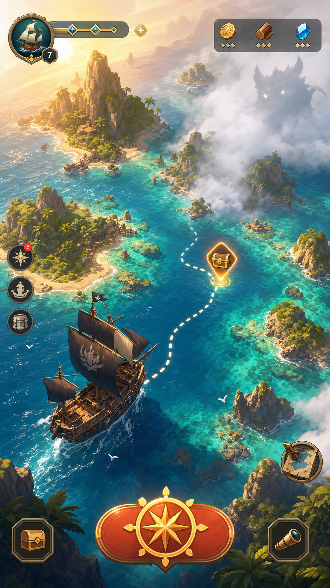
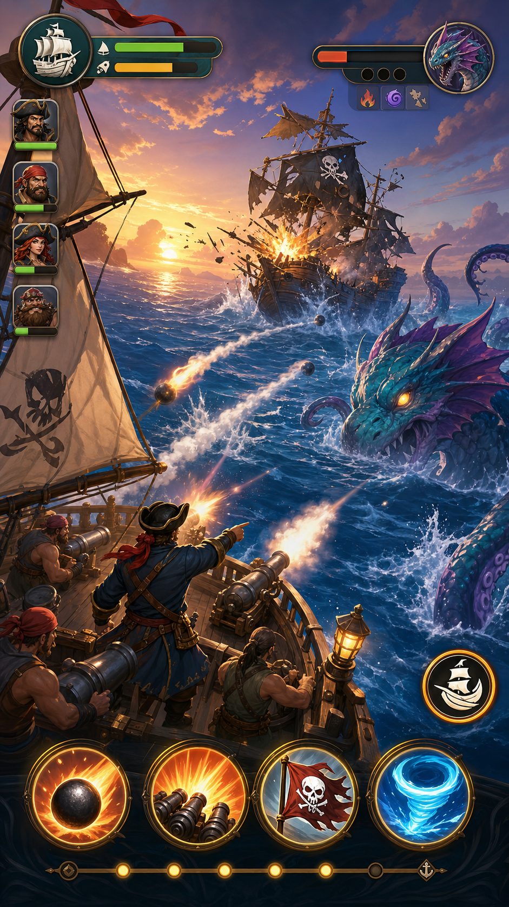
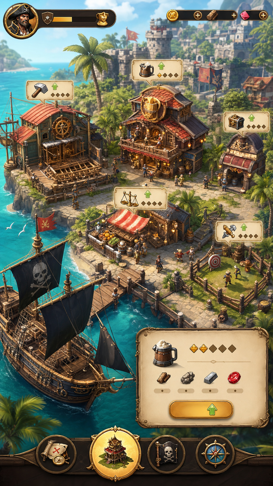

# App Store Art Direction

Date: 2026-06-13

This document defines the long-term visual target for the App Store version of
`NewPirate`. It is a direction document, not an implementation plan.

## Final Target

The final art direction is:

**Polished cartoon 2.5D pirate adventure with light dark-fantasy sea monsters.**

In Chinese:

**精致卡通 2.5D 海盗冒险 + 轻暗黑海怪**

The game should feel like a bright, premium mobile pirate adventure first, and a
resource-management game second. The player should understand the fantasy within
the first few seconds:

> Set sail, explore mysterious seas, fight sea monsters, return to port, and
> grow a pirate fleet.

## Platform Positioning

For App Store, the visual direction should prioritize:

- fast readability on a phone screen
- strong icon and screenshot conversion
- broad audience appeal
- clear adventure fantasy before system depth
- touch-friendly UI with low visual noise

The game should not look like a direct port of an older mobile webgame. Dense
menus, heavy bevel frames, small text, and full-screen resource bars should be
reduced or replaced over time.

## Visual Pillars

### 1. Bright Ocean Adventure

The sea should be the first visual identity of the game. Use turquoise water,
sunlit islands, white waves, reefs, fog banks, dotted routes, treasure markers,
and visible ships.

The player should feel they are about to sail into an unknown but inviting sea.

### 2. Light Dark-Fantasy Monsters

Sea monsters should remain part of the identity, but they should not become
gory, dirty, or overly horror-focused.

They should be:

- readable at small size
- colorful enough for App Store screenshots
- threatening but not disgusting
- shaped with strong silhouettes
- suitable for a broad mobile audience

### 3. Living Pirate Harbor

Base progression should be shown as a living harbor, not as a warehouse list.

Buildings such as the tavern, shipyard, market, training yard, warehouse, and
dock should become spatial locations. Upgrade states should appear as light
badges or contextual panels, not as dense tables.

### 4. Spectacular Ship Combat

Ship combat should be one of the main selling visuals.

The battle screen should clearly show ships, cannons, sails, waves, monster
attacks, skill buttons, and crew state. The player should immediately understand
that this is pirate naval combat, not generic RPG combat.

### 5. Clean Mobile UI

The UI should support adventure and decision-making instead of dominating the
screen.

Long-term UI direction:

- large gameplay canvas
- compact status widgets
- icon-first controls
- fewer always-visible currencies
- fewer full-width bars
- readable panels using parchment, wood, brass, and sea-blue materials
- no dense text blocks on the main screen

## Reference Concepts

These concept images are not final UI. They define the desired direction and
relative priority.

### Exploration First Screen

This is the strongest long-term direction for the first screen: sea map,
voyage route, fog, treasure point, ship, and minimal UI.

### Ship Battle

This direction should guide combat: readable spectacle, large characters and
ships, visible skill buttons, and a sense of action.

### Harbor Progression

This direction should guide base progression: upgrade systems are represented by
places in a harbor instead of isolated management screens.

## What Should Change From The Current Style

Current style issues to move away from:

- warehouse or resource screen as the first impression
- dark teal UI dominating most screens
- skull header and bottom navigation consuming too much space
- small text and dense resource rows
- old bevel buttons and glowing rectangular frames
- different features looking like the same menu with different labels
- monster art being stronger than the actual game shell

The new style should make the strongest parts of the design visible first:

- sea map exploration
- ship combat
- monsters and unknown waters
- port growth after returning from voyages

## What Should Stay

The new direction does not require abandoning the whole game identity.

Keep and evolve:

- pirate theme
- sea map exploration
- fog and unknown regions
- ship battle and boarding fantasy
- sea monsters
- treasure, black market, tavern, shipyard, and port systems
- parchment, brass, wood, sails, ropes, maps, lanterns, and compass motifs

The goal is to reframe these elements with a brighter and more readable mobile
presentation.

## Long-Term Screenshot Goal

If the game is eventually prepared for App Store, the first three screenshots
should communicate:

1. **Explore the Sea**: ship, map, fog, islands, treasure route.
2. **Fight at Sea**: cannons, enemy ship or sea monster, clear skill buttons.
3. **Build the Port**: living harbor, upgrades, crew, shipyard, tavern.

Screenshots should avoid leading with warehouse, alchemy, long item lists,
achievement lists, or abstract resource screens.

## Guardrails

Do not turn the game into:

- a pure horror game
- a gritty realistic pirate simulator
- a childish Q-version pirate toy
- a gacha menu collection screen
- a spreadsheet-heavy resource manager
- a direct clone of any single reference game

The target is a premium-feeling mobile adventure with enough darkness to make
the sea mysterious, but enough color and clarity to make players want to tap
and explore.

## Success Criteria

The long-term art direction is working when:

- the first screen immediately reads as pirate sea exploration
- a player can understand the core fantasy without reading a tutorial
- App Store screenshots look colorful and high-value at thumbnail size
- combat screenshots show active ship battle instead of UI tables
- port screens feel like places, not lists
- UI supports touch decisions without hiding the world
- the game feels modern while preserving the original pirate systems
