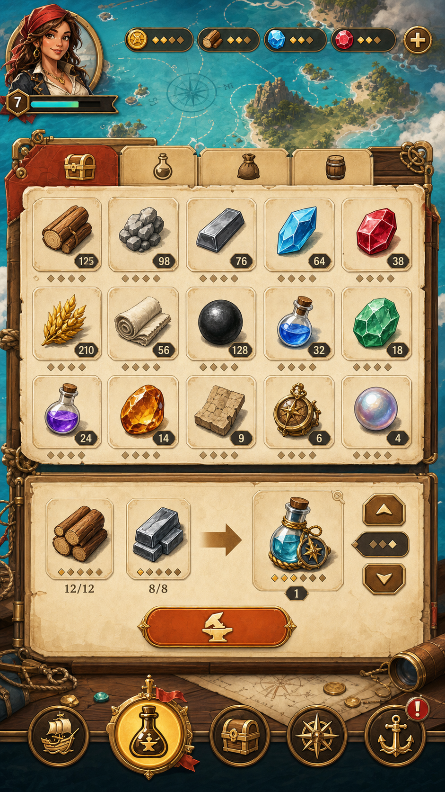
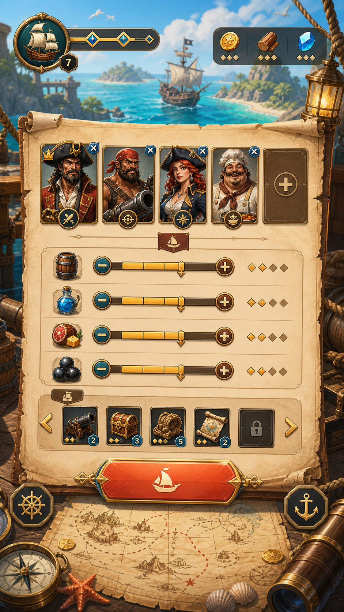
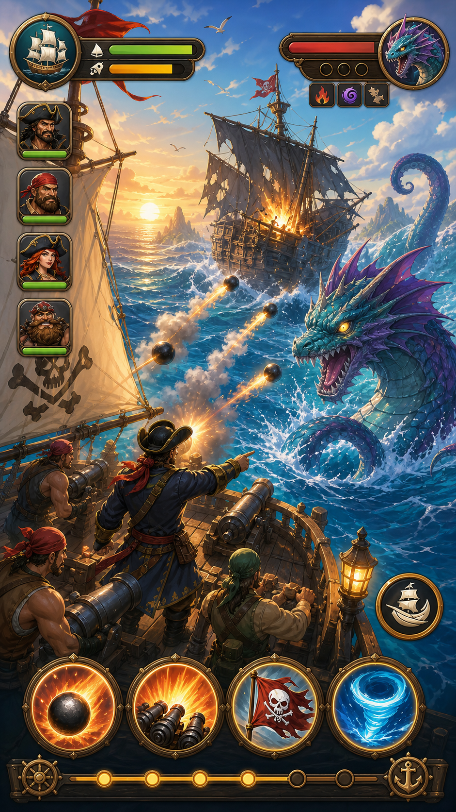
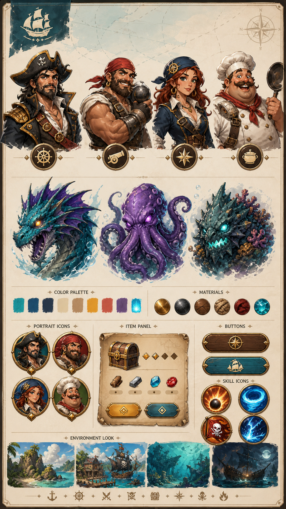

# Near-Term Art Refresh Plan

Date: 2026-06-13

This plan describes the near-term art refresh for `NewPirate`.

The goal is to refresh the visual style without changing the current gameplay
systems. It is a practical execution plan for the current project, not a full
redesign of the long-term product.

## Target Style

Near-term target:

**Clean hand-painted nautical UI + semi-Q pirate characters + bright ship
combat + light dark-fantasy sea monsters.**

In Chinese:

**清爽手绘海图风 + 半 Q 版海盗角色 + 明亮船战特效 + 轻暗黑海怪**

This is the practical first step toward the long-term App Store direction:

**精致卡通 2.5D 海盗冒险 + 轻暗黑海怪**

## References

These images define the near-term visual direction:









The near-term style should use the first, second, and fourth images as the
baseline. The battle image can be more expressive and more promotional, but the
actual in-game version should remain readable.

## Scope

### In Scope

- Replace the old dark teal UI skin with parchment, brass, wood, and sea-blue
  materials.
- Refresh shared UI components: buttons, panels, tabs, popups, progress bars,
  item cells, portrait frames, resource chips, bottom navigation, and red dots.
- Refresh the most visible screens first:
  - resource / warehouse / alchemy management
  - expedition preparation
  - ship battle
  - common reward and alert dialogs
- Improve character and monster presentation where they appear on these screens.
- Keep current screen flow and gameplay rules.
- Keep current Lua/Cocos2d-x implementation unless asset replacement requires
  small layout adjustments.
- Build and test the iOS version after integration.

### Out of Scope

- New gameplay systems.
- Full 2.5D harbor reconstruction.
- Full world-map exploration redesign.
- Combat rules redesign.
- Monetization redesign.
- Rewriting the UI framework.
- Replacing every item icon in the first pass.
- Final App Store product page screenshots.

## Current Resource Areas

The current image resources are mainly under:

```text
bin/res/assets/Images/
  UI/          shared UI components
  Icon/        resources, items, functional icons
  Fight/       battle UI and ship battle assets
  MainMenu/    main menu assets
  Map/         exploration and world map assets
  Background/  shared backgrounds
```

The first refresh should focus on `UI`, `Fight`, `MainMenu`, `Map`, and the most
visible `Icon` assets.

## Work Packages

### 1. Asset Audit

Purpose: understand what must be replaced and what can stay temporarily.

Tasks:

- List all image files used by the main screens.
- Map old assets to screens and Lua files.
- Mark each asset as shared, screen-specific, unused, or unknown.
- Identify assets that are safe to replace with the same filename.
- Identify assets that need code layout changes because size or anchor changes
  would break the screen.
- Create an asset replacement table.

Expected output:

- `docs/art-refresh-asset-map.md`
- replacement priority list
- list of high-risk assets that need engineering attention

### 2. Visual System

Purpose: define a small reusable visual kit before producing full screens.

Tasks:

- Lock the color palette:
  - turquoise sea blue
  - parchment cream
  - brass gold
  - warm wood brown
  - coral red
  - monster teal / violet
- Define materials:
  - parchment panels
  - brass borders
  - wood buttons
  - circular portrait frames
  - icon-backed resource chips
- Define icon style:
  - simple silhouette first
  - readable at small size
  - no heavy glow
  - consistent brass or parchment framing
- Define character proportions:
  - semi-Q, roughly 3 to 4 head proportions
  - expressive but not childish
- Define monster proportions:
  - strong silhouette
  - bright enough for mobile screenshots
  - threatening but not gross

Expected output:

- one style sheet
- component sample sheet
- updated art notes in this document or a separate style guide

### 3. Shared UI Skin

Purpose: make the whole game look different before every screen is rebuilt.

Priority components:

- top resource widgets
- bottom navigation buttons
- primary and secondary buttons
- tabs
- item cells
- popup panels
- progress bars
- number badges
- lock icons
- red dot notification
- star rating markers
- portrait frames
- skill button frames

Implementation notes:

- Prefer replacing same-purpose assets with compatible sizes first.
- If a new asset needs a different size, update the Lua layout deliberately.
- Keep original assets available until the refreshed screen is verified.

Expected output:

- refreshed shared UI asset set
- first in-game screenshot pass showing old UI skin reduced across the app

### 4. Screen Refresh: Management

Target screens:

- warehouse / repository
- alchemy / crafting
- resource listing
- related common item views

Design direction:

- use a hand-painted sea-map or parchment background
- use large, clean item cards
- keep resource counts readable
- reduce the old dark frame feeling
- keep current resource and crafting logic unchanged

Likely engineering touchpoints:

- `bin/res/scripts/LuaClass/Repository.lua`
- `bin/res/scripts/LuaClass/MakeMode.lua`
- `bin/res/scripts/LuaClass/Resource.lua`
- shared UI helpers such as `UIKit.lua`, `BaseView.lua`, and `SDButton.lua`

Acceptance:

- item icons and counts are readable on iPhone
- no text overlaps item frames
- crafting action remains obvious
- bottom navigation still works

### 5. Screen Refresh: Expedition Preparation

Target screens:

- expedition setup
- crew and supply preparation
- cargo/resource preparation

Design direction:

- make the screen feel like preparing a voyage
- use a map table, ship deck, compass, rope, and sea background
- keep sliders, crew slots, cargo icons, and start action
- make the main action visually stronger than secondary controls

Likely engineering touchpoints:

- `bin/res/scripts/LuaClass/Expedition.lua`
- `bin/res/scripts/LuaClass/Explore.lua`
- `bin/res/scripts/LuaClass/ExploreBagController.lua`
- `bin/res/scripts/LuaClass/ExploreDataManager.lua`

Acceptance:

- the screen reads as "set sail" within a few seconds
- crew slots are clear
- supply controls remain touch-friendly
- the main action button is visually dominant

### 6. Screen Refresh: Ship Battle

Target screens:

- ship battle
- boarding battle if it shares the same battle shell
- skill buttons
- crew portraits
- enemy status panel
- battle result / chest reward dialogs if tightly coupled

Design direction:

- brighter sea and clearer ships
- more readable cannon and wave effects
- sea monsters use teal/violet accents
- bottom skill buttons become large circular brass icons
- reduce dense numeric clutter

Likely engineering touchpoints:

- `bin/res/scripts/LuaClass/FightMode.lua`
- `bin/res/scripts/LuaClass/FightDataManager.lua`
- `bin/res/scripts/LuaClass/EffectUtil.lua`
- `bin/res/assets/Images/Fight/`
- `bin/res/assets/Effect/`

Acceptance:

- battle screenshot immediately reads as pirate naval combat
- enemy, player ship, crew, health, and skills are visually separated
- effects do not hide touch targets
- frame rate remains acceptable on simulator

### 7. Character And Monster Pass

Purpose: improve the most visible personality assets without repainting every
asset in the game.

Priority:

1. captain / default player portrait
2. cannon master
3. navigator
4. cook or supply character
5. first sea monster
6. first boss / stronghold monster

Tasks:

- produce final portrait style for key characters
- produce final monster portrait style for key enemies
- replace only the visible first-pass portraits
- leave deeper catalog replacement for a later pass

Acceptance:

- character portraits share a consistent proportion and rendering style
- monsters are brighter and more readable than the current dark portraits
- old and new portraits do not clash badly in the first several screens

### 8. Integration And Technical Cleanup

Tasks:

- Add new assets under the existing resource structure.
- Keep filenames compatible where safe.
- Update Lua image references where new names are required.
- Check image sizes, anchors, scale modes, and touch bounds.
- Rebuild texture atlases if the project uses packed sheets for the changed
  assets.
- Remove unused experimental assets only after the refreshed screens are stable.
- Run iOS simulator build and launch test.

Acceptance:

- iOS simulator builds successfully
- no missing image logs for refreshed screens
- no obvious layout overlap on phone viewport
- touch areas still match visible buttons

## Suggested Milestones

### Milestone 0: Direction Lock

Goal: confirm the near-term style and screen priority.

Deliverables:

- approved reference images
- approved color and material direction
- confirmed first three screens

Exit criteria:

- no more major style direction changes before production begins

### Milestone 1: Asset Audit And UI Kit

Goal: know what needs replacement and build the common UI kit.

Deliverables:

- asset replacement table
- shared button/panel/tab/item/progress/portrait assets
- one test screen using the new UI skin

Exit criteria:

- common UI skin works in-game without breaking layout

### Milestone 2: First Playable Visual Slice

Goal: refresh the visible first loop without changing gameplay.

Deliverables:

- refreshed expedition preparation screen
- refreshed management screen
- refreshed ship battle screen
- refreshed common popup/reward shell if needed

Exit criteria:

- user can launch iOS version and see the new art direction across the first
  visible loop

### Milestone 3: Polish Pass

Goal: make the visual slice coherent enough for screenshots and feedback.

Deliverables:

- character and monster first pass
- improved battle effects
- layout and readability fixes
- screenshot set for internal review

Exit criteria:

- first screenshots no longer look like an older dark mobile webgame

## Batch Execution Plan

The refresh should start in small batches. Each batch should produce something
that can be reviewed in-game or with a concrete asset sheet.

### Batch 0: Direction And Asset Audit

Goal: lock the near-term style and understand the current asset dependency map.

Work:

- confirm the four near-term reference images
- list the main image assets used by the first visible screens
- map key assets to Lua screens
- decide which assets can be replaced in place
- decide which assets require layout changes

Deliverables:

- asset replacement table
- first-priority screen list
- high-risk asset list
- `docs/art-refresh-asset-map.md`

Acceptance:

- the team knows exactly which assets to repaint first
- no production art starts before asset usage is understood

### Batch 1: Shared UI Skin

Goal: replace the old visual shell with the new parchment, brass, wood, and
sea-blue style.

Work:

- buttons
- popup panels
- item cells
- top resource chips
- bottom navigation icons and frames
- tabs
- progress bars
- portrait frames
- red-dot notification
- lock and star markers

Deliverables:

- shared UI component asset set
- one or two existing screens using the new UI skin

Acceptance:

- the game no longer feels dominated by the old dark teal UI shell
- old screen logic still works
- common controls remain touch-friendly

### Batch 2: First-Loop Screen Refresh

Goal: refresh the screens players see earliest, without changing their gameplay
logic.

Work:

- expedition preparation screen
- warehouse / repository screen
- alchemy / crafting screen
- shared item detail and lack-material prompts if they appear in the loop

Deliverables:

- refreshed expedition preparation screen
- refreshed management / warehouse / alchemy screens
- iOS simulator screenshot set

Acceptance:

- the first visible loop communicates pirate voyage preparation
- management screens look clean enough to coexist with the new style
- no obvious layout overlap on phone viewport

### Batch 3: Ship Battle Refresh

Goal: make battle the strongest near-term selling screen.

Work:

- ship battle background and battle shell
- enemy and player status areas
- crew portrait column
- skill buttons
- cannon, wave, and hit effects
- battle result shell if tightly coupled

Deliverables:

- refreshed ship battle screen
- first pass of battle effects
- iOS simulator battle screenshots

Acceptance:

- the screen immediately reads as pirate naval combat
- health, skills, crew, enemy, and action areas are visually separated
- effects do not hide controls or hurt readability

### Batch 4: Character And Monster First Pass

Goal: establish the new personality style without repainting the entire catalog.

Work:

- captain portrait
- cannon master portrait
- navigator portrait
- cook or supply character portrait
- first sea monster
- first boss or stronghold monster

Deliverables:

- final first-pass character portraits
- final first-pass monster portraits
- updated in-game screens using these portraits

Acceptance:

- key characters share the same semi-Q art language
- monsters are brighter and readable but still threatening
- new portraits do not clash badly with the refreshed UI

### Batch 5: Polish And Internal Screenshot Review

Goal: stabilize the first visual slice and prepare it for broader feedback.

Work:

- fix spacing, scale, and touch-target issues
- tune colors and contrast
- reduce over-heavy effects
- check common dialogs
- verify iOS build and launch
- capture internal screenshot set

Deliverables:

- polished first-pass art refresh build
- internal review screenshots
- remaining asset backlog

Acceptance:

- iOS simulator build launches successfully
- first screenshots no longer look like the old mobile webgame style
- remaining work can be prioritized screen by screen

## Recommended Starting Point

Start with **Batch 0** and **Batch 1** only.

Do not start repainting every screen immediately. The shared UI skin is the
lowest-risk way to prove the direction in the real project. Once the common UI
skin works in-game, continue into Batch 2.

## Priority Order

Recommended order:

1. Shared UI kit
2. Expedition preparation
3. Management / warehouse / alchemy
4. Ship battle
5. Common reward and alert dialogs
6. First character and monster portrait pass
7. Secondary icons and deeper screen cleanup

This order gives the fastest visible improvement while limiting gameplay risk.

## Risks

### Asset Replacement Breaks Layout

New assets may have different sizes, pivots, or transparent padding.

Mitigation:

- replace shared components one group at a time
- verify screen screenshots after each group
- avoid changing gameplay code while skinning

### Style Becomes Too Heavy

The concept art can look good but may overwhelm actual touch UI.

Mitigation:

- keep real screens lighter than promotional concepts
- prioritize readability and touch targets
- reduce effect intensity inside gameplay

### Inconsistent Old And New Assets

If only some assets are replaced, mixed styles may feel messy.

Mitigation:

- refresh shared UI first
- refresh the first visible loop before deeper screens
- keep old deep catalog items temporarily, but reframe them inside new panels

### Scope Creep

It is easy to turn art refresh into gameplay redesign.

Mitigation:

- do not change mechanics in this phase
- track gameplay changes separately
- treat the refresh as a skin and presentation pass

## Definition Of Done

The near-term art refresh is done when:

- the first visible screens no longer use the old dark teal webgame shell
- expedition preparation feels like setting sail
- management screens feel cleaner and brighter
- ship battle reads as pirate naval combat
- shared UI components have a coherent parchment/brass/wood style
- key character and monster portraits match the new direction
- iOS simulator build and launch are verified
- screenshots can be used for internal feedback on the new style

## Non-Goals For This Phase

- final App Store submission assets
- final trailer
- complete rewrite of every screen
- final economy or monetization tuning
- full harbor scene conversion
- full map exploration redesign
- complete item icon replacement
