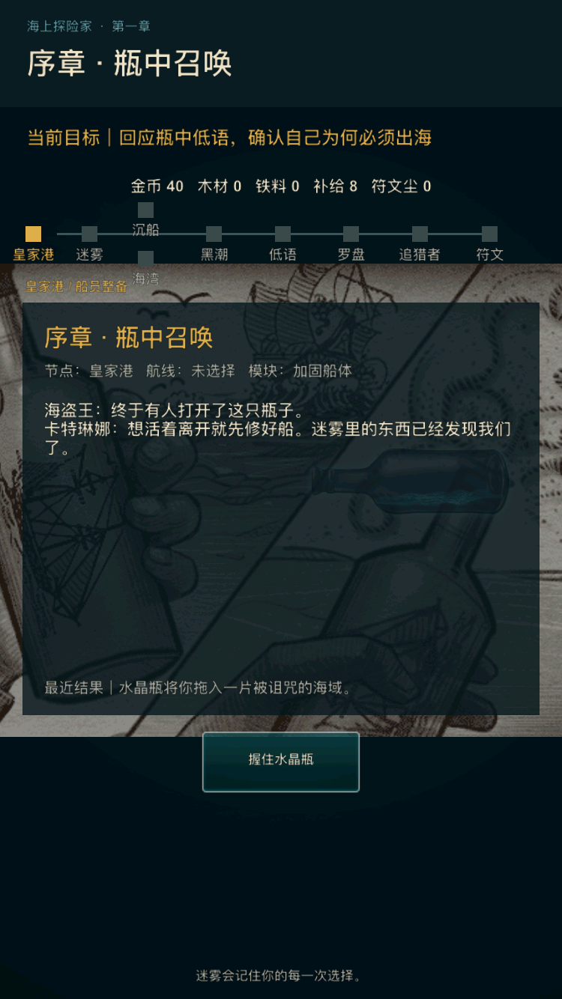

# 海上探险家 V2：iOS 发行工程迭代 1 验收记录

日期：2026-07-16

版本：2.0.0（build 1）

迭代结论：**通过，可提交本轮代码；产品总体仍为上线 HOLD**

## 1. 本轮目标

把已通过内部样片验收的第一章，从“本机可运行”推进为可复现、可审计、可生成
iOS Release archive 的发行工程基线。本轮不把无签名归档、模拟器或自动化结果等同于
真机、TestFlight 或 App Store 审核通过。

## 2. 落地范围

### 2.1 可复现构建

- 将主应用 Xcode 工程、所引用的 cocos2d 引擎工程和 iOS/macOS shared scheme 纳入
  版本控制候选；继续排除个人 `xcuserdata` 和工程 workspace 用户状态；
- iOS target 使用自动签名配置，移除历史团队、证书、provisioning profile 和
  `LD_NO_PIE` 硬编码；
- 版本统一为 `2.0.0 (1)`，Release 开启 dSYM 与 dead-code stripping；
- 新增 `ios-device`、`ios-archive` 和可复验的 archive 验证入口。

### 2.2 隐私、商业化与攻击面收敛

- 从 iOS target 移除 IDFA、AdSupport、Google Mobile Ads、旧内购、兑换码、奖励评论
  和相关 Objective-C/C++ 桥接；
- 加入 `PrivacyInfo.xcprivacy`：Tracking 为 No，Collected Data 为空，声明
  `NSUserDefaults / CA92.1` 与文件时间戳 `C617.1`；
- 从 iOS 引擎 target 移除 curl、OpenSSL、WebSocket、HttpClient、XMLHttpRequest、
  LuaSocket 及旧静态库链接；macOS 历史 target 不在本轮范围；
- 将远程 `AssetsManager` 在 iOS 上显式停用，`Info.plist` 声明
  `ITSAppUsesNonExemptEncryption = false`；
- 候选二进制不再包含已识别的旧广告、IAP、网络或加密符号。

### 2.3 iOS 资源与商店基础

- 使用现代 `UILaunchScreen` 声明，保持纵向全屏、iPhone/iPad 和 iOS 12 最低版本；
- 补齐 App Icon catalog 的 20pt iPad 槽位并验证所有像素尺寸；
- 本轮结束时 1024 图标只满足 RGB、无 Alpha；后续商店素材迭代已完成视觉定稿并关闭 `V2-015`，见 `app-store-assets-iteration-1.md`；
- 建立中文 App Store 元数据草案和上线就绪清单。

## 3. 运行回归发现与修复

本轮第一次用裁剪网络栈后的 Release 包做干净安装时，应用可以启动，但进度条满格后
停留在加载页。该问题登记为 `V2-016 / P0`。

诊断得到两个串联根因：

1. 加载完成后使用的延迟 Action 每帧被 `stopAllActions()` 重置，回调无法落地；
2. 修正一次性回调后，`NotificationNode` 仍在启动时请求已退役的服务器时间，访问已从
   iOS 删除的 `cc.XMLHttpRequest`，并在 Release 环境中以 Lua 异常中断主界面初始化。

最终修复为：

- 加载完成只触发一次，直接进入本地主逻辑；
- 加载文案从“联网获取离线资源”改为“正在准备本地航海资源”；
- 新增默认关闭的 `legacy.network_time`，同时保护启动与回前台两条服务器时钟入口；
- 将以上约束加入静态检查和 archive 内容检查，防止后续回归。

最终玩家入口证据：

## 4. 回归与制品验收

| 验收项 | 命令/环境 | 结果 |
| --- | --- | --- |
| 阶段 0～4 全量回归 | `tools/release/validate_ios_release.sh` | 通过；16 个问题纳入台账，真实外测仍 pending |
| 发行静态检查 | `python3 tools/release/validate_ios_release.py` | 通过 |
| Release 模拟器构建 | `CONFIGURATION=Release ./xcode.sh ios-sim` | 退出码 0；arm64 |
| 干净安装启动 | iPhone SE（第 3 代），iOS 17.2 | 通过；5 秒内进入第一章，PID `13397` |
| 再次唤起 | 同一模拟器、同一安装 | 通过；PID 仍为 `13397`，未触发旧网络入口 |
| 通用设备 Release 归档 | `./xcode.sh ios-archive` | 通过；生成无签名 `.xcarchive` 与 app dSYM |
| archive 内容检查 | `python3 tools/release/validate_ios_archive.py build/archives/NewPirate.xcarchive` | 通过 |

archive 内容检查覆盖：

- Bundle ID、显示名、版本、build、最低 iOS、iPhone/iPad 设备族；
- `ITSAppUsesNonExemptEncryption = false`；
- 隐私清单内容及 required-reason API；
- arm64 可执行文件和 app dSYM；
- 无 AdSupport、StoreKit、libcurl、libssl、libcrypto 动态依赖；
- 无 IDFA、Google Ads、IAP、curl、SSL、AES、HttpClient、XMLHttpRequest、WebSocket
  符号；
- archive 中实际打包的 Lua 资源保持离线加载文案、一次性完成回调和服务器时钟门控。

## 5. 本轮验收判定

本轮要求“可复现工程、Release 模拟器、通用设备 archive、隐私/符号审计、干净安装
进入玩家首章、阶段 0～4 回归”均有当前制品证据，因此本轮判定通过并允许提交。

以下证据仍然不存在，不能据此宣称产品可上线：

- Apple Developer 团队、最终 Bundle ID 归属、Distribution 签名和上传校验；
- 低端 iPhone、现代 iPhone、iPad 的真实设备触控、音量、发热、帧率与恢复矩阵；
- 两轮真实目标用户外测及阶段 4 阈值；
- 可公开访问的隐私政策 URL、支持 URL、App Privacy、年龄分级和合规问卷；
- 最终商店图标、所需设备截图和美术评审。

后续迭代应先推进可在仓库内完成的商店素材与发布包准备；账号、真机和外测由对应
负责人提供真实证据后，再把总体结论从 HOLD 改为 GO。
