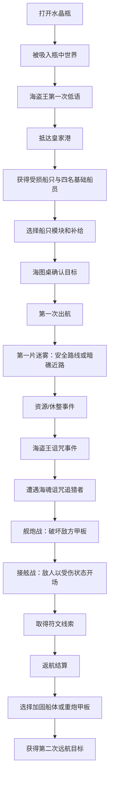

# V2 首章流程：皇家港与瓶中海域

> 状态：阶段 0 基线
>
> 对应章节：`chapter_01`
> 目标时长：15～20 分钟

## 1. 章节目标

玩家打开水晶瓶进入瓶中世界，在皇家港完成最小整备，第一次驶入迷雾，
经历路线选择、舰炮战和接舷战，取得第一枚符文线索，返港完成一次升级。

章节只验证五件事：

1. 水晶瓶与海盗王诅咒能否建立故事动机；
2. 玩家是否愿意进入迷雾并理解路线风险；
3. 船员、模块和补给是否影响远航；
4. 舰炮战如何影响接舷战是否清晰；
5. 战利品是否能驱动第二次出航。

## 2. 玩家流程

## 3. 时间与信息节奏

| 时间 | 阶段 | 玩家动作 | 必须理解 |
|---|---|---|---|
| 0～1 分钟 | 开场 | 观看水晶瓶与低语 | 自己被困，海盗王正在苏醒 |
| 1～3 分钟 | 港口 | 查看船只、船员和海图桌 | 修船并寻找符文才能离开 |
| 3～6 分钟 | 整备 | 接受默认配置或调整一次 | 船员与补给影响航行 |
| 6～9 分钟 | 探索 | 在安全路线和近路间选择 | 风险、成本和收益不同 |
| 9～12 分钟 | 事件 | 处理休整/残骸与诅咒 | 选择会影响后续状态 |
| 12～16 分钟 | 战斗 | 舰炮破坏甲板、进入接舷 | 两阶段是一场连续战斗 |
| 16～18 分钟 | 目标 | 取得符文线索并返航 | 收获推进了主线 |
| 18～20 分钟 | 成长 | 选择一次升级 | 下一次出航会因此改变 |

时间为测试目标，不作为不可跳过的演出长度。

## 4. 状态门槛

| 状态 | 获得条件 | 解锁内容 |
|---|---|---|
| `voyage_ready` | 完成港口最小整备 | 可以第一次出航 |
| `route_chosen` | 选择安全或高风险路线 | 进入对应事件节点 |
| `salvage_found` | 搜索沉船残骸 | 获得木材、铁料和补给 |
| `crew_restored` | 在避风海湾休整 | 接舷队伍恢复状态 |
| `curse_heard` | 完成海盗王低语选择 | 追猎者战斗出现 |
| `raider_defeated` | 赢得双阶段战斗 | 符文线索节点解锁 |
| `chapter_01_complete` | 接受符文线索 | 返港升级和第二航目标解锁 |

## 5. 失败与恢复

- 整备不足：保留当前配置并指出缺少的项目，不扣资源；
- 探索补给不足：允许主动返航，保留已确认的战利品；
- 舰炮战失败：展示船体、火炮和决策原因，返港免费恢复到可再次尝试状态；
- 接舷战失败：保留章节进度，不丢失核心船员；
- 中途退出：恢复到最近完成的节点，而不是重置整个章节；
- 存档异常：测试构建可切换到 `qa_fresh`、`qa_explore` 或 `qa_combat` 档位复现。

## 6. 验收脚本

每轮首章测试从全新 V2 存档开始，测试者不得获得口头指导。观察者记录：

1. 60 秒时玩家认为目标是什么；
2. 第一次出航时间；
3. 路线选择及理由；
4. 舰炮转接舷时是否理解状态传递；
5. 胜负原因复述；
6. 返港后选择的升级及理由；
7. 是否主动寻找第二次远航入口。

任一测试者出现流程死路、无法返航或存档损坏，按 P0 处理。
