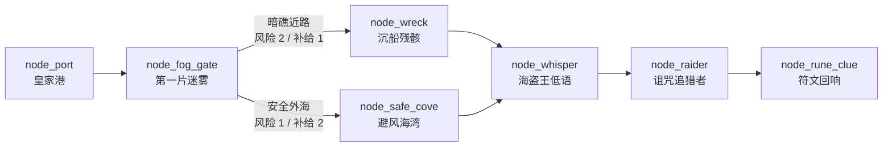

# V2 首章节点图

> 数据源：`design/v2/data/map_node.csv`、`map_edge.csv`
>
> 本文用于关卡讨论，CSV 是机器校验源。

## 1. 地图结构

## 2. 节点定义

| 节点 | 类型 | 风险 | 作用 | 主要产出 |
|---|---|---:|---|---|
| `node_port` | 港口 | 0 | 整备、出航、返航 | `voyage_ready` |
| `node_fog_gate` | 路线选择 | 1 | 教会风险与成本比较 | `route_chosen` |
| `node_wreck` | 资源 | 1 | 近路额外收益 | `reward_salvage` |
| `node_safe_cove` | 事件 | 1 | 远路恢复接舷状态 | `crew_restored` |
| `node_whisper` | 剧情事件 | 2 | 第一次诅咒选择 | `curse_heard` |
| `node_raider` | 双阶段战斗 | 3 | 验证核心战斗 | `reward_battle` |
| `node_rune_clue` | 章节终点 | 2 | 主线推进与返港 | `reward_rune_clue` |

## 3. 两条路线的设计目的

### 暗礁近路

- 少消耗 1 份补给；
- 承担更高风险；
- 获得沉船资源；
- 适合重炮或希望尽快进入战斗的玩家。

### 安全外海

- 多消耗 1 份补给；
- 接舷队伍得到恢复；
- 不获得沉船额外资源；
- 适合加固船体或希望提高战斗容错的玩家。

路线差异必须在后续战斗或结算中可观察，不能只改变一行提示文字。

## 4. 舰炮到接舷的首章规则

首章只验证一条明确传递关系：

> 舰炮阶段击毁“敌方甲板”后，接舷阶段敌方前排以受伤状态开场。

实现时需要同时提供：

- 舰炮阶段的甲板目标与破坏进度；
- 切换阶段时的短反馈；
- 接舷开场的受伤状态图标；
- 结算中对该优势的说明。

暂不同时制作桅杆、火药库、士气和多个部位系统。

## 5. 扩展约束

首章通过验收前：

- 不增加第二张地图；
- 不增加与首章目标无关的支路；
- 不用体力或付费地图门替代内容门槛；
- 不把节点数量扩充为无选择的逐格移动；
- 新节点必须新增信息、选择、结果或故事中的至少一项。
