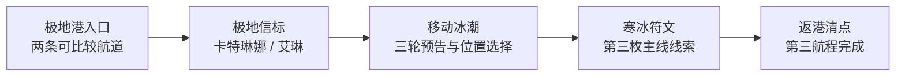

# V2 内容扩展管线第 1 轮：19 表契约与霜冻航线候选

日期：2026-08-29

状态：`BASELINED`

产品开发：`ACTIVE`

真机与发行：`DEFERRED_UNTIL_FINAL`

## 1. 本轮目标

前两次远航已经证明 V2 可以做出真实成长、角色取舍、差异敌人和专属视觉，但每次增加内容仍需要人工记住节点、事件、选择、敌人、奖励、演出、遥测、QA 和生成 Lua 之间的全部关系。规模继续增加时，最危险的不是代码量，而是某张表漏填、运行时硬连、半成品入口提前出现，最后又回到旧项目多份数据互相分叉的状态。

审计已经发现一个实际例子：`event_wreck_survivors` 在状态机中与 `node_wreck` 相连，但 `map_node.csv` 的 `event_id` 为空。当前玩法能运行，数据却不能独立解释运行关系。本轮先修正这条隐性连接，再建立覆盖全部 19 张权威表的共享内容契约；同时以“极地港 · 霜冻航线”验证下一段内容能否在不进入运行时的前提下，把体验、UI、资产和验收边界定义完整。

## 2. Before / After / Why

| Before | After | Why |
| --- | --- | --- |
| Phase 0 只校验早期 11 张表，后续 8 张表由多个专项脚本分别记忆 | `content_contract.py` 统一加载和校验 19 张权威 CSV | 新内容不再依赖开发者记住所有隐式规则 |
| 沉船事件靠状态机硬连，节点表没有事件引用 | `node_wreck.event_id = event_wreck_survivors` | 数据源自身可以完整解释地图—事件关系 |
| 跨表引用主要在功能完成后才被专项脚本发现 | 节点、事件、奖励、敌人、船员、演出、音频等引用在导出前统一失败 | 把错误阻断点移到最便宜的编辑阶段 |
| 操作 ID、阶段演出和孤立内容可能静默共存 | 重复操作、重复阶段演出、孤立事件/敌人/航线和缺失资产都有明确错误码 | 防止“表里有、玩家到不了”或两个页面争用同一状态 |
| 新航程容易先加入口再边做边补 | 候选清单固定 `runtime_exposed = false`，全部预留 ID 必须在当前运行时中不存在 | 半成品不能形成新的玩家死路 |
| 下一海域可能沿用潮盾结构只换背景和名称 | 第三航程明确为三轮“移动冰潮”预告与位置决策，不把单一护盾打到零 | 每次内容扩展必须带来可验证的新决策，而非主题换皮 |
| UI 需求到实现时才临时决定 | 候选提前定义稳定骨架、唯一新焦点、提交前预览、场景结果映射和动效预算 | 新机制从第一天就能被界面解释，而不是事后塞字 |
| 资产先做、机制后改，容易浪费 | 三个英雄画面只在状态机与文案评审通过后制作，且是运行时开放的硬门槛 | 把美术投入集中到已经证明需要的场景 |

## 3. 19 张表的统一契约

`tools/v2/content_contract.py` 现在负责下列通用规则：

- 全部 19 张表存在、列完整、ID 非空且不重复；
- 所有数值字段可以被确定解析为整数；
- `chapter → node`、`node → event/enemy/reward`、`choice → event/reward`、`enemy → reward`、`crew_upgrade → crew`、`presentation → audio` 等跨表引用真实存在；
- 地图可见性与风险值处于批准范围；
- 玩家操作 ID 在事件选择中唯一；
- 一个运行阶段只能有一份英雄演出；战斗操作必须存在同阶段演出；
- 演出图片和音频文件必须存在于 `bin/res/assets`；
- 每个事件、敌人与正式路线至少被一个运行节点或边使用；
- 每名船员的主动能力必须能落到已知事件动作、战斗动作或批准的测绘动作。

`tools/v2/test_content_contract.py` 不只检查当前数据通过，还会主动构造四种错误，证明未知引用、重复动作、重复阶段演出和孤立事件确实会失败。契约作为模块复用，专项验证不再复制一套读取和引用逻辑。

当前仍保留专项脚本：通用契约只能证明“数据关系正确”，不能替代船员成长效果、恢复边界、潮盾结算、角色建议或 UI 截图等具体体验规则。

## 4. 内容切片生产顺序

以后每次远航或大型角色事件按固定顺序推进：

1. **来源追溯**：逐条记录采用什么世界观、美术或敌人元素，同时写明拒绝恢复的旧机制；
2. **体验承诺**：用一句玩家语言说明这段内容的新体验，不用节点数和资产数代替；
3. **候选清单**：从 `content-slice-template.json` 建立 `design_candidate`，保持 `runtime_exposed = false`；
4. **差异评审**：必须写明与上一航程的机制差异、已有成长如何兑现、为什么不存在无脑最优解；
5. **UI 契约**：只允许一个新视觉焦点，操作前给出真实后果，操作后在原因发生位置反馈；
6. **ID 预留**：阶段、节点、事件、动作、敌人、奖励、演出、遥测和 QA 名称一次确定；
7. **权威表与导出**：通过 19 表契约后才生成 `V2ChapterData.lua`；
8. **完整运行闭环**：状态机、失败恢复、旧存档、港口、遥测和 UI 同时接通；
9. **资产与运行证据**：完成专属场景、主流 iPhone 连续截图、完整 Phase 4 和 iOS Simulator Debug；
10. **最后开放**：所有门槛一起通过后才给上一完成页增加出航动作并切换运行暴露状态。

任何一步失败都不得用“开发中”按钮、无后续节点或复用旧敌人名称占位。内部 QA 可以直达未公开阶段，但必须和玩家档隔离。

## 5. 第三航程候选：极地港 · 霜冻航线

候选文件：`design/v2/content_slices/voyage-03-frostbound.json`

玩家承诺：**读懂正在移动的冰潮，在保船、保人和抓住破冰窗口之间作出可预判的航海决定。**

来源取自原项目的地图 6“极地港”、地图 7“霜冻海湾”、冰霜巨人/雪蟒轮廓，以及亡灵侵蚀与卡特琳娜线索。明确拒绝逐格体力、大量同质据点、传送钥匙、材料刷取和旧陆战数值。

### 5.1 五节点短闭环

目标时长 8～12 分钟，只有 5 个有意义节点。两条航道最终汇合，不增加为了消耗补给而移动的空格。

### 5.2 两条航道

| 航道 | 可见代价 | 已有成长兑现 | 为什么不是无脑最优 |
| --- | --- | --- | --- |
| 浮冰群航道 | 连续两次可预告船体碰撞 | 船体等级减伤；大副降低一次危险转向代价 | 保留补给，但选错两次可能迫使返港 |
| 信号焰航道 | 消耗补给维持火盆并暴露船位 | 火炮等级缩短破冰窗口；炮术长强化一次远距裂冰 | 船体风险较低，但补给不足不能完成全部轮次 |

数值尚未写入运行表；现在只确定信息必须在提交前可见，以及两种成长都有优势但都不能自动替玩家完成航程。

### 5.3 极地信标角色事件

卡特琳娜与艾琳第一次成为航程核心人物：

- **研读冰图**：卡特琳娜完整标出下一轮冰潮方向，危险操作显示真实碰撞值；
- **温暖救援队**：艾琳救下受困探险队，并提供一次可见、一次性的错误恢复。

当前首席罗克或米克可以补充战术意见，但不会把任一方案锁为唯一答案。角色表达立场，船长保留最终决定，结果立即进入移动冰潮而不是只留在一段对白中。

### 5.4 移动冰潮

挑战由三轮可预告危险构成。每轮先显示冰霜巨人将推动的左/右冰潮、可能损失和可利用的裂冰窗口，再选择：

- 稳舵避险：推进较慢，按当前方向承担或避免碰撞；
- 炮击裂冰：消耗补给，火炮成长可一次推进两个位置；
- 抢行窗口：收益最高，但只有预告与当前位置匹配时安全。

它和沉锚守卫的本质差异是：守卫比较一次攻击伤害与代价，移动冰潮比较**预告、位置、剩余资源和下一轮方向**；目标是穿过航道，不是把单一护盾打到零。至少一个最优动作必须随预告方向变化，不能把三轮压缩成重复点击同一按钮。

原地重试保留航道和信标选择、重置三轮序列；返港清除本航程临时预告并允许重选航道。

## 6. UI 与美术预算

仍使用 UI 3.5 的章节铭牌、航令、资源仪表、纵向航程、船长日志和编号指令。唯一新增主焦点是一条位于场景与日志之间的**冰潮预告条**：

- 只显示下一轮方向、实际可能损失、裂冰窗口和当前航道位置；
- 卡特琳娜方案显示精确值，未获得情报时明确标为未知，不用“较安全”之类模糊词；
- 碰撞反馈锚定左侧我方船，裂冰反馈锚定场景对应冰带，位置推进只更新预告条；
- 冰裂与推进各使用一次小于 300ms 的短反馈；不做循环飘雪、呼吸、镜头摇摆或弹跳。

运行开放前需要三张 1024×1024 专属英雄画面：极地探索、冰霜巨人挑战、第三符文结果。当前不生成资产，先证明玩法与构图需求稳定，避免用一张新背景掩盖尚未成立的交互。

## 7. 暴露边界与验收

候选固定为 `runtime_exposed = false`。`tools/v2/validate_content_pipeline.py` 检查所有规划阶段、节点、事件、动作、敌人、奖励、演出、遥测和 QA ID 当前都不存在于权威表、状态机和配置中。`tide_complete` 继续不暴露出航按钮。

未来只有同时满足以下门槛才可开放：

- 新档可以连续完成三次航程，船体与火炮成长都不软锁；
- 两条航道、两项信标选择、至少两种冰潮序列具有正反路径测试；
- 普通动作、错误恢复和最终穿越使用真实状态反馈；
- 原地重试与返港恢复边界通过测试；
- 六个 QA 档可恢复且不污染玩家档；
- 三张英雄画面完成主流 iPhone 1206×2622 px 连续运行复核；
- 完整 Phase 4 与 iOS Simulator Debug 构建通过；
- 上述全部通过前，第二航程完成页不出现第三航程出航动作。

## 8. 当前结论与下一步

本轮完成的是可执行生产约束与一份已通过差异审查的第三航程候选，不宣称第三航程已经可玩。它对产品的直接价值是阻止数据分叉、孤立内容、背景换皮和半成品入口再次进入玩家体验。

下一轮开始实现霜冻航线的**状态模型与纯 Lua 正反路径**：先证明三轮预告会改变最优选择、两条旧成长都有真实作用、失败可恢复，再制作三张专属美术和 Cocos 表现层。真机、签名、TestFlight 和 App Store 继续保持 `DEFERRED_UNTIL_FINAL`。
