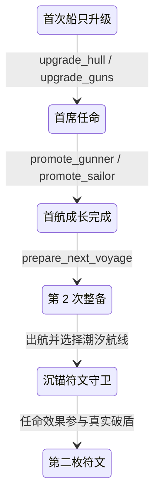
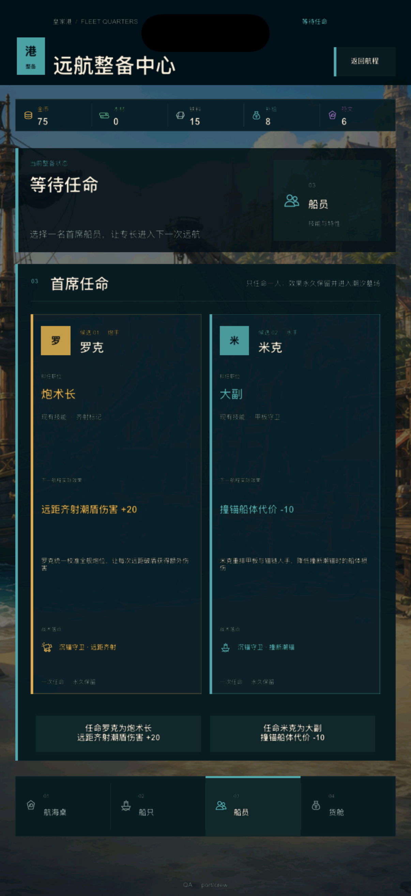
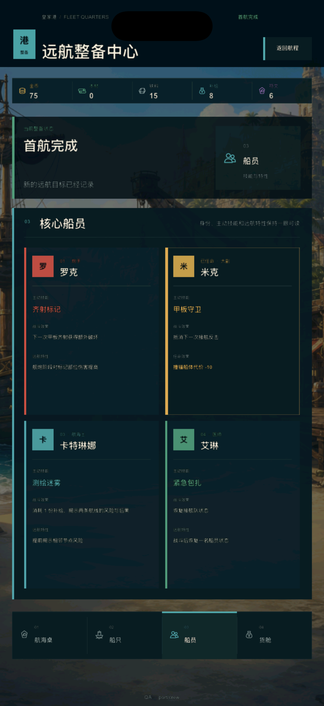
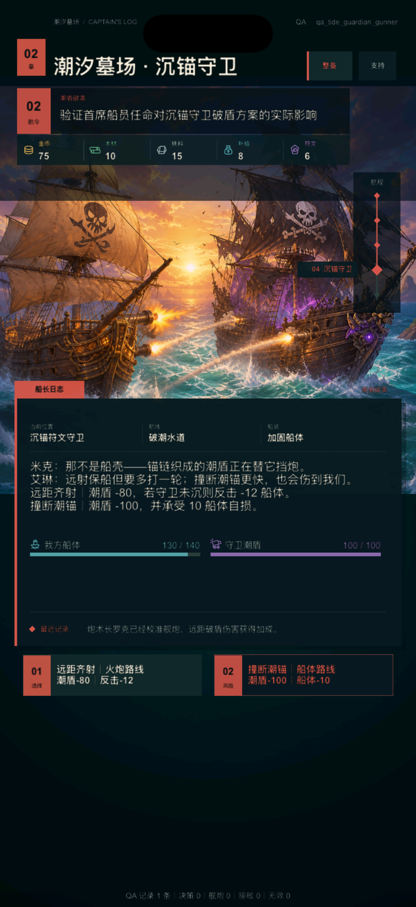
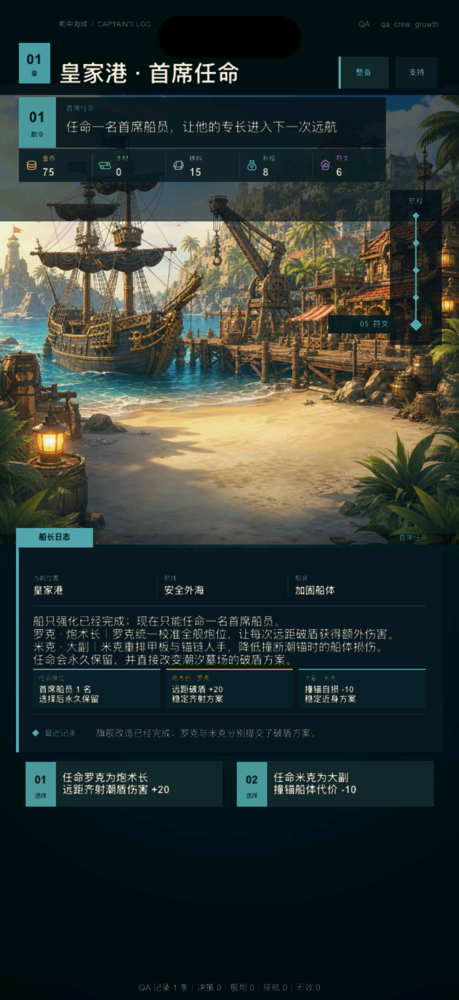

# V2 船员成长第 1 轮：首席任命与守卫协同

日期：2026-08-09

状态：`BASELINED`

产品开发：`ACTIVE`

真机与发行：`DEFERRED_UNTIL_FINAL`

## 1. 本轮目标

皇家港船员页此前已经能说明四名核心船员是谁、拥有什么技能，但仍是只读档案；玩家完成首次船只升级后，成长只落在船体或火炮数值上，船员没有一次真实、长期、能在下一航程被感知的决策。

本轮不恢复旧版星级、招募、长职业树和训练资源链，只建立一条最小但完整的成长闭环：

1. 首次船只升级后必须从两名候选者中任命一名首席船员；
2. 两个选择分别服务远距破盾和近身撞锚，效果直接进入潮汐墓场守卫结算；
3. 任命永久保留，不能在同一存档内随意切换；
4. 船员页从四张等权资料卡切换为两张可比较的决策卡，任命后再回到稳定编队视图；
5. UI 预览、实际结算、战报、存档和遥测使用同一份数据源。

## 2. Before / After / Why

| Before | After | Why |
| --- | --- | --- |
| 船员页只有身份、技能与特性说明 | 首次升级后进入两候选首席任命页，可直接执行真实动作 | 让船员页承担成长决策，而不是继续做资料陈列 |
| 船体或火炮升级后直接进入首航完成态 | 新增 `crew_growth` 阶段，任命完成后才进入 `complete` | 成长顺序清楚，玩家不会错过或绕过船员选择 |
| 船员与潮汐墓场守卫没有关系 | 炮术长提高远距齐射破盾；大副降低撞锚船体代价 | 选择立刻改变已有玩法，不新增空壳数值 |
| 两个按钮只可能显示抽象职业名 | 每张候选卡同时显示当前技能、任命效果、作用目标和永久性 | 在承诺前说明结果，降低不可逆选择的不确定性 |
| 伤害预览可能把过量火力写成实际伤害 | 预览显示实际潮盾损失；过量时附注方案火力，例如 `潮盾-100（火力120）` | 保证按钮承诺、敌方状态和最终战报一致 |
| 已完成首航的旧存档没有新字段 | 旧 `complete` 且未任命的存档先进入补任命动作，不能直接准备下一航程 | 不升级 schema 也能保证新成长规则不被绕过 |

## 3. 成长流程

任命动作仍由 `V2ChapterState` 处理。皇家港只读取动作并负责展示，不能自行写入船员成长或战斗结果。

## 4. 两项首席任命

唯一数据源为 `design/v2/data/crew_upgrade.csv`：

| 选择 | 永久职位 | 当前战斗身份 | 任命效果 | 战术目标 |
| --- | --- | --- | --- | --- |
| 罗克 · 炮术长 | 负责全舰炮位校准 | 炮手 / 精准射击 | 每次远距齐射对潮盾伤害 +20 | 沉锚守卫 · 远距齐射 |
| 米克 · 大副 | 重排甲板与锚链人手 | 水手 / 紧急修理 | 撞断潮锚的船体代价 -10 | 沉锚守卫 · 撞断潮锚 |

本轮只有两名候选者。导航员安娜和医生莉娅继续保留当前技能身份，但不虚构尚未进入第二航程玩法的成长分支。

## 5. 与船只成长的组合结果

船只强化与船员任命是两个维度，不强制玩家选择同一方向。由此形成四种清楚可解释的组合：

| 船只强化 | 首席任命 | 远距齐射 | 撞断潮锚 | 玩家含义 |
| --- | --- | ---: | ---: | --- |
| 船体 +1 | 罗克 · 炮术长 | 潮盾 60 → 每次实际 80 | 潮盾 100，船体 -10 | 远距两轮稳定破盾，也保留一次近身终结 |
| 船体 +1 | 米克 · 大副 | 潮盾 60 | 潮盾 100，船体 -0 | 用船体成长与大副协同，零额外船损撞锚 |
| 火炮 +1 | 罗克 · 炮术长 | 方案火力 120；面对 100 潮盾实际 -100 | 潮盾 75，船体 -20 | 极致远距方案，过量火力被诚实展示 |
| 火炮 +1 | 米克 · 大副 | 潮盾 100 | 潮盾 75，船体 -10 | 两种打法都可用，选择更灵活 |

潮盾的实际扣减始终取“剩余潮盾”和“方案火力”的较小值。只有理论火力高于剩余潮盾时，UI 才额外显示方案火力；终结战报同样记录“最终破盾 100（方案火力 120）”，不会把 120 写成敌人实际损失。

## 6. UI 结构与运行画面

### 6.1 两候选决策页

`crew_growth` 阶段进入船员区后，不继续显示四张同权重档案卡，而是使用两张纵向候选卡。每张卡的阅读顺序固定为姓名与职位、当前技能、永久效果、战术目标、执行动作；页面底部明确“永久任命 · 本次只能选择一人”。

### 6.2 任命后的稳定编队

真实执行 `promote_sailor` 后，页面原地刷新为四人编队。米克卡片以任命强调色标出“已任命 · 大副”，并持续显示“撞锚船体代价 -10”；未选船员仍保持普通身份层级。轻量操作不强制玩家跳回章节页。

### 6.3 守卫中的真实兑现

炮术长档进入沉锚守卫后，远距齐射按钮从基础 `潮盾-60` 改为 `潮盾-80`。执行后潮盾真实减少 80，战报点名“罗克 · 炮术长”，任命不是港口里的孤立标签。

### 6.4 章节页的成长节点

章节页也能完整表达同一状态：阶段标题、叙事、两组候选结果和两个动作全部来自真实成长数据。玩家不进入皇家港也不会卡住，同时皇家港保留更适合比较的结构化视图。

四张图均来自 iPhone 17 模拟器的 1206×2622 px 开发期运行画面。主流 iPhone 竖屏继续作为风格与层级判断基准；没有执行真机、签名、TestFlight、商店截图或 App Store 工作。

## 7. 为什么这不是“只换背景”

本轮没有新增一张装饰背景来冒充升级，而是改动四层产品结构：

- 流程层：船只升级与首航完成之间增加不可绕过的成长节点；
- 决策层：两项互斥选择分别改变远距与近身策略；
- 页面层：船员区拥有决策态和已选择态两套真实结构；
- 反馈层：按钮预览、敌方潮盾、玩家船体、终结战报和遥测同步反映选择。

Apple Design 对本轮的影响是状态可见、空间位置稳定、永久选择在点击前可预测，点击后立即原地刷新。Emil Design Engineering 对本轮的影响是单一焦点、渐进披露和克制动效：决策时只突出两名相关候选，选择后再恢复完整编队；不添加循环呼吸、弹跳或无信息价值的装饰反馈。

## 8. 存档与旧存档兼容

- 任命结果存入既有 `state.upgrades.crew`，值为 `crew_upgrade_gunner` 或 `crew_upgrade_sailor`；
- 存档 schema 继续保持 4，不为一个可由默认值覆盖的字段制造迁移版本；
- 新流程中的船只升级把状态推进到 `crew_growth`；
- 已经处于 `complete`、但没有 `upgrades.crew` 的旧存档会收到两项补任命动作；
- 这类旧存档直接调用 `prepare_next_voyage` 会被拒绝，完成任命后才可继续；
- 任命随 `prepare_next_voyage` 保留，不在清理临时航程状态时丢失。

## 9. 数据、遥测与 QA

- 新增 `crew_upgrade.csv`，成为职位、动作、效果类型、效果数值、说明和强调色的唯一来源；
- 运行数据导出从 18 张表扩展为 19 张表；
- 新增 `crew_upgrade_selected` 本地遥测事件，并记录 `action`、`stage_after` 与 `crew_upgrade`；
- 汇总增加 `crew_growth_decisions`，用于后续观察两种首席偏好；
- 新增 `qa_crew_growth`、`qa_tide_guardian_gunner`、`qa_tide_guardian_sailor` 三个隔离直达档；
- 原有完成态 QA 默认带炮术长，以保持既有船体路线与守卫基线稳定。

## 10. 自动验收

`tools/v2/test_v2_crew_growth.lua` 覆盖：

- 首次船只升级进入任命，且只有两项真实选择；
- 第二次任命无法覆盖已经保留的结果；
- 旧完成存档被补入任命流程，无法绕过；
- 炮术长使基础远距破盾从 60 提高到 80，并改变真实潮盾；
- 大副把船体成长路线的撞锚代价从 10 降到 0；
- 火炮成长与炮术长叠加时，实际伤害 100 与方案火力 120 被分别表达；
- 船员页动作过滤、已任命高亮、章节结果组和本地遥测一致；
- 三个新 QA 状态可以正常恢复。

专项静态验收 `tools/v2/validate_crew_growth.py` 同时检查数据契约、状态机、港口模型、页面结构、主题、遥测、四张 iPhone 证据与文档记录；它已加入完整 `tools/v2/validate_phase4.sh` 回归链。

## 11. 当前边界与下一步

本轮建立的是一次清楚、永久、能影响守卫的首席任命，不是完整船员养成系统：

- 不做星级、等级、经验、装备、重复招募和长职业树；
- 暂不提供洗点或改任，避免永久选择尚未形成足够内容前变成频繁配置；
- 不为安娜与莉娅虚构第二航程中尚未存在的效果；
- 暂用编号、首字与角色色维持识别，不把风格不一致的临时头像当正式美术；
- 不扩建第三海域，不提前进行真机与发行工作。

下一轮最高优先级是**潮汐墓场角色事件**：在航线与沉锚守卫之间加入一个由船员身份和首席任命产生不同回应的短事件，让第二航程除了数值兑现还拥有角色记忆。之后再制作沉锚守卫专属美术与一次性破盾效果，并进入内容管线与长流程稳定化。真机测试、签名、TestFlight 和 App Store 仍统一留到产品内容与体验收敛后的最终阶段。
