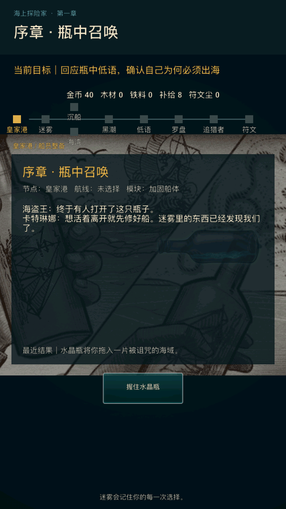
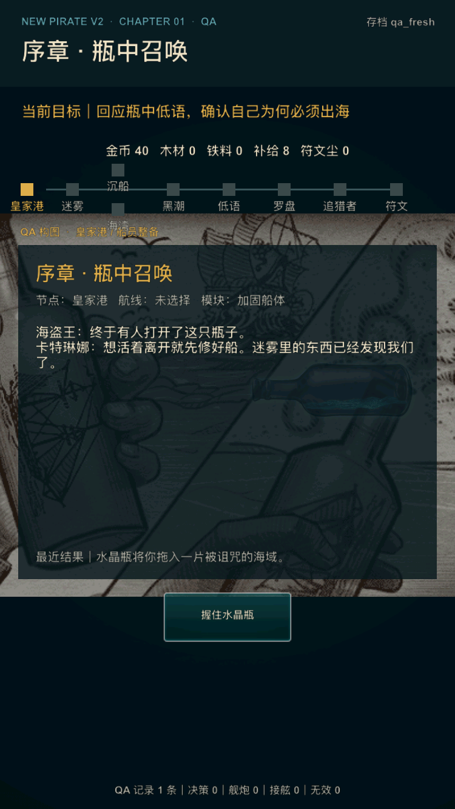

# V2 内部样片精修第 1 轮：玩家展示模式

日期：2026-07-16

## 1. 迭代目标

本轮把默认玩家档与内部 QA 档的展示职责分开。玩家看到产品名称、章节内容和世界观提示；测试人员仍可通过 `qa_*` 档位看到档位、构图与遥测诊断信息。

本轮只改变展示标识，不改变首章数值、事件、战斗、存档命名空间和 QA 快速入口。

## 2. 展示规则

| 区域 | 玩家档 `player` | QA 档 `qa_*` |
| --- | --- | --- |
| 顶部眉题 | `海上探险家 · 第一章` | `NEW PIRATE V2 · CHAPTER 01 · QA` |
| 存档档位 | 不显示内部档位名 | 显示当前 `qa_*` 档位 |
| 英雄图标签 | 只显示场景构图名 | 增加 `QA 构图` 前缀 |
| 底部信息 | 世界观提示 | 事件与战斗遥测计数 |
| 完成标题 | `第一章完成` | 与玩家使用相同章节标题，诊断信息继续显示在底部 |

展示模式由 `V2Config:isQAProfile` 统一判定，界面层不再自行解析档位前缀。这样后续新增玩家界面时可以复用同一条边界，避免把开发术语带入发行候选。

## 3. 自动验收

`tools/v2/validate_player_presentation.py` 检查：

- 玩家/QA 模式判定函数存在并有 Lua 单元断言；
- 玩家产品标题、章节完成标题和叙事提示存在；
- QA 标题、档位、构图标签与遥测仍然可用；
- `CONTENT SAMPLE`、`正式样片构图`、`V2 样片` 等旧内部标识不再存在于展示层；
- 该检查已接入 `tools/v2/validate_phase4.sh`，成为后续全量内部回归的一部分。

## 4. 验收标准

- `tools/v2/validate_phase4.sh` 全部通过；
- `./xcode.sh ios-sim` 构建通过；
- 全新安装、默认 `player` 档启动后，首屏没有 QA、档位或样片开发术语；
- 玩家首屏布局完整、按钮可见、进程稳定；
- 截图证据纳入本目录并在提交前人工复核。

满足以上条件后，本轮独立提交，再进入内部样片第 2 轮交互、文案与异常恢复精修。

## 5. 本轮验收结果

本轮验收结果：通过。

- 全量自动回归：`tools/v2/validate_phase4.sh` 通过，阶段 0–4、状态机、内容表、存档、战斗、遥测与外测分析器没有回归；
- 构建：`./xcode.sh ios-sim` 通过；
- 设备：iPhone SE（第 3 代），iOS 17.2，750×1334 px；
- 玩家路径：卸载旧包后全新安装，不注入环境档位，默认进入 `player`；首屏不显示 QA、存档档位或样片开发术语，唯一操作完整可见；
- QA 路径：同一构建以 `qa_fresh` 启动，顶部 QA 标识、档位、构图标签和底部遥测完整显示；截图后进程已连续存活 40 秒；
- 本轮没有新增 P0/P1 问题，不改变阶段 4 的外测 `HOLD` 结论。

### 玩家首屏

### QA 首屏

