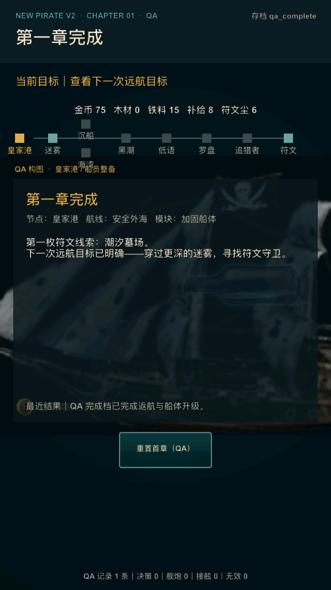

# V2 内部样片精修第 2 轮：交互文案与存档恢复

日期：2026-07-16

## 1. 迭代目标

本轮收口玩家可见的完成/重开文案，并强化损坏存档的恢复边界。目标是让首章从首次启动到结尾重开都保持产品表达，同时保证局部损坏的历史存档不会进入界面或战斗后才触发异常。

## 2. 玩家体验调整

- 完成页由“重玩首章（测试）”改为“再次体验第一章”；QA 档明确显示“重置首章（QA）”；
- 玩家重开后的最近结果改为世界观反馈，不再出现“测试进度”；
- 战斗英雄图说明由“双阶段战斗”改为“舰炮与接舷”；
- 失败后重试目标直接解释“先破坏甲板可削弱接舷敌军”，避免要求玩家“理解”内部机制；
- 新增 `qa_complete` 直达档，供每轮回归直接检查返航升级后的完成页，不改变默认玩家流程。

完整安全/风险路线、失败重试、返港恢复、返航升级和章节重开仍由纯 Lua 状态机测试逐步执行；QA 直达档只用于表现与布局复核。

## 3. 存档恢复修复

代码审计登记 P1 问题 `V2-010`：旧逻辑只验证 schema、chapter 和 stage。若顶层合法而 `resources`、`ship` 或 `battle` 被截断或写成错误类型，存档仍会被合并，之后可能在资源行、战斗行或行动结算中异常。

新恢复边界在接受存档前验证：

- 当前章节、阶段、地图节点、船只模块和需要路线的阶段关系；
- 资源、船只升级、舰炮与接舷的全部关键数值；
- flags、奖励、升级、历史等容器，以及回合/远航计数；
- 数值必须是有限数字，不能是字符串、NaN 或无穷值。

schema 3→4 的合法迁移继续保留；无存档的新玩家不会看到恢复提示。损坏或不兼容存档会回退到同档位的合法基线，并把“已安全创建新的首章航程”写入当前目标与最近结果，避免静默重置。

## 4. 自动与运行验收

自动注入并验证了以下情况：

- 错误 schema、非法 stage；
- `resources` 整体变为字符串；
- `ship.hull_level` 变为字符串且船只表缺字段；
- `battle.crew_hp` 变为字符串；
- 正常 schema 4 存档与 schema 3 存档均不产生误恢复提示；
- 玩家和 QA 完成页按钮文案分别符合展示模式。

运行验收使用 iPhone SE（第 3 代）/ iOS 17.2：

- `./xcode.sh ios-sim` 构建通过；
- `qa_complete` 首屏为 750×1334 px，章节结论、下一航程目标、资源、地图、最近结果和重置按钮均完整；
- 截图后进程复核时已持续存活 1 分 09 秒；
- Computer Use 因本机锁屏不可用，因此没有把 GUI 点击冒充运行证据；返航、升级、完成和重开转换由状态机完整路径回归证明。

## 5. 本轮结论

本轮验收结果：通过。

阶段 0–4 全量回归、专用精修验证、iOS 模拟器构建与完成页运行均通过；`V2-010` 已修复，未新增开放的内部 P0/P1。真实设备体验和两轮目标用户结果仍未完成，阶段 4 总体结论继续为 **外测 HOLD**。
