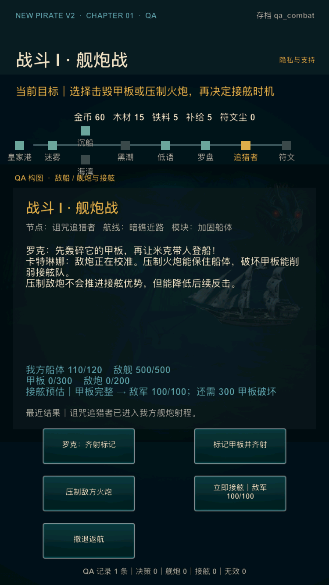
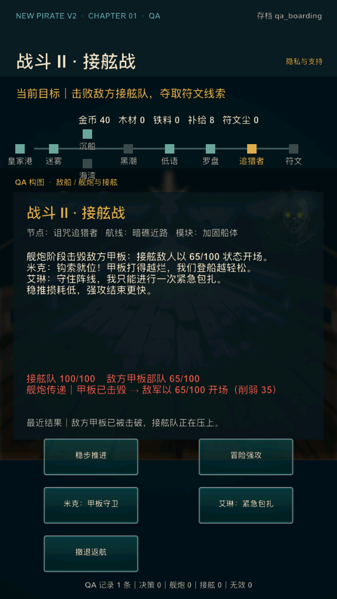

# V2 内部样片精修第 3 轮：战斗因果与成长回报

日期：2026-07-17

## 1. 迭代结论

本轮选择首章最关键的两处理解缺口进行精修：玩家在舰炮阶段是否能提前知道“现在接舷会面对什么”，以及完成升级后是否知道“下一航程具体获得了什么优势”。

本轮不扩建第二海域、不改变战斗数值、不调整存档 schema，也不把尚未制作的潮汐墓场伪装成可玩内容。它是一轮内部样片因果反馈修正，外部用户指标仍保持 `pending_external`。

内部审计问题登记为 `V2-033 / P2`：原界面虽然在说明文字和战斗复盘中描述了“破坏甲板会削弱接舷队”，但玩家作出接舷决定前看不到结果预估；完成页也只说明目标与升级已经完成，没有把数值收益和下一航程的用途建立直接联系。

## 2. 玩家体验调整

### 2.1 舰炮阶段：决策前显示接舷预估

战斗数值区新增由当前状态实时推导的反馈：

- 甲板完整：`接舷预估｜甲板完整 → 敌军 100/100；还需 N 甲板破坏`；
- 甲板已击毁：`接舷预估｜甲板已击毁 → 敌军 65/100（削弱 35）`；
- 接舷按钮同步显示预估敌军状态；取得优势后按钮明确改为“带着甲板优势接舷”。

这让玩家在按下接舷按钮前就能比较“立即登船”和“继续轰击甲板”的后果，而不是进入下一阶段后才阅读解释。

### 2.2 接舷阶段：确认预估与实际一致

进入接舷后，战斗数值区保留舰炮传递说明：

- 击毁甲板：明确显示敌军以 `65/100` 开场并被削弱 `35`；
- 未击毁甲板：明确显示敌军以 `100/100` 开场且“未削弱”。

预估和实际状态来自同一个纯 Lua 计算模型，界面不自行复制数值规则，避免后续调平衡时说明与实际战斗分叉。

### 2.3 完成阶段：说明升级如何影响下一航程

完成页根据玩家真实选择显示具体成长：

- 船体升级：`最大耐久 +20`、当前最大耐久，以及它对暗礁和敌炮容错的意义；
- 火炮升级：`单次齐射伤害 +25`、当前火炮等级，以及它对甲板破坏和接舷优势的意义；
- 两条路径都继续显示“前往潮汐墓场寻找符文守卫”，但不提供不可用的第二海域入口。

## 3. 工程边界

- `V2ChapterState.getCombatImpact` 是唯一的舰炮预估/接舷传递展示模型；
- `V2ChapterController` 只透传状态模型，`V2ChapterLayer` 只负责呈现文本；
- 现有 `boarding_wounded_hp=65`、甲板阈值 `300`、船体升级 `+20`、火炮升级 `+25` 均来自既有数据源；
- 没有新增持久化字段，schema 4 存档兼容性不变；
- 紧凑布局把三行战斗反馈纳入数值区边界测试，防止 iPad/短屏与“最近结果”重叠。

## 4. 自动验收

专项测试 `tools/v2/test_v2_internal_sample_3.lua` 覆盖：

1. 甲板完整时预估和实际接舷均为 `100/100`；
2. 两轮甲板齐射后预估和实际接舷均为 `65/100`；
3. 优势量明确为 `35`，剩余甲板阈值从 `300` 归零；
4. 接舷按钮随甲板状态改变文案和数值；
5. 船体升级完成页显示 `+20` 与当前最大耐久；
6. 火炮升级完成页显示 `+25` 与当前等级；
7. 紧凑布局为三行战斗反馈保留独立空间。

专项契约检查 `tools/v2/validate_internal_sample_3.py` 已接入 `tools/v2/validate_phase4.sh`，后续阶段 0–4 回归会持续执行本轮规则。

## 5. 本轮验收标准

- 专项 Lua 与 Python 检查通过；
- `tools/v2/validate_phase4.sh` 阶段 0–4 全量回归通过；
- `tools/release/validate_ios_release.sh` 发行静态/原生安全回归通过；
- Release iOS 模拟器构建、安装、`qa_combat` 启动和进程稳定性通过；
- Release device compile 与无签名 archive 内容检查通过；
- 小屏战斗画面中，战斗预估、最近结果和操作按钮无重叠；
- 本轮独立提交后再进入下一项内部样片迭代。

## 6. 验收结果

本轮验收结果：通过。

- 专项回归：`lua tools/v2/test_v2_internal_sample_3.lua` 与 `python3 tools/v2/validate_internal_sample_3.py` 通过；
- 阶段回归：`tools/v2/validate_phase4.sh` 通过阶段 0–4 完整链，双路线、战斗传递、失败恢复、存档兼容、布局和 33 项问题登记均无回归；
- 发行回归：`tools/release/validate_ios_release.sh` 通过，包括原生内存/文件安全、存档耐久、签名工具契约、商店素材和总体门禁测试；外部字段仍保持真实 pending；
- Release 模拟器构建：`CONFIGURATION=Release ./xcode.sh ios-sim` 通过；
- 小屏运行：iPhone SE（第 3 代）/ iOS 17.2，750×1334 px，全新安装后分别以 `qa_combat` 和 `qa_boarding` 启动；预估、实际传递、最近结果和五个操作均完整无重叠；
- 稳定性：`qa_combat` 截图后 PID 已持续运行 38 秒，`qa_boarding` 截图后 PID 已持续运行 23 秒；
- Release device compile：`CONFIGURATION=Release ./xcode.sh ios-device` 通过；
- Release archive：受限沙箱内首次因 `actool` 无法访问 simulator runtime 失败；允许访问本机 Xcode 服务后，以最终源码在 `NewPirate-internal-sample-3-final.xcarchive` 重跑成功，`validate_ios_archive.py` 通过。该环境重试没有改动产品代码；
- 遗留 OpenGLES 和旧静态图库 platform metadata 警告与 `V2-005` 的既有结论一致，本轮没有新增 P0/P1。

### 舰炮阶段：甲板完整预估

### 接舷阶段：甲板击毁传递

本轮独立提交后可进入下一项内部样片迭代。阶段 4 的真实目标用户结论继续保持 **外测 HOLD**，不以本轮内部验收替代。
