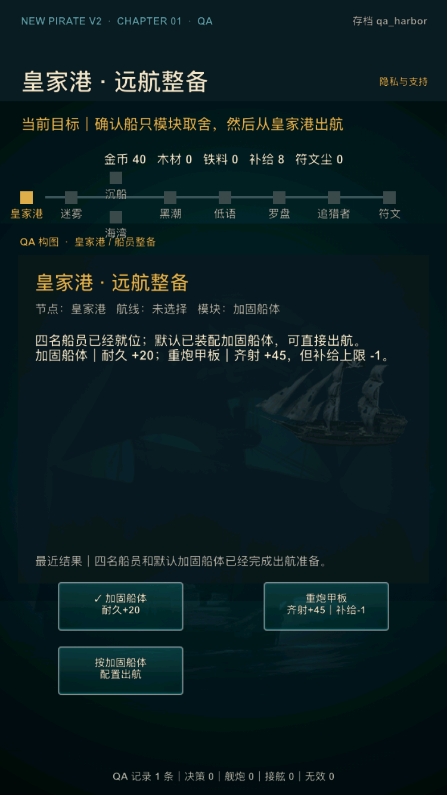
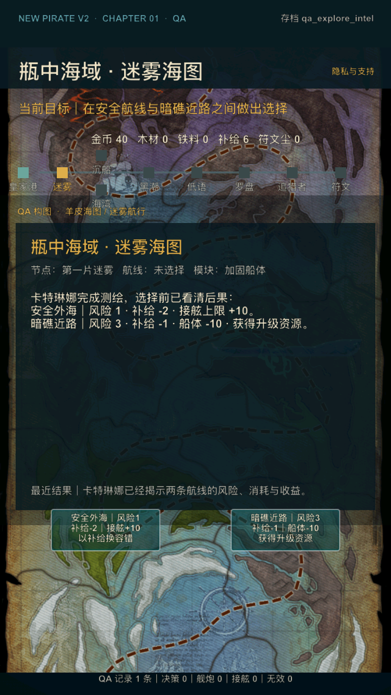

# V2 内部样片精修第 4 轮：首航决策预览

日期：2026-07-17

## 1. 迭代目标

本轮处理首航前两次核心选择的信息阻力：玩家在皇家港选择船只模块时，能否直接知道两个模块怎样改变本次出航；玩家第一次进入迷雾海图时，能否区分“盲选方向”和“花费情报成本后做有依据的选择”。

内部审计登记 `V2-034 / P2`：原流程已经可直接出航，也有数据完整的模块与航线取舍，但按钮主要显示名称、风险和补给，具体收益分散在叙事段落、数据表与选择结果中。首次玩家需要先理解界面术语，再自行拼出后果，增加了首航前 60 秒的认知负担。

本轮不扩建第二海域、不改变模块/路线数值、不新增玩家步骤，也不把内部可读性回归当作真实目标用户证据。

## 2. 玩家体验调整

### 2.1 皇家港：模块选择前看到完整取舍

- 默认加固船体仍已选中，说明明确写出“可直接出航”；
- 加固船体按钮分两行显示名称与 `耐久+20`；
- 重炮甲板按钮分两行显示名称与 `齐射+45｜补给-1`；
- 出航按钮随当前选择变化为“按加固船体配置出航”或“按重炮甲板配置出航”；
- 玩家更换模块后，勾选状态和出航确认同步更新。

这些数值直接读取既有 `ship_module` 数据，不在界面层复制常量。

### 2.2 迷雾海图：先区分盲选与测绘

未测绘时：

- 两个方向明确标为“盲选 A / B”，避免把未知按钮误认为已经具备情报的路线决策；
- 测绘按钮改为“先测绘｜花 1 补给查看后果”；
- 说明明确：玩家可以盲选，也可以为看清风险与后果支付情报成本。

测绘完成后：

| 航线 | 按钮与说明中的决策预览 |
| --- | --- |
| 安全外海 | 风险 1、补给 -2、接舷上限 +10 |
| 暗礁近路 | 风险 3、补给 -1、船体 -10、获得升级资源/战利品 |

测绘仍消耗 1 补给，玩家仍可选择不测绘；本轮只让“未知”和“已知”的界面状态更诚实。

## 3. QA 与工程边界

- 新增 `qa_harbor`，直达默认加固船体的皇家港整备；
- 新增 `qa_explore_intel`，直达已扣除测绘成本、两条航线后果已揭示的迷雾海图；
- 两个 QA 档使用独立 scoped save，不改变默认 `player`、`qa_fresh` 或其他测试档；
- 没有新增持久化字段，schema 4 兼容边界不变；
- 模块与路线后果继续来自 `ship_module.csv` 和 `route.csv` 的运行时导出。
- 操作按钮按最长单行而不是整段 UTF-8 字节数决定紧凑字号，并扩大按钮内可用文本宽度；航线使用人工语义换行，避免成本数字被单独挤到下一行。

## 4. 自动验收

`tools/v2/test_v2_internal_sample_4.lua` 覆盖：

1. 皇家港默认配置、可直接出航和当前选中状态；
2. 模块按钮的 `+20`、`+45`、`-1` 与出航按钮同步；
3. 未测绘航线的盲选标识与测绘成本；
4. 测绘后两条路线的风险、资源成本、战斗容错和升级收益；
5. `qa_explore_intel` 已扣除 1 补给且不会重复提供测绘；
6. 原有双路线结果、资源扣除和战斗流程继续由阶段 1–4 回归覆盖。

`tools/v2/validate_internal_sample_4.py` 检查 QA 档、状态文案、行为测试、问题登记和文档契约，并已接入 `tools/v2/validate_phase4.sh`。

## 5. 本轮验收标准

- 第 4 轮 Lua/Python 专项检查通过；
- 阶段 0–4 与发行级全量回归通过；
- Release iOS 模拟器、device compile 和无签名 archive 通过；
- iPhone SE 3 的港口三按钮与已测绘海图两按钮无裁切、重叠；
- `qa_harbor` 和 `qa_explore_intel` 截图后进程稳定；
- 本轮独立提交后再进入下一项内部样片迭代。

## 6. 验收结果

本轮验收结果：通过。

- 专项回归：`lua tools/v2/test_v2_internal_sample_4.lua` 与 `python3 tools/v2/validate_internal_sample_4.py` 通过；
- 阶段回归：`tools/v2/validate_phase4.sh` 通过阶段 0–4 完整链，模块、双路线、资源扣除、战斗、失败恢复、存档与布局均无回归；
- 发行回归：`tools/release/validate_ios_release.sh` 通过；外测、真机和 App Store 外部字段继续保持真实 pending；
- Release 模拟器：`CONFIGURATION=Release ./xcode.sh ios-sim` 构建通过；
- 小屏运行：iPhone SE（第 3 代）/ iOS 17.2，750×1334 px，全新安装后分别以 `qa_harbor` 和 `qa_explore_intel` 启动；港口三按钮、海图两按钮、最近结果与页脚无裁切或重叠；
- 运行稳定：最终港口画面截图后 PID 持续运行 25 秒，已测绘海图截图后 PID 持续运行 26 秒；
- 视觉回归过程：首次港口截图暴露中文多行标签按整段 UTF-8 字节数缩小、重炮成本被错误断行；本轮内改为最长单行计数、144 pt 文本宽度和语义换行，最终截图复验通过；
- Release device compile：`CONFIGURATION=Release ./xcode.sh ios-device` 通过；
- Release archive：最终源码生成 `NewPirate-internal-sample-4-final.xcarchive`，`validate_ios_archive.py` 通过；
- 本轮没有新增 P0/P1，`V2-034` 已按内部可验证范围关闭。

### 皇家港：模块后果与当前配置

### 迷雾海图：测绘后的路线后果

本轮独立提交后可继续下一项内部样片迭代；真实目标用户是否更快出航，仍需后续外测验证，阶段 4 外部结论保持 **HOLD**。
