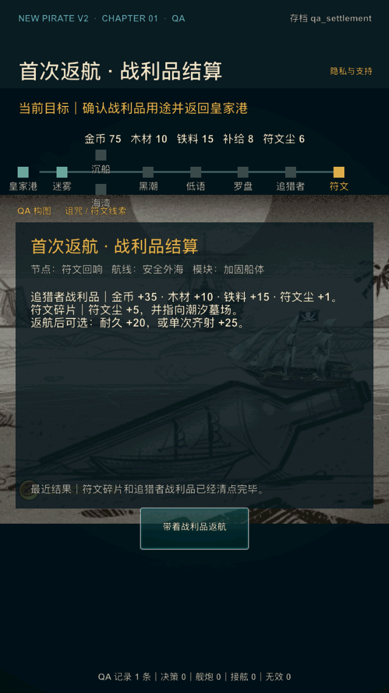
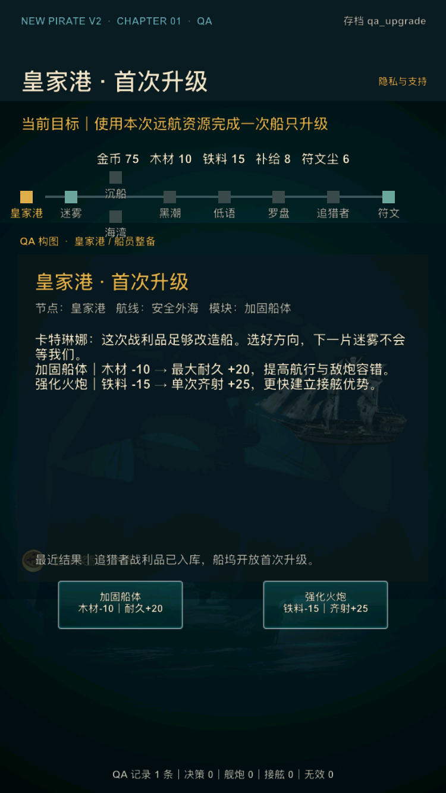

# V2 内部样片精修第 5 轮：战利品到成长的转化

日期：2026-07-17

## 1. 迭代目标

本轮收口首章后半段的成长闭环：玩家取得符文并返回皇家港时，先知道本次具体获得了什么，再在支付升级资源前看清两种成长的成本、数值收益和下一航程用途。

内部审计登记 `V2-035 / P2`：结算页原先只说“战利品已经装船”，升级按钮只显示需要 10 木材或 15 铁料；船体 `+20` 和齐射 `+25` 要到完成页才明确。资源系统可运行，但“战斗奖励 → 升级选择 → 下次优势”的因果链出现得太晚。

本轮不扩建第二海域、不改变任何奖励/升级数值、不增加新的长期经济，也不以内部回归替代真实玩家的继续意愿数据。

## 2. 玩家体验调整

### 2.1 战利品结算：区分两类收获

结算页按既有奖励源表逐项展示：

- 追猎者战利品：金币 +35、木材 +10、铁料 +15、符文尘 +1；
- 第一枚符文线索：符文尘 +5，并指向潮汐墓场；
- 返航升级预告：本次资源可换取耐久 +20，或单次齐射 +25。

玩家资源栏中的最终总数保持不变；结算文本解释的是本次增量和用途。

### 2.2 首次升级：支付前展示完整转化

升级页和按钮同时展示：

| 选择 | 成本 | 立即收益 | 下一航程意义 |
| --- | ---: | ---: | --- |
| 加固船体 | 木材 -10 | 耐久+20 | 提高航行与敌炮容错 |
| 强化火炮 | 铁料 -15 | 齐射+25 | 更快击毁甲板并建立接舷优势 |

两个按钮使用人工两行结构，延续第 4 轮的多行按钮可读性规则。选择后仍进入既有完成页，由第 3 轮成长反馈再次确认结果。

## 3. QA 与工程边界

- 新增 `qa_upgrade`，直达已返港、奖励已入库且尚未支付升级资源的选择页；
- 既有 `qa_settlement` 继续用于结算页；
- 两个 QA 档使用真实 `reward_battle`、`reward_rune_clue` 和 balance 数据；
- 没有新增持久化字段，schema 4 不变；
- 默认玩家流程仍必须依次完成符文领取、结算、返港、升级和完成。

## 4. 自动验收

`tools/v2/test_v2_internal_sample_5.lua` 覆盖：

1. 结算资源总数与两份奖励的增量拆解一致；
2. 符文尘 `+1/+5` 的来源和潮汐墓场用途可见；
3. 两个升级按钮在支付前显示完整成本和收益；
4. `qa_upgrade` 拥有恰好支持两种选择的 10 木材与 15 铁料；
5. 船体选择实际扣到 0 木材并得到 140 最大耐久；
6. 火炮选择实际扣到 0 铁料、升到 1 级，完成页继续显示单次齐射伤害 +25。

`tools/v2/validate_internal_sample_5.py` 检查 QA 档、状态文案、行为测试、问题登记和文档契约，并已接入 `tools/v2/validate_phase4.sh`。

## 5. 本轮验收标准

- 第 5 轮 Lua/Python 专项检查通过；
- 阶段 0–4 与发行级回归通过；
- Release iOS 模拟器、device compile 和无签名 archive 通过；
- iPhone SE 3 的结算与升级页面信息、按钮、最近结果和页脚无裁切/重叠；
- 两个 QA 档截图后进程稳定；
- 本轮独立提交后再进入下一项内部样片迭代。

## 6. 验收结果

本轮验收结果：通过。

- 专项回归：`lua tools/v2/test_v2_internal_sample_5.lua` 与 `python3 tools/v2/validate_internal_sample_5.py` 通过；
- 阶段回归：`tools/v2/validate_phase4.sh` 通过阶段 0–4 完整链，结算、两类升级、两条航线、战斗、失败恢复、存档与布局均无回归；
- 发行回归：`tools/release/validate_ios_release.sh` 通过；外部证据继续保持 pending；
- Release 模拟器：`CONFIGURATION=Release ./xcode.sh ios-sim` 构建通过；
- 小屏运行：iPhone SE（第 3 代）/ iOS 17.2，750×1334 px，全新安装后分别以 `qa_settlement` 和 `qa_upgrade` 启动；三行奖励拆解、升级说明、两按钮、最近结果和页脚完整无重叠；
- 运行稳定：结算页截图后 PID 持续运行 30 秒，升级页截图后 PID 持续运行 28 秒；
- Release device compile：`CONFIGURATION=Release ./xcode.sh ios-device` 通过；
- Release archive：最终源码生成 `NewPirate-internal-sample-5-final.xcarchive`，`validate_ios_archive.py` 通过；
- 本轮没有新增 P0/P1，`V2-035` 已按内部可验证范围关闭。

### 首次返航：战利品拆解

### 皇家港：升级成本与收益

本轮独立提交后可继续下一项内部样片迭代；第二次远航真实意愿仍需后续外测，阶段 4 外部结论保持 **HOLD**。
