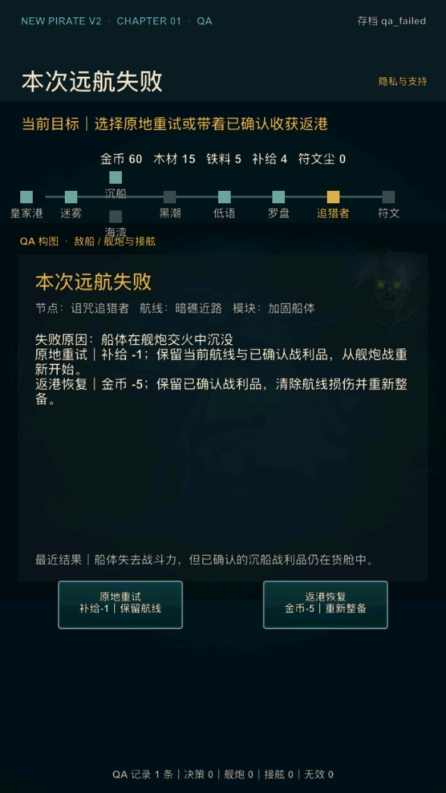

# V2 内部样片精修第 6 轮：失败恢复决策

日期：2026-07-17

## 1. 迭代目标

本轮收口首章失败后的恢复体验：玩家在船体沉没、接舷失败或主动撤退后，不必猜测“重试会不会丢路线”“返港会不会吞战利品”，而是在做决定前直接看到两条路径的成本、保留项、重置项和返回阶段。

内部审计登记 `V2-036 / P2`：既有失败页说明了原地重试消耗 1 补给、返港恢复消耗 5 金币，但没有明确两条路径分别保留什么、清除什么。状态机实际支持安全恢复，玩家界面却不足以建立信任。

本轮不扩建第二海域、不改变战斗数值与恢复成本、不调整存档 schema，也不把内部状态机回归当成真实玩家挫败感结论。

## 2. 玩家体验调整

### 2.1 原地重试：继续当前远航

失败页在决策前明确：

- 成本：补给 -1；
- 保留：当前航线、航线损伤上下文、已确认战利品，也就是保留当前航线进度；
- 重置：舰炮战中的船体、敌船和部位战斗状态；
- 返回：从舰炮战重新开始。

按钮使用两行预览：`原地重试 / 补给-1｜保留航线`。补给不足时不修改失败状态，并引导玩家选择返港恢复。

### 2.2 返港恢复：止损并重新整备

失败页同时明确：

- 成本：金币 -5；
- 保留：此前已经确认入货舱的战利品及对应领取状态；
- 清除：本次航线、航线情报和航线损伤；
- 返回：皇家港整备阶段。

按钮使用两行预览：`返港恢复 / 金币-5｜重新整备`。返港会清除航线损伤、保留已确认战利品，是放弃当前航线进度，不是回滚已经确认的收获。

## 3. QA 与工程边界

- 新增 `qa_failed`，直达风险航线舰炮失败页；
- QA 档预置已确认沉船战利品和 10 点航线损伤，用于验证保留/清除边界；
- 恢复成本继续读取既有 balance 数据，页面没有复制一套独立数值；
- 原地重试和返港恢复沿用既有状态机动作，没有新增持久化字段，schema 4 不变；
- 默认玩家流程的三种失败来源仍进入同一恢复页。

## 4. 自动验收

`tools/v2/test_v2_internal_sample_6.lua` 覆盖：

1. 失败页和两个按钮在选择前显示成本与关键保留项；
2. 原地重试只扣 1 补给，保留金币、木材、铁料、符文尘、风险航线、10 点航线损伤和已领取奖励；
3. 原地重试回到舰炮战，并重置即时战斗状态；
4. 返港恢复只扣 5 金币，保留剩余补给、木材、铁料、符文尘和已领取奖励；
5. 返港恢复清除路线与 10 点航线损伤，回到皇家港；
6. 补给不足的原地重试被拒绝，失败页状态不被部分修改。

`tools/v2/validate_internal_sample_6.py` 检查 QA 档、界面契约、行为测试、问题登记、验收文档和 750×1334 小屏实图，并已接入 `tools/v2/validate_phase4.sh`。

## 5. 本轮验收标准

- 第 6 轮 Lua/Python 专项检查通过；
- 阶段 0–4 与发行级回归通过；
- Release iOS 模拟器、device compile 和无签名 archive 通过；
- iPhone SE 3 失败页面的原因、两条恢复说明、按钮、最近结果和页脚无裁切/重叠；
- 截图后进程持续稳定；
- 本轮独立提交后，再评估内部样片是否达到冻结门槛。

## 6. 验收结果

本轮验收结果：通过。

- 专项回归：`lua tools/v2/test_v2_internal_sample_6.lua` 与 `python3 tools/v2/validate_internal_sample_6.py` 通过；
- 阶段回归：`tools/v2/validate_phase4.sh` 通过阶段 0–4 完整链；
- 发行回归：`tools/release/validate_ios_release.sh` 通过；外部证据继续保持 pending；
- Release 模拟器：`CONFIGURATION=Release ./xcode.sh ios-sim` 构建通过；
- 小屏运行：iPhone SE（第 3 代）/ iOS 17.2，750×1334 px，全新安装后以 `qa_failed` 启动；失败原因、两条恢复后果、两按钮、最近结果和页脚完整无重叠；
- 运行稳定：失败页截图后进程持续运行至 56 秒，PID 状态为 `Rs`；
- Release device compile：`CONFIGURATION=Release ./xcode.sh ios-device` 通过；
- Release archive：最终源码生成 `NewPirate-internal-sample-6-final.xcarchive`，`validate_ios_archive.py` 通过；
- 本轮没有新增 P0/P1，`V2-036` 已按内部可验证范围关闭。

### 失败页：成本、保留项与恢复去向

本轮独立提交后进入内部样片冻结审计；恢复选择的真实理解率与挫败感仍需后续外测，阶段 4 外部结论保持 **HOLD**。
