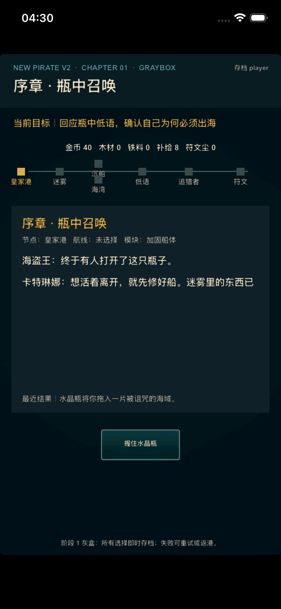
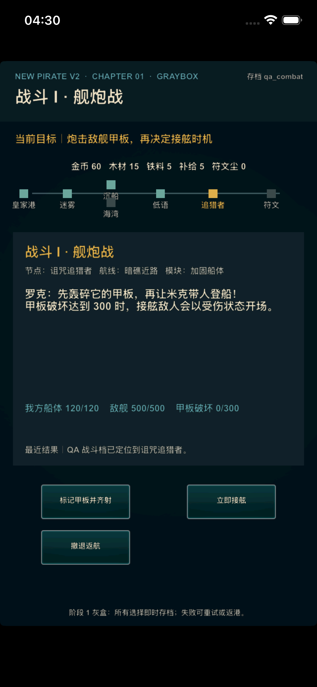

# V2 阶段 1：首章可玩灰盒

> 状态：已实现，等待阶段提交
>
> 章节：皇家港与瓶中海域
>
> 目标体验：15～20 分钟首航闭环

## 1. 本阶段落地结果

阶段 1 已将阶段 0 的策划源表接入实际运行时，并以一套可即时存档的章节状态机
跑通以下完整闭环：

```text
瓶中召唤
  → 皇家港整备
  → 选择安全航线或暗礁近路
  → 海湾休整或沉船搜索
  → 回应海盗王低语
  → 舰炮战
  → 接舷战
  → 取得第一枚符文线索
  → 返航结算
  → 船体或火炮升级
  → 获得下一次远航目标
```

新档启动后直接进入 V2 开场，不再依赖旧联网更新、旧七屏剧情或旧大厅菜单才能
理解目标。旧剧情代码仍保留在历史模式中。

## 2. 运行时结构

### 2.1 数据导出

`design/v2/data/*.csv` 继续是唯一明文策划源。执行：

```bash
python3 tools/v2/export_runtime.py
```

会生成 `V2ChapterData.lua`。验证流程使用 `--check` 检查导出结果是否过期，禁止
直接手改生成文件。

### 2.2 章节状态机

`V2ChapterState.lua` 不依赖 Cocos，负责：

- 当前章节阶段、节点、目标和最近结果；
- 五种资源、四名基础船员和两种船只模块；
- 安全与风险两条航线；
- 舰炮甲板破坏与接舷开场状态传递；
- 胜利、撤退、战败、重试和返港恢复；
- 符文奖励、战利品结算和两种首次升级；
- 明确的下一次远航目标。

当前唯一战斗传递规则为：甲板破坏达到 300 后接舷，敌方接舷队从
`65/100` 状态开场；提前接舷则从 `100/100` 开场。

### 2.3 存档控制

`V2ChapterController.lua` 在每个有效操作后保存完整章节状态。存档继续使用阶段 0
命名空间，因此正式玩家档与 QA 档互不覆盖。非法或不兼容存档会回退到对应档位
的安全初始状态。

### 2.4 灰盒表现层

`V2ChapterLayer.lua` 已成为 V2 主入口，统一显示：

- 当前阶段与单一目标；
- 五种资源；
- 七节点海图与当前位置；
- 航线和船只模块；
- 舰炮、甲板破坏与接舷状态；
- 最近一次操作结果；
- 当前可执行操作。

旧金币栏、钻石栏、底部七按钮和旧随机事件覆盖层在 V2 入口中隐藏，玩家不会
误入仓库、商城、竞技场或其他首章外系统。

## 3. QA 档位

| 档位 | 入口 | 用途 |
|---|---|---|
| `player` / `qa_fresh` | 瓶中召唤 | 验证新档完整流程 |
| `qa_explore` | 第一片迷雾 | 快速验证路线选择与节点表现 |
| `qa_combat` | 诅咒追猎者舰炮战 | 快速验证双阶段战斗与失败恢复 |

模拟器可用环境变量选择隔离档位：

```bash
SIMCTL_CHILD_NEWPIRATE_V2_PROFILE=qa_combat \
  xcrun simctl launch <device> com.fancyGame.NewPirate
```

## 4. 灰盒截图

新档第一目标：



QA 舰炮战入口：



## 5. 阶段 2 接手边界

阶段 1 证明的是完整闭环和可恢复性，不代表探索与战斗已经达到正式深度。
阶段 2 应在现有状态机上继续处理：

- 让航线情报、补给和奖励形成更真实的取舍；
- 让航海士能力实际改变迷雾信息；
- 增强舰炮目标、接舷时机、技能和状态反馈；
- 将当前基础数值全部下沉到源表；
- 增加可解释的受损、维修、撤退代价和战后复盘；
- 保持全部流程仍可由纯 Lua 测试覆盖。
