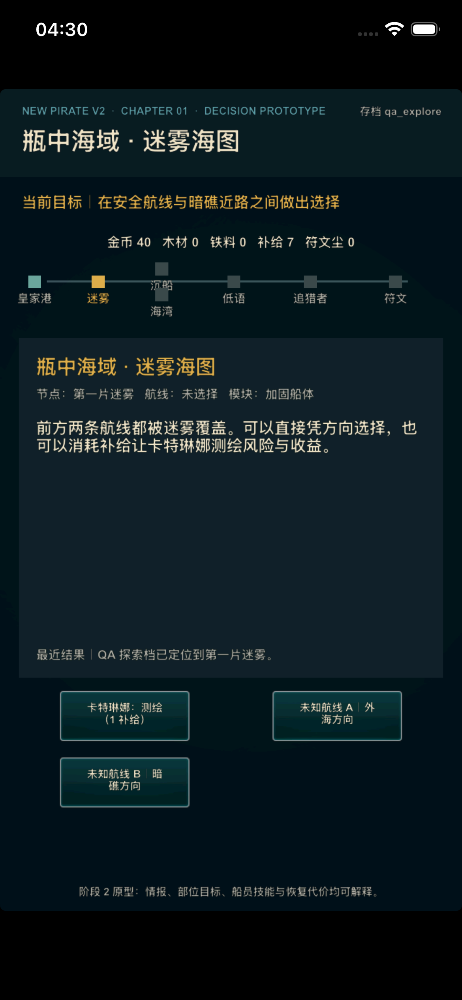
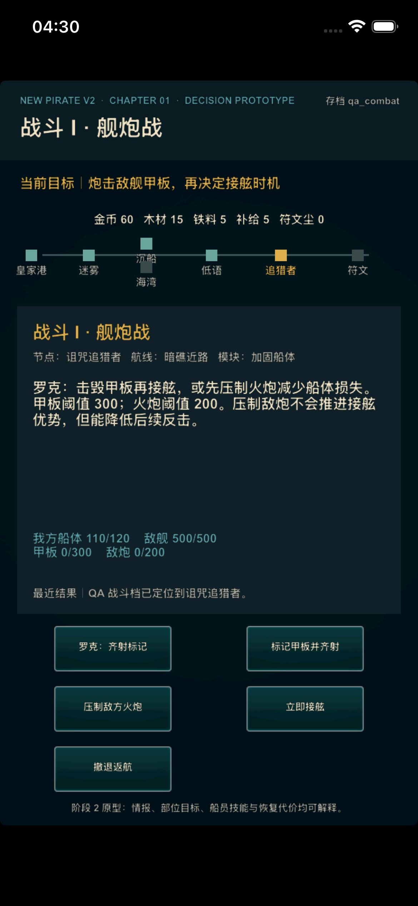

# V2 阶段 2：探索与双阶段战斗重做

> 状态：已实现
>
> 设计目标：让路线、部位目标、接舷时机和恢复产生可解释的取舍

## 1. 阶段结论

阶段 1 解决了“首章能否完整跑通”，阶段 2 解决“玩家为什么要这样选”。
现有首章已经形成三层决策：

```text
探索前
  船体容错 vs 舰炮效率与补给容量

迷雾中
  直接选择未知方向
  vs 消耗补给让航海士揭示风险与收益

战斗中
  击毁甲板获得接舷优势
  vs 压制火炮降低船体损耗
  → 选择接舷时机
  → 稳步推进 / 冒险强攻 / 船员技能
```

每次胜利会生成包含航线风险、舰炮与接舷行动数、甲板/敌炮状态、剩余船员
状态和主要胜因的战斗复盘。每次失败会同时显示原因、原地重试成本和返港恢复
成本。

## 2. 探索决策

### 2.1 航海士情报

第一片迷雾默认只显示“外海方向”和“暗礁方向”。玩家可以：

- 直接选择，节省 1 份补给但承担信息不足；
- 使用卡特琳娜的“测绘迷雾”，消耗 1 份补给，揭示两条路线的风险、补给
  成本、受损与奖励信息。

该能力不是装饰性被动：它改变玩家做路线决策时能看到的信息质量。

### 2.2 路线取舍

| 航线 | 风险 | 成本与损失 | 收益 | 后续影响 |
|---|---:|---|---|---|
| 外海安全航线 | 1 | 2 补给 | 避风休整 | 接舷队状态上限 +10 |
| 暗礁高风险近路 | 3 | 1 补给、船体预损 10 | 沉船战利品 | 更早取得升级资源，但以较低船体进入战斗 |

重炮甲板额外提供舰炮部位破坏，但补给容量减少 1；加固船体增加 20 船体耐久。
因此整备、情报和路线不再是互不相关的按钮。

## 3. 舰炮战

### 3.1 两种部位目标

| 目标 | 主要效果 | 代价 |
|---|---|---|
| 甲板 | 累计 300 破坏后，敌方接舷状态降为 65/100 | 持续承受完整敌炮反击 |
| 火炮 | 累计 200 破坏后，后续敌方反击降低 8 | 不推进接舷优势 |

玩家可以随时提前接舷。界面同时显示敌舰耐久、甲板破坏、敌炮压制和我方
船体，使接舷时机有可观察依据。

### 3.2 船员与状态

- 罗克“齐射标记”：本场一次，使下一次甲板齐射额外增加 80 破坏；
- 米克“甲板守卫”：本场一次，使下一次接舷反击伤害归零；
- 艾琳“紧急包扎”：本场一次，恢复接舷队 28 状态；
- 卡特琳娜“测绘迷雾”：在战前改变路线情报质量。

所有一次性技能使用后从当前动作列表移除，避免按钮仍可点但结果无效。

## 4. 接舷与结果解释

接舷阶段提供：

- 稳步推进：30 伤害、18 反击；
- 冒险强攻：42 伤害、34 反击；
- 水手守卫和医师包扎；
- 主动撤退。

甲板是否击毁会直接写入接舷开场文案和战后复盘。胜利不只显示“成功”，还说明
主要胜因是舰炮优势传递，还是船员在完整敌阵下取胜。

## 5. 失败、撤退与恢复

| 处理 | 成本 | 结果 |
|---|---:|---|
| 原地重试 | 1 补给 | 回到舰炮战开始，保留本次路线背景 |
| 返回皇家港 | 5 金币 | 清除航线受损，恢复船只和船员，重新整备 |

资源不足时操作会被拒绝并说明原因。恢复不再是无反馈的免费重置。

## 6. 数据驱动边界

阶段 2 新增：

- `route.csv`：路线成本、风险、收益、受损和情报文本；
- `balance.csv`：17 个经济、探索、舰炮、接舷、恢复和升级参数；
- `battle_action.csv`：7 个舰炮/接舷动作及其伤害与反击；
- `crew.csv` 的运行时主动动作映射；
- `ship_module.csv` 的定量船体、舰炮和补给修正。

当前共 14 张 V2 源表、72 条记录。核心数值通过源表调整，不在状态机中散改。
由于状态结构和数值来源发生变化，V2 存档 schema 已升至 2；旧灰盒档会安全回退
到对应测试档位的初始状态。

## 7. 运行截图

迷雾未测绘时的路线选择：



舰炮战部位目标与五个动作：



## 8. 阶段 3 接手边界

阶段 2 已经建立可解释决策，但仍使用工程灰盒表现。阶段 3 应保持现有数据和状态
规则，重点替换四个英雄画面、补足 6～8 个事件、对白、敌船/敌人表现、关键动画
与获批音效，不再改变首章主循环。
