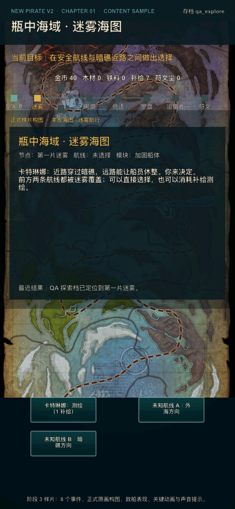
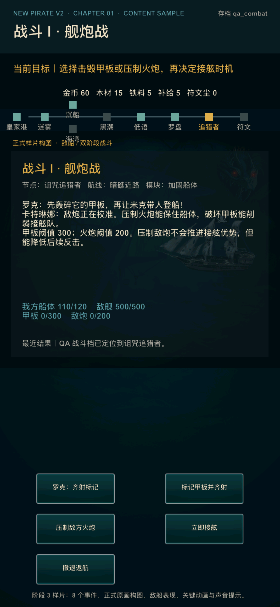
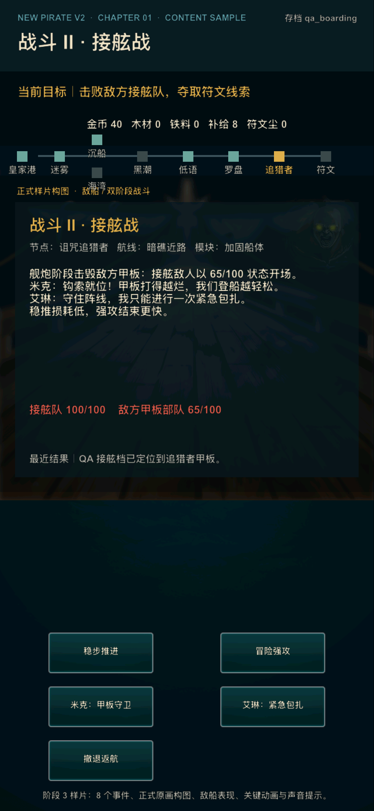
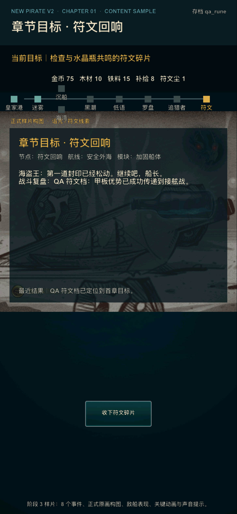

# V2 阶段 3：内容与美术样片

更新时间：2026-07-16

## 1. 阶段目标

阶段 3 将阶段 2 的可解释决策原型提升为可以代表正式产品方向的首章样片。本阶段不扩建长期系统，不新开海域，而是集中解决四件事：

1. 让探索、舰炮、接舷和符文四类画面在缩略图中也能一眼区分；
2. 把第一章从四个功能事件扩展为八个有角色、有代价、有后果的事件；
3. 将对白、美术、音效和动画做成可替换的源表，而不是散落在界面代码中；
4. 继续复用项目已确认的原始美术和声音资源，不以临时生成图冒充正式资源。

阶段 3 当前数据规模为 16 张源表、124 条记录，其中包括 8 个事件、13 个事件选择、18 条剧情/航行对白、14 个阶段表现映射和 6 个音效 cue。

## 2. 美术来源与使用原则

本轮先核对了 `/Users/lizi/Desktop/Pirate` 中的原策划与美术目录，再以已经进入运行包的 `bin/res/assets` 为正式运行来源。两处内容能够互相追溯，运行时不依赖桌面外部目录。

采用的核心资源包括：

- `Images/Plot/juqing_1.png`～`juqing_9.png`：瓶中海域、诅咒、漂流瓶、船只和剧情构图；
- `Images/Map/WorldMap/worldMapMid.png`：羊皮海图主视觉；
- `Images/Background/yuanz.png`：风暴海面与敌船气氛；
- `Images/Fight/chuan_01.png`：接舷甲板透视；
- `Images/Boss/g_300.png`、`g_319.png`：诅咒生物与接舷首领头像；
- `Images/UI/CoinBg.png`：章节奖励动效图标；
- `music/*.mp3`：原项目已使用并有语义注释的航行、炮击、物理攻击、奖励、魔法和沉船声音。

阶段 3 没有新增生成式占位图。源表校验会拒绝路径中带有 `generated` 或 `placeholder` 的表现资源。

## 3. 第一章八事件结构

| 顺序 | 事件 | 玩家决策 | 可见后果 |
| --- | --- | --- | --- |
| 1 | 暗礁间的航线 | 安全外海 / 暗礁近路 | 补给、风险、船体和战利品不同 |
| 2A | 避风休整 | 靠岸休整 / 不停船通过 | 接舷容错或航行节奏 |
| 2B | 沉船幸存者 | 先救人 / 先搜货舱 | 船员信任和小奖励，或完整沉船战利品 |
| 3 | 黑潮来袭 | 固定货舱 / 迎浪穿越 | 消耗 1 补给，或承受 8 船体损伤 |
| 4 | 瓶中低语 | 拒绝 / 借用力量 | 稳定船员，或强化首次炮击并留下诅咒 |
| 5 | 诅咒罗盘 | 利用 / 砸碎 | 敌舰开场损失 50，或接舷状态上限增加 10 |
| 6 | 追猎者拦截 | 甲板、火炮、接舷时机 | 舰炮结果传递到接舷开场 |
| 7 | 符文回响 | 收下碎片 | 记录潮汐墓场目标并进入返航结算 |

表中 2A 与 2B 是互斥航线事件，因此总内容量为八个事件，每次单局会经历其中七个。所有事件定义位于：

- `design/v2/data/event.csv`
- `design/v2/data/event_choice.csv`
- `design/v2/data/map_node.csv`
- `design/v2/data/map_edge.csv`

事件选择通过 `action_id` 映射到状态机，按钮名称、结果文案、奖励和标志位仍以 CSV 为准。

## 4. 剧情与航行对白

18 条对白覆盖以下触发点：

- 首章开场；
- 海图节点进入；
- 事件选择提示与选择结果；
- 舰炮开场与目标提示；
- 接舷开场与船员技能提示；
- 符文获得；
- 返港升级。

角色分工保持清晰：

- 海盗王负责诱惑、诅咒和符文主线；
- 卡特琳娜负责航线、风险和下一步目标；
- 罗克负责舰炮目标与即时战斗判断；
- 米克负责救援、登船和甲板阵线；
- 艾琳负责风险提醒、休整和恢复边界。

运行时通过节点和触发类型从 `dialogue.csv` 组合对白；数值解释仍由状态机根据 `balance.csv` 生成，避免文案和实际规则不一致。

## 5. 四类英雄画面

表现源表 `presentation.csv` 用 `hero_group` 将所有阶段归入四类英雄构图：

| 英雄画面 | 代表阶段 | 画面识别点 | 主要资源 |
| --- | --- | --- | --- |
| 皇家港 / 整备 | 开场、港口、升级、完成 | 船只、漂流瓶、暖金奖励 | `fm_01`、`juqing_6/7/9` |
| 羊皮海图 / 航行 | 航线、据点、黑潮 | 羊皮路线、节点轨迹、海浪 | `worldMapMid`、`yuanz`、`juqing_8` |
| 敌船 / 双阶段战斗 | 舰炮、接舷、失败 | 风暴敌船、甲板透视、敌人头像 | `yuanz`、`chuan_01`、`g_300/319` |
| 诅咒 / 符文 | 低语、罗盘、符文、结算 | 漂流瓶、封印、紫色诅咒生物 | `juqing_2/3/4/5/7`、`g_300` |

同一层级保留当前目标、资源、航线节点、叙事、战斗状态和操作按钮，背景原画承担氛围与场景识别，不承担规则说明。

### 5.1 海图



### 5.2 舰炮



### 5.3 接舷



### 5.4 符文



## 6. 敌船、接舷敌人和首领表现

首章继续使用一套集中打磨的敌人，而不是扩充敌人数量：

- 舰炮阶段：风暴海面、黑帆敌船、诅咒生物头像；
- 接舷阶段：第一人称甲板透视、黄色眼睛的接舷首领头像；
- 规则传递：甲板被击毁时，接舷敌人以 `65/100` 状态开场；未击毁则为完整状态；
- 战后表现：符文画面显示漂流瓶和封印，战斗复盘解释胜因。

该设计优先证明“舰炮结果会改变接舷”，后续海域可替换敌船、首领和部位参数，不需要改界面结构。

## 7. 音效架构

| Cue | 文件 | 触发点 |
| --- | --- | --- |
| `wave` | `music/walk.mp3` | 出航、航线推进、黑潮通过 |
| `cannon` | `music/paoji.mp3` | 舰炮攻击 |
| `boarding` | `music/attack.mp3` | 开始接舷 |
| `victory` | `music/gold.mp3` | 战斗胜利与奖励 |
| `curse` | `music/magic.mp3` | 低语、罗盘、符文选择 |
| `sinking` | `music/chenchuan.mp3` | 远航失败 |

阶段 3 实测发现旧 CocosDenshion/OpenAL 后端在 iOS 26 模拟器播放单次音效后会终止进程，因此 V2 不再调用 `AudioEngine.playEffect`。新实现通过 Lua 绑定调用 `CppOCBridge::playV2Sound`，由 AVFoundation 的 `AVAudioSession` 和 `AVAudioPlayer` 播放短音效。

旧循环背景音乐仍保持关闭，避免将未解决的旧后端重新带入 V2。模拟器音效默认关闭，可用以下环境变量执行单 cue 稳定性测试：

```bash
SIMCTL_CHILD_NEWPIRATE_V2_AUDIO=1 \
SIMCTL_CHILD_NEWPIRATE_V2_AUDIO_CUE=cannon \
SIMCTL_CHILD_NEWPIRATE_V2_PROFILE=qa_combat
```

正式设备默认允许 V2 cue。阶段 4 仍需在目标真机上确认实际响度、静音键行为和与其他音频的混音体验。

## 8. 关键动画

当前关键动画以轻量 Cocos 动作为主：

- 原画淡入；
- 船只、漂流瓶和海浪轻微上下漂浮；
- 敌人头像呼吸缩放；
- 符文/奖励图标旋转；
- 失败画面的损伤表现映射。

动画名称由 `presentation.csv` 管理，运行层只实现公共动效骨架。阶段 4 体验测试后再决定是否为炮击命中、登船钩索和诅咒扩散增加专用序列帧。

## 9. QA 入口

| Profile | 目标画面 |
| --- | --- |
| `qa_explore` | 海图与路线情报 |
| `qa_combat` | 舰炮战 |
| `qa_boarding` | 接舷战 |
| `qa_rune` | 符文线索 |
| `qa_settlement` | 战利品结算 |

这些入口使用独立存档命名空间，不会污染玩家存档。

## 10. 阶段边界

阶段 3 已完成内容、美术、音效与关键动画的运行时样片；以下工作明确留给阶段 4：

- 两轮外部目标用户测试；
- 真机上的字号、触控、音效响度、静音键与持续帧率记录；
- 新手流程埋点或等价事件日志；
- 问题分级、修复回归和 Go/No-Go 决策；
- 第二海域内容成本与正式商业模式预算。
