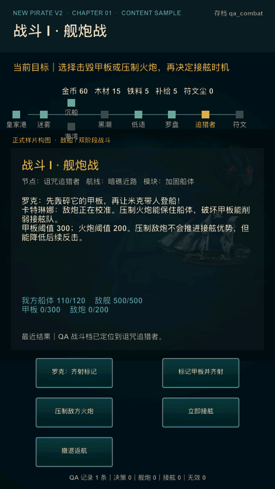
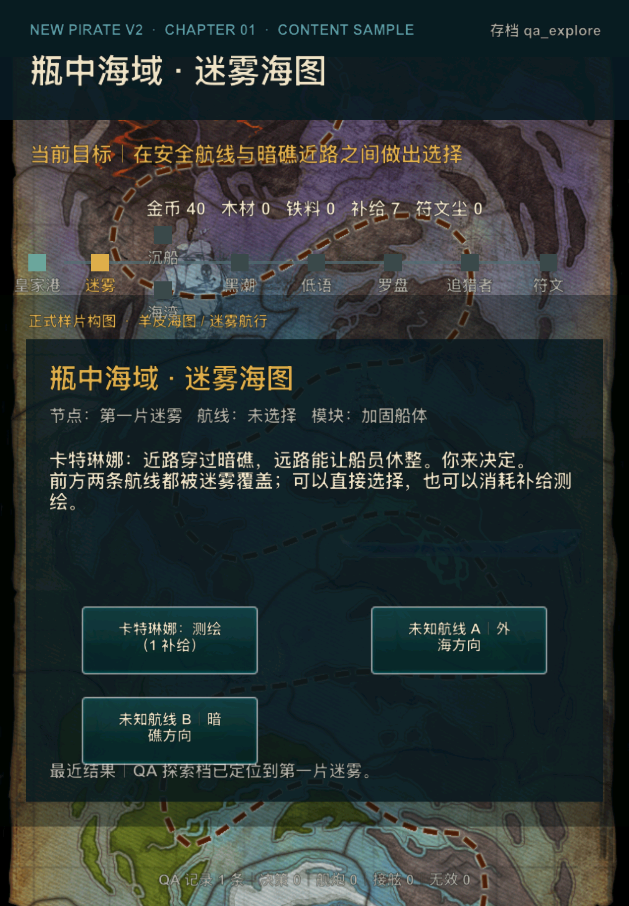

# V2 阶段 4：模拟器多尺寸体验矩阵

日期：2026-07-16

候选基线：`ef5ee72` 之后的同源 arm64 simulator 构建

构建命令：`./xcode.sh ios-sim`

## 1. 目的与口径

本矩阵在真机验证后置期间补齐稳定的模拟器尺寸覆盖，重点检查首章样片是否全屏、文本和操作是否被截断、关键操作是否都能出现，以及进程在画面稳定后是否继续存活。

它只证明布局和模拟器运行基线，不替代真实设备上的安全区、触控手感、30 FPS、静音键、系统音频混合、响度与功耗结论。外部用户理解率和继续远航意愿也不从本矩阵推断，仍保持 `pending_external`。

## 2. 稳定设备矩阵

| 设备 | 系统 | 逻辑画布 / 截图像素 | QA 档位 | 结果 | 主要证据 |
| --- | --- | --- | --- | --- | --- |
| iPhone SE（第 3 代） | iOS 17.2 | 375×667 pt / 750×1334 px | `qa_combat` | 通过 | 最短竖向空间下标题、目标、资源、战斗说明、五个操作和 QA 记录均完整可见；候选 PID 55270 核对时已存活 8 分 58 秒 |
| iPhone 12 Pro（`NewPirate Fresh QA`） | iOS 26.2 | 390×844 pt / 1170×2532 px | `qa_combat` 等 | 通过 | 既有四英雄全屏截图与音效/内存候选均在该设备完成，见 [`phase-3-naval.png`](phase-3-naval.png) 和质量审计 |
| iPad（A16） | iOS 26.2 | 820×1180 pt / 1640×2360 px | `qa_explore` | 通过 | 海图、路线节点、说明面板、三个路线操作、最近结果和 QA 记录完整可见；候选 PID 56686 核对时已存活 5 分 59 秒 |

稳定矩阵覆盖了短屏手机、现代刘海屏手机和 4:3 附近的平板比例。三档均保持竖屏，没有横向旋转、兼容画布黑边、按钮越界或文字被屏幕边缘裁掉。

## 3. 小屏战斗检查



iPhone SE 3 是当前可靠的小屏下限。`qa_combat` 画面中：

- 顶部档位名、章节标题和当前目标没有重叠；
- 七节点航线与资源行保持可读；
- 舰炮说明、阈值、双方状态和最近结果都在操作区之前出现；
- “齐射标记”“标记甲板并齐射”“压制敌方火炮”“立即接舷”“撤退返航”五个操作全部位于屏内；
- 底部 QA 记录没有被 Home Indicator 或屏幕边缘遮挡。

## 4. iPad 探索检查



iPad A16 使用与手机相同的 640-point 设计宽度并按高度扩展。`qa_explore` 画面中：

- 顶栏、目标、资源和七节点航线横向完整；
- 地图原画覆盖宽屏背景，信息面板保持居中且留有边界；
- 测绘、未知航线 A、未知航线 B 三个操作均完整可见且互不重叠；
- 最近结果和底部 QA 记录仍在屏内；
- 首次安装启动较慢，进入前台后截图和进程存活检查正常，不计为启动失败。

## 5. iPhone 13 mini 环境限制

iPhone 13 mini / iOS 26.2 当前不能作为可信验收设备。模拟器显示红色 `rdar:45025538` 条，并把本应为 375×812 pt 的设备报告为 360×780，应用窗口进一步落入约 360×640 的兼容画布，造成上下留黑。

已执行干净卸载重装、清除 `simctl status_bar` override 和正式 `UILaunchScreen` 构建复核，现象不变。Apple Developer Forums 记录了 Xcode 26.2 在 iPhone 12/13 mini 上的相同问题、错误屏幕宽度和临时 Display Zoom 绕行方案：[In Simulator on status bar red banner with rdar:45025538](https://developer.apple.com/forums/thread/807280)。

处理原则：

- 不把该截图登记为 V2 产品回归，也不为模拟器缺陷修改启动屏或游戏画布；
- 稳定的小屏自动/截图基线改用 iPhone SE 3；
- mini 刘海与窄屏组合最终由 Xcode 更新后的同型号模拟器或真实设备补测；
- 若后续仍需使用当前 mini，先在 Settings → Developer → Display Zoom 中切到 Larger Text 再切回 Default，并在每次重启后重新确认逻辑尺寸。

## 6. 复现命令

小屏战斗：

```bash
xcrun simctl boot 061F4C38-3774-4951-8E85-AF2D7AE95EB3
xcrun simctl install 061F4C38-3774-4951-8E85-AF2D7AE95EB3 \
  "build/DerivedData/ios-sim/Build/Products/Debug-iphonesimulator/NewPirate iOS.app"
SIMCTL_CHILD_NEWPIRATE_V2_PROFILE=qa_combat \
  xcrun simctl launch 061F4C38-3774-4951-8E85-AF2D7AE95EB3 com.fancyGame.NewPirate
```

iPad 探索：

```bash
xcrun simctl boot 9961FDC3-15CA-472B-B73C-66C75F76A472
xcrun simctl install 9961FDC3-15CA-472B-B73C-66C75F76A472 \
  "build/DerivedData/ios-sim/Build/Products/Debug-iphonesimulator/NewPirate iOS.app"
SIMCTL_CHILD_NEWPIRATE_V2_PROFILE=qa_explore \
  xcrun simctl launch 9961FDC3-15CA-472B-B73C-66C75F76A472 com.fancyGame.NewPirate
```

设备 UUID 属于当前测试机；其他环境应按设备名称重新取得 UUID，不把它写入产品运行逻辑。

## 7. 当前结论

模拟器多尺寸内部门槛通过：V2 候选在三档稳定比例上全屏、可读、操作完整并持续运行。iPhone 13 mini 的 Xcode 26.2 缺陷已隔离为测试环境限制。真机与两轮外部目标用户门槛仍未完成，因此 Phase 4 总体决策继续为 **HOLD**。
