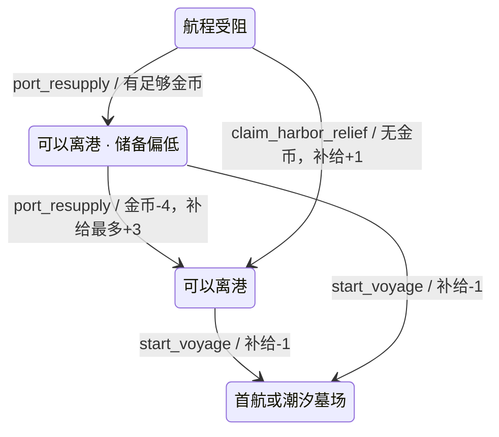

# V2 皇家港后勤第 1 轮：补给恢复与软锁保护

日期：2026-08-09

状态：`BASELINED`

产品开发：`ACTIVE`

真机与发行：`DEFERRED_UNTIL_FINAL`

## 1. 本轮目标

第二次远航已经成为独立可玩闭环，但皇家港货舱仍只是库存说明页。玩家在失败恢复或连续消耗后可能带着 0 补给回港，此时原有界面仍显示出航入口，执行后才提示失败，而且没有补充补给的合法动作。

本轮不恢复旧版制造、农场或多层生产链，只完成一个透明的后勤闭环：

1. 有金币时，可以按固定价格购买航海补给；
2. 补给不足且付不起常规补给时，可以领取一次最低限度的港务救济；
3. 补给不足时不再显示伪可用的出航按钮；
4. 货舱页先回答“能否离港、缺多少、怎样恢复”，再展示完整库存；
5. 既有失败返港继续承担航损修复，不新增没有真实状态支撑的维修按钮。

## 2. Before / After / Why

| Before | After | Why |
| --- | --- | --- |
| 货舱五行资源只读展示 | 顶部新增港务后勤主卡，显示补给容量、离港消耗、状态和服务规则 | 让货舱成为真实准备节点，而不只是说明书 |
| 0 补给仍显示出航，点击后才报错 | 补给不足时隐藏出航，并在港口状态中明确提示前往货舱 | 操作结果在承诺前可预测 |
| 港口没有补给来源 | 4 金币购买最多 3 份补给，实际增加量按当前船装容量封顶 | 用一条最小兑换规则恢复循环，不引入生产链 |
| 金币和补给同时耗尽会软锁 | 只在无法离港且付不起常规补给时，开放一次免费 +1 补给救济 | 保证可继续，同时避免免费资源被反复获取 |
| 加装重炮后补给上限变化只在出航时处理 | 后勤主卡直接显示当前装载量与船装容量；补给动作按该容量计算 | 船装取舍和后勤结果保持一致 |
| 计划新增“维修”入口 | 保留失败页 5 金币返港恢复并清除航损；港内不展示不可达的维修服务 | 当前所有可继续出航的 `harbor` 状态航损均为 0，不制造空壳按钮 |

## 3. 后勤规则

数值全部来自 `design/v2/data/balance.csv`：

| 规则 | 数值 | 适用条件 | 结果 |
| --- | ---: | --- | --- |
| 常规补给成本 | 金币 4 | 皇家港、补给未满、金币足够 | 补给最多 +3，不超过当前模块容量 |
| 港务救济 | 免费补给 1 | 无法支付常规补给、当前补给低于离港门槛、本次停港未领取 | 恢复一次最低离港能力 |
| 首航/第二航程离港 | 补给 1 | 当前补给达到地图边的真实消耗 | 扣除补给并进入对应航程 |
| 失败返港恢复 | 金币 5 | 远航失败且金币足够 | 回港、恢复船只与船员、清除航损 |

常规补给可以重复购买，直到当前模块容量。救济只能解决“这次无法离港”，领取后不会把货舱补满；真正离港时清除本次救济标记，因此未来一次新的失败返港仍有兜底。

## 4. 状态与动作

章节状态机仍是唯一规则权威：`V2PortModel` 只计算展示状态并过滤动作，`V2PortLayer` 继续把操作交给 `V2ChapterController:dispatch`。货舱不自行修改金币或补给。

动作可见性遵循以下原则：

- 补给足够：航海桌显示真实出航动作；若未满且金币足够，货舱显示常规补给；
- 补给不足、金币足够：航海桌不显示出航，货舱显示常规补给；
- 补给不足、金币不足：航海桌不显示出航，货舱显示一次港务救济；
- 补给已满：货舱不显示多余补给动作；
- 第二次远航完成：不借后勤系统伪造第三航程入口。

## 5. UI 结构与运行画面

### 5.1 常规补给

低储备但仍能离港时，顶部整备状态与后勤主卡使用金色警示，不把它误报为失败。主卡在同一视线内给出 `2 / 8`、离港消耗 1、常规补给 4 金币和本次 +3；底部按钮重复完整交易结果，点击前不需要猜测。

### 5.2 真实操作结果

模拟器真实执行 `port_resupply` 后，金币从 12 降至 8，补给从 2 增至 5；顶部资源栏、后勤主卡和库存行同步刷新。页面留在货舱，避免一次轻量服务把玩家强制送回航程页。

### 5.3 应急救济

补给与金币都为 0 时，顶部改为“航程受阻”，后勤卡明确解释一次免费救济，唯一主操作为“领取港务救济 / 本次免费 / 补给 +1”。这是软锁保护，不是日常收益入口。

三张图均来自 iPhone 17 模拟器的 1206×2622 px 开发期运行画面。主流 iPhone 竖屏继续作为风格判断基准；本轮没有执行真机、签名、TestFlight、商店截图或 App Store 工作。

## 6. 设计原则如何影响实现

- Apple Design 的状态可见性与可预测性：顶部状态、后勤卡和动作同时表达同一离港条件；无效出航不会继续显示为可执行按钮；操作后原地刷新真实资源。
- Emil Design Engineering 的单一焦点与渐进披露：货舱第一焦点从“五个等权资源行”改为“本次能否离港”，常规库存退到第二层；只有当前可用的一种服务进入操作区。
- 动效保持克制：沿用既有按下态、短提示与刷新，不加入循环呼吸、弹跳或装饰性转场。

## 7. 数据、存档与遥测

- 平衡表新增 `port_resupply_gold_cost`、`port_resupply_gain`、`port_relief_gain` 三项；
- 本地遥测新增 `port_logistics_used`，用 `action` 区分购买与救济，用于判断玩家是否频繁陷入补给压力；
- 新增 `qa_port_low_supply` 和 `qa_port_blocked` 两个隔离 QA 档；
- `harbor_relief_used` 存在既有 `flags` 容器中，存档 schema 保持 4；
- 旧 schema 3/4 存档继续使用现有默认字段覆盖与结构校验恢复。

## 8. 自动验收

`tools/v2/test_v2_port_logistics.lua` 覆盖：

- 常规补给的金币成本、补给收益和容量封顶；
- 接近容量时按钮显示实际 `+1`，满仓时动作隐藏且直接调用被拒绝；
- 0 补给/0 金币时隐藏出航并开放救济；
- 救济只能领取一次，领取后立即出现出航，离港后重置资格；
- 失败后以最后 5 金币返港、补给为 0 时仍有合法离港路径；
- 航海桌与货舱保持单一职责；
- 第二航程完成态不出现后勤伪入口；
- 新 QA 状态可恢复，本地遥测正确分类。

完整 `tools/v2/validate_phase4.sh` 已通过，iOS Simulator Debug 构建通过。专项文档与运行证据由 `tools/v2/validate_port_logistics.py` 持续校验。

## 9. 当前边界与下一步

本轮完成的是透明后勤与软锁保护，不是完整港口经营系统：

- 不恢复旧版食物生产、建筑等待、制造队列和多资源转换；
- 不新增港内付费维修，因为现有失败返港已支付金币并清除航损，当前没有“带未修复航损进入 `harbor` 并继续出航”的合法状态；`tide_complete` 只记录第二航程结果且没有第三航程入口；
- 不扩展第三海域；
- 不提前进行真机与发行工作。

下一轮最高优先级转为船员成长最小闭环：让一次明确的船员选择改变潮汐墓场事件或沉锚守卫方案，并把船员页从只读档案推进为有真实后果的成长界面。之后补潮汐墓场角色事件，再在机制稳定后制作守卫专属美术与一次性破盾效果。
