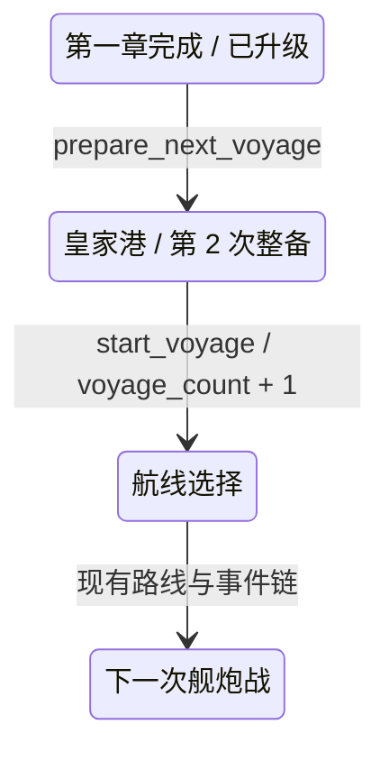
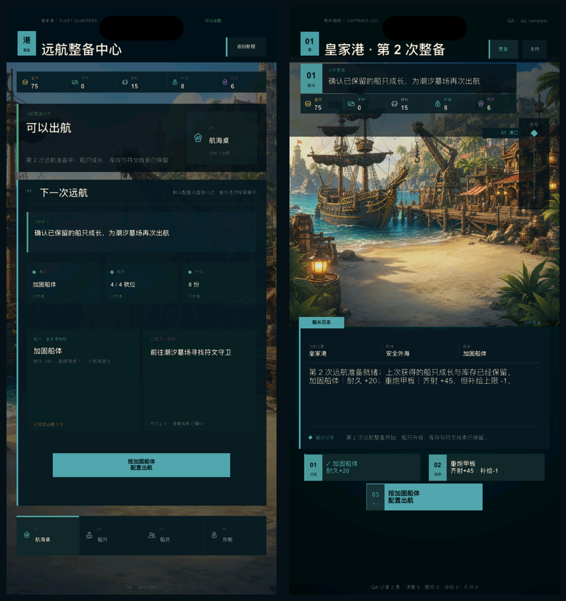

# V2 重复远航第 1 轮：成长留存与第二次整备

日期：2026-08-09

状态：`BASELINED`

产品开发：`ACTIVE`

真机与发行：`DEFERRED_UNTIL_FINAL`

## 1. 要解决的问题

第一章已经能完成出航、路线、事件、双阶段战斗、结算和首次升级，但完成页原有按钮仍是“再次体验第一章”。执行后会重新创建初始状态，刚获得的船只等级、库存、符文线索、航次和历史全部丢失。

这会破坏核心成长承诺：界面虽然说明升级将在下一航程生效，玩家实际上却无法带着升级继续游戏。

本轮将玩家完成态动作替换为 `prepare_next_voyage`，使首次升级真正进入下一次整备与战斗。QA 档继续保留 `restart_chapter`，用于稳定重置测试状态。

## 2. Before / After / Why

| Before | After | Why |
| --- | --- | --- |
| 玩家完成页显示“再次体验第一章” | 显示“准备下一次远航 / 保留升级与库存” | 操作前明确承诺成长留存 |
| 完成后创建全新初始状态 | 返回皇家港 `harbor`，保留长期状态，只清理本次远航临时状态 | 建立真实的“升级—再出航”循环 |
| 船体/火炮升级只在完成页说明未来收益 | 船体升级改变下一战最大耐久，火炮升级改变下一次齐射伤害 | 让成长成为玩法变量而非展示数字 |
| 航次始终回到 0 | 准备阶段保留已完成航次，实际出航时从 1 增至 2 | 区分“准备下一航程”和“已经出航” |
| 玩家与 QA 都只有重置行为 | 玩家走留存循环，QA 保留诊断重置 | 产品行为与测试工具彻底分离 |

## 3. 状态转换

`prepare_next_voyage` 本身不增加航次。只有玩家再次执行 `start_voyage` 时，`voyage_count` 才从 1 增至 2。

## 4. 保留与清理边界

| 状态 | 处理 | 原因 |
| --- | --- | --- |
| 船体等级、火炮等级、计算后耐久 | 保留 | 核心永久成长 |
| 当前船只模块 | 保留 | 下一次整备可以沿用或重新选择 |
| 金币、木材、铁料、补给、符文尘 | 保留 | 远航结算与成长库存 |
| 四名核心船员 | 保留 | 当前长期编队 |
| 第一枚符文线索与章节完成标记 | 保留 | 唯一主线收集不能重复领取 |
| 历史与本地遥测会话 | 保留 | 航次因果与测试记录连续 |
| 航线、测绘情报、临时事件旗标 | 清理 | 只属于上一航次 |
| 诅咒选择、战斗状态、战损、失败摘要 | 清理 | 皇家港重新整备后的临时状态 |
| 沉船、救援、追猎者普通战利品领取标记 | 清理 | 允许重复航行继续产生升级资源 |
| 第一枚符文奖励领取标记 | 保留 | 防止唯一符文线索重复发放 |

## 5. 成长如何改变下一次玩法

本轮没有新增第二套数值规则，继续使用既有平衡表：

- 船体升级：`hull_level_bonus = 20`。加固船体下，下一航程最大耐久从 120 提高到 140；
- 火炮升级：`gun_level_bonus = 25`。下一航程基础甲板齐射从 175 提高到 200，敌舰生命从 500 降到 300；
- 模块仍可在第二次整备时切换，因此长期升级与当次模块继续形成组合，而不是锁死配置。

这些结果由同一 `V2ChapterState` 计算并进入自动测试，没有在界面模型中复制数值。

## 6. 玩家界面结果

左侧皇家港航海桌显示：

- 第 2 次远航准备中；
- 船体成长、库存和符文线索已保留；
- 加固船体当前耐久 140、船体等级 1；
- 已完成远航 1 次；
- 下一目标为潮汐墓场符文守卫。

右侧章节页显示动态标题“皇家港 · 第 2 次整备”，航令、船长日志和最近记录使用同一套留存文案，现有“整备”入口与模块选择继续可用。

两张图均来自 iPhone 17 模拟器 1206×2622 px 运行画面，不是静态设计稿。

## 7. 数据、遥测与 QA

- 新增 `next_voyage_prepared` 本地遥测事件，记录动作、返回阶段、库存和当前航次；
- 玩家完成态只暴露 `prepare_next_voyage`；
- `qa_*` 完成态继续暴露 `restart_chapter`，不会因产品循环改变而失去稳定重置能力；
- 港口 QA 入口支持 `NEWPIRATE_V2_QA_ACTION`，可从 `qa_complete` 直接执行真实留存转换；
- 存档 schema 保持 4，因为本轮只使用已有字段，不新增持久化结构。

## 8. 本轮边界

本轮解决的是“成长能否带入下一次远航”，不是第二海域内容完成：

- 第二次出航暂时复用第一章路线、事件和追猎者战斗骨架；
- 潮汐墓场的新地图节点、差异敌人、第二枚符文目标和剧情尚未制作；
- 船员长期成长和港口补给恢复规则尚未开放；
- 真机、签名、TestFlight 与 App Store 继续后置。

## 9. 下一迭代

1. 制作潮汐墓场第二次远航灰盒，至少包含一个新路线抉择、一个差异敌人机制和一个新符文目标；
2. 用 `voyage_count` 或明确航程 ID 选择内容，不把第二航次永久映射为第一章复刻；
3. 让船体/火炮成长分别改变一次第二航次决策，而不仅是最终伤害数字；
4. 为补给耗尽增加真实且克制的港口恢复规则；
5. 再评估船员成长最小闭环与正式角色美术。
