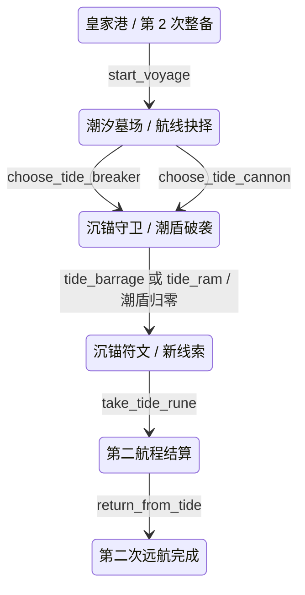
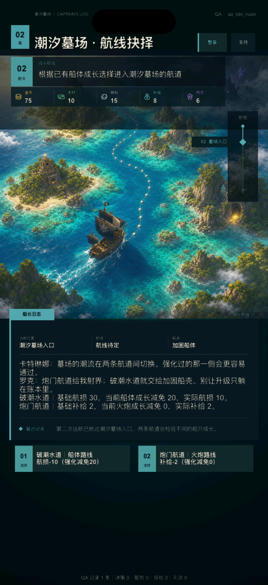
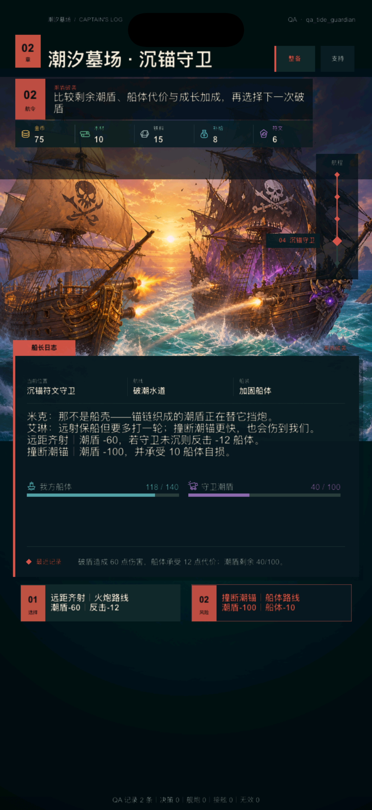
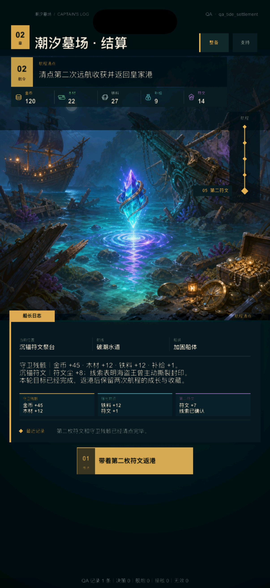

# V2 第二次远航第 1 轮：潮汐墓场灰盒

日期：2026-08-09

状态：`BASELINED`

产品开发：`ACTIVE`

真机与发行：`DEFERRED_UNTIL_FINAL`

## 1. 本轮目标

上一轮已经解决“首航升级能否保留到下一次整备”，但第 2 次出航仍会回到首航的安全外海、暗礁、黑潮、追猎者和接舷流程。玩家带着成长继续游戏，得到的却只是数值更高的同章重播。

本轮把第 2 次远航接入独立的“潮汐墓场”短闭环：

1. 两条新航道分别检验船体成长和火炮成长；
2. 新敌人“沉锚符文守卫”使用潮盾机制，不复刻舰炮转接舷；
3. 玩家取得唯一的第二枚沉锚符文并完成独立结算；
4. 没有完成的第三海域不暴露假按钮；
5. 真机、签名、TestFlight 与 App Store 继续留到最终阶段。

## 2. Before / After / Why

| Before | After | Why |
| --- | --- | --- |
| 第 2 次出航再次进入首航迷雾路线 | 进入 `tide_route_choice`，显示潮汐墓场专属航道 | 让第二航程拥有可辨认的新目标 |
| 成长只改变最大耐久或单次齐射 | 船体等级降低破潮水道航损，火炮等级降低炮门航道补给 | 让成长先改变选择代价，再改变战斗结果 |
| 第 2 次战斗仍是追猎者舰炮与接舷 | 沉锚守卫使用 100 点潮盾和两种成长驱动破盾方案 | 用一个新规则验证内容差异，而不是复制旧战斗 |
| 完成后只能再次复刻或直接重置 | 第二枚符文进入独立结算，最终停在诚实的内容边界 | 不用假循环掩盖尚未制作的第三海域 |
| 第二航程沿用“追猎者/第一符文”进度标签 | 航程轨改为“墓场入口—潮流—沉锚守卫—第二符文” | 保持空间结构稳定，同时明确地点和目标已经变化 |
| 新玩法可能重新堆叠卡片和说明 | 继续使用单一船长日志、双状态仪表和两项主决策 | 新内容不破坏 UI 3.x 已建立的信息层级 |

## 3. 可玩流程

入口条件是首航已经完成、第一次升级已经安装且 `voyage_count` 在再次出航时达到 2。首航、新档和原有 QA 流程保持不变。

## 4. 成长如何改变路线

| 成长方向 | 破潮水道 | 炮门航道 | 玩家可见结果 |
| --- | --- | --- | --- |
| 船体等级 1 | 基础航损 30，减免 20，实际航损 10 | 仍消耗 2 补给 | 按钮明确显示“航损 -10（强化减免 20）” |
| 火炮等级 1 | 仍承受 30 航损 | 基础补给 2，减免 2，实际补给 0 | 按钮明确显示“补给 -0（强化减免 2）” |

两条路线始终可选，没有硬性属性门槛。升级改变的是代价曲线，而不是把另一条路线锁掉。

## 5. 沉锚守卫机制

守卫拥有 100 点潮盾。潮盾归零即结束战斗并开放第二枚符文，不进入接舷阶段。

| 操作 | 基础结果 | 对应成长 | 等级 1 结果 |
| --- | --- | --- | --- |
| 远距齐射 `tide_barrage` | 潮盾 -60；守卫未沉时船体 -12 | 每级火炮增加 40 破盾 | 潮盾 -100，一轮结束且不承受终结反击 |
| 撞断潮锚 `tide_ram` | 潮盾 -75；船体 -25 | 每级船体增加 25 破盾并减少 15 自损 | 潮盾 -100；船体 -10 |

专属 UI 同时显示“我方船体”和“守卫潮盾”两条仪表；按钮在执行前给出真实伤害与代价，执行后场景反馈和中部回执使用实际状态差值，不解析文案推算结果。

失败仍进入统一可恢复状态，但会保留守卫上下文：

- 原地重试消耗 1 补给，恢复完整潮盾并保留成长与当前墓场航道；
- 返港恢复消耗 5 金币，清除航损并允许重新选择潮汐墓场航道。

## 6. 第二枚符文与结算

守卫被击败后发放 `reward_tide_guardian`：金币 45、木材 12、铁料 12、补给 1、符文尘 1。

确认 `reward_tide_rune` 再获得 7 点符文尘，并记录新线索：海盗王的封印并非只因时间松动，他曾主动撕裂封印。

结算页把结果分为三组：守卫残骸、强化物资、第二符文。返回皇家港后进入 `tide_complete`，显示已完成 2 次航程、取得 2 枚符文，并明确说明后续海域仍在制作。该状态不提供第三次出航动作。

## 7. UI 层级与运行画面

### 航线抉择

- 顶部编号、航令和航程轨统一使用 `02`；
- 纵向航程改为墓场语义，不再显示追猎者；
- 日志先说明两类成长的实际减免，底部只保留两个等权选择；
- 初次运行复核发现长标题和重复结果卡拥挤，已缩短标题并移除重复摘要。

### 沉锚守卫

- 同一战斗卡只显示船体与潮盾两个决策仪表；
- 远距齐射保持普通选择，撞锚因固定自损使用风险样式；
- 画面已执行一次真实远距齐射：潮盾由 100 降至 40，船体由 130 降至 118，最近记录同步解释 `60 / 12` 因果；
- 船体成长档能在操作前看到 `潮盾 -100 / 船体 -10`，不需要先点再猜。

### 第二航程结算

- 叙事说明主线变化；
- 三个结果组分别承担货币/木材、铁料/守卫符文和第二枚符文；
- 唯一主操作为“带着第二枚符文返港”。

三张图均来自 iPhone 17 模拟器 1206×2622 px 运行画面，用于开发期布局验收，不代表真机或发行验收。

## 8. 数据、存档与 QA

新增内容全部进入 `design/v2/data/*.csv` 唯一数据源并导出到 `V2ChapterData.lua`：

- 3 个地图节点、4 条边、3 个事件、3 个事件选项；
- 2 条潮汐墓场路线、1 个差异敌人、2 个新奖励；
- 2 个守卫动作、5 个平衡值、5 条对白、5 个演出映射；
- 4 个本地遥测事件：守卫普通动作、守卫结果、第二符文、第二航程完成。

新增 QA 档：

- `qa_tide_route`
- `qa_tide_guardian`
- `qa_tide_rune`
- `qa_tide_settlement`
- `qa_tide_complete`

存档 schema 保持 4。新增的潮盾字段存在于既有 `battle` 容器中，旧 schema 4 存档会由默认状态补齐；守卫阶段的潮盾、最大潮盾和动作数都进入结构校验。

## 9. 自动验收

`tools/v2/test_v2_second_voyage.lua` 覆盖：

- 第 2 次出航不再进入首航路线；
- 船体/火炮成长分别改变两条路线的实际代价；
- 两类成长分别形成一轮撞锚和一轮齐射策略；
- 守卫奖励、第二符文、结算和最终状态；
- 未完成第三海域不出现假动作；
- 守卫失败、原地重试与恢复完整潮盾；
- 5 个 QA 档可恢复；
- 守卫终结动作进入独立本地遥测。

完整 `tools/v2/validate_phase4.sh` 已通过。iOS Simulator Debug 构建通过。未执行真机、签名、TestFlight 或 App Store 工作。

## 10. 当前边界与下一步

本轮是第二航程的可玩灰盒，不是第二海域正式内容完成：

- 守卫暂时复用现有舰炮英雄背景，机制和界面已区分，专属守卫美术待玩法稳定后制作；
- 第二航程目前是一段聚焦成长兑现的短路线，没有扩成大量格子或事件；
- 船员成长第 1 轮已经补入永久首席任命，并改变远距或近身破盾；
- 皇家港后勤第 1 轮已经补入常规补给、应急救济和无效出航隐藏；
- 第三海域、额外角色支线和正式内容生产节奏尚未开放。

后续优先级：

1. 潮汐墓场角色事件已完成，见 [`tide-character-event-iteration-1.md`](tide-character-event-iteration-1.md)；
2. 下一轮制作沉锚守卫专属美术与一次性破盾效果；
3. 继续验证存档迁移、内容表扩展和长流程稳定性；
4. 所有游戏内容收敛后，最后统一执行真机、签名、TestFlight 与 App Store。

已完成的后勤与船员成长分别见 [`port-logistics-iteration-1.md`](port-logistics-iteration-1.md) 和 [`crew-growth-iteration-1.md`](crew-growth-iteration-1.md)。
