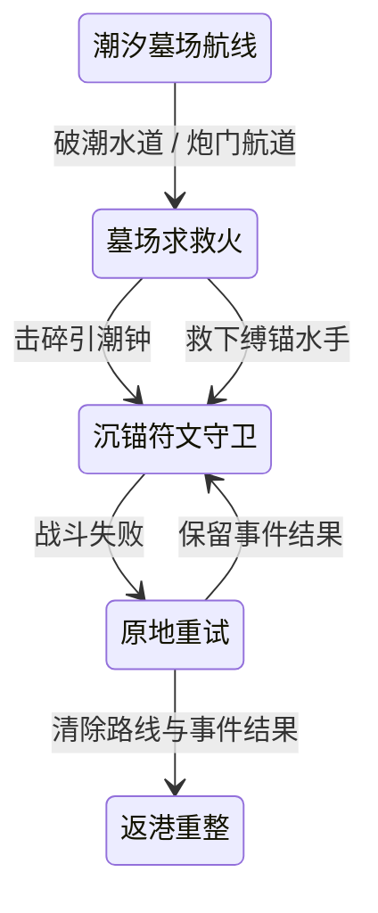
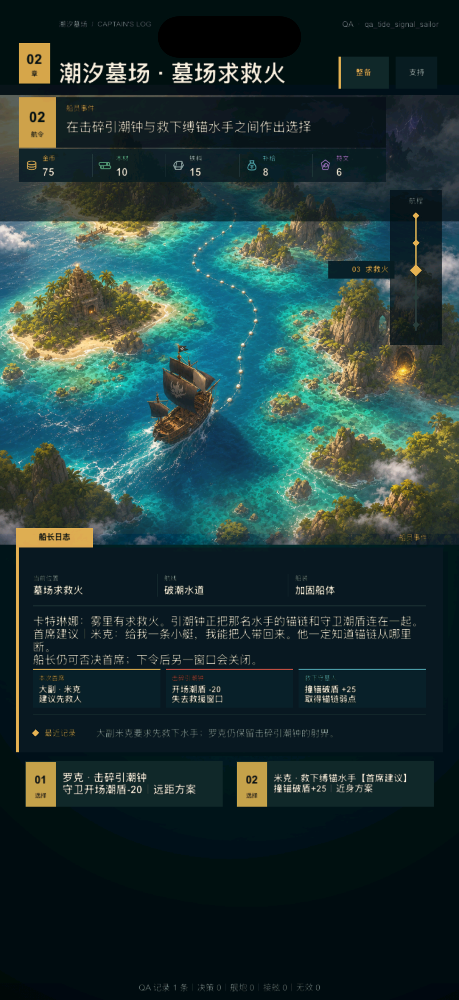
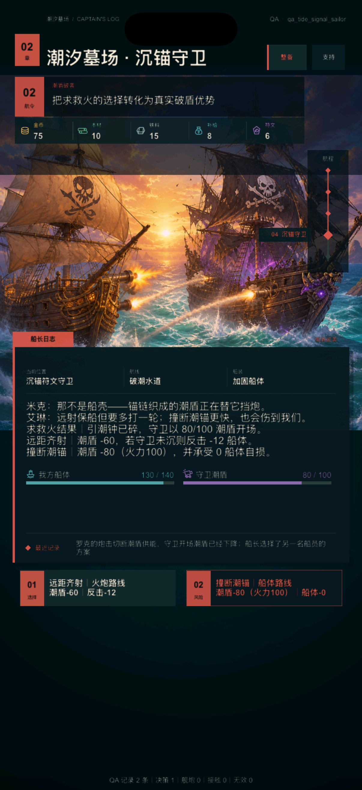
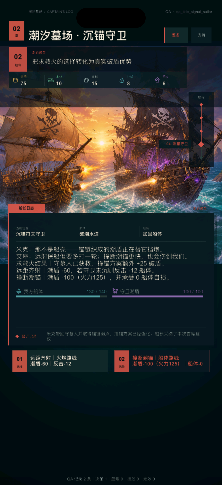

# V2 潮汐墓场角色事件第 1 轮：墓场求救火

日期：2026-08-09

状态：`BASELINED`

产品开发：`ACTIVE`

真机与发行：`DEFERRED_UNTIL_FINAL`

## 1. 本轮目标

第二次远航已经有成长航线、沉锚守卫和第二枚符文，但航线选择后直接进入战斗，船员成长主要表现为按钮上的数值。玩家能理解“哪种打法更强”，却还没有经历一次能记住罗克、米克以及自己是否采纳首席意见的海上事件。

本轮只增加一个聚焦事件，不扩成重复格子移动：船驶入潮汐墓场后遇见“墓场求救火”，一名守墓水手被锚链缚在残骸上，引潮钟同时为沉锚守卫输送潮盾。罗克主张抓住射界击碎钟，米克主张先救人并询问锚链弱点。玩家必须二选一。

## 2. Before / After / Why

| Before | After | Why |
| --- | --- | --- |
| 潮汐航线选择后直接进入守卫 | 两条航线都先进入 `tide_character_event`，处理求救火后再战斗 | 为第二航程增加角色节奏，不堆无意义地图节点 |
| 首席任命只改变战斗数值 | 当前首席的方案在叙事、结果组和按钮中标记为“首席建议” | 让职位成为角色立场，而不只是被动加成 |
| 角色提出意见就等于锁定答案 | 首席建议得到强调，但另一个方案始终可执行 | 保留船长决策权，避免培养选择替玩家自动做决定 |
| 普通事件结束后影响难以追踪 | 击钟让守卫以 80/100 潮盾开场；救人让撞锚破盾 +25 | 事件结果立即进入下一场战斗，可观察、可验证 |
| 守卫失败重试可能抹掉前置选择 | 原地重试保留求救火结果，返港重选航线才清除 | 稳定因果关系，同时让完整重开拥有重新决策的机会 |
| 叙事、首席说明与结果数值全部堆在正文 | 正文只保留事件背景与当前首席一句建议；数值交给三块结果组和两个按钮 | 保持字号与可扫视层级，解决 iPhone 首轮运行中的信息重叠 |

## 3. 事件流程

数据地图新增 `node_tide_signal`，两条潮汐航线都先到该节点；`node_tide_guardian` 的前置条件从单纯选定航线改为 `tide_signal_resolved`。已在守卫阶段的旧存档继续原地恢复，不被强制倒退到新事件。

## 4. 两种选择与首席关系

| 事件选择 | 直接后果 | 与首席任命的组合 |
| --- | --- | --- |
| 罗克 · 击碎引潮钟 | 守卫最大潮盾仍为 100，但开场先损失 20，仪表显示 80/100 | 炮术长的远距 +20 可与开场削盾叠加；大副档也可否决首席、选择远距准备 |
| 米克 · 救下缚锚水手 | 守墓人指出锚链弱点，撞锚方案额外 +25 破盾 | 大副的撞锚自损 -10 与弱点伤害协同；炮术长档也可选择保住水手并改走近身方案 |

“首席建议”只表示本次任命带来的角色立场，不额外隐藏数值，也不禁止另一项命令。若采纳当前首席建议，状态记录 `tide_chief_followed`；若否决，最近记录会明确“船长选择了另一名船员的方案”。

## 5. UI 结构与运行结果

### 5.1 炮术长建议

炮术长档把罗克方案标为“首席建议”。船长日志只保留事件背景、罗克的一句意见和“仍可否决”的权力说明；下方三块结果组分别回答当前首席、击钟后果与救人后果。

### 5.2 大副建议

切换为大副任命后，相同空间结构不移动，只把首席身份、建议台词和按钮标记切换到米克。玩家无需重新学习页面，也不会把建议误认成强制路线。

### 5.3 击碎引潮钟后的守卫

真实执行 `shatter_tide_bell` 后，目标进入守卫，潮盾仪表显示 `80 / 100`；叙事明确“引潮钟已碎”，攻击按钮根据剩余潮盾显示实际损失。截图使用大副档并选择罗克方案，也验证玩家可以否决首席。

### 5.4 救下守墓人后的守卫

真实执行 `rescue_anchor_keeper` 后，潮盾保持 `100 / 100`，撞锚按钮显示 `潮盾-100（火力125）`，大副同时把船体自损降为 0。正文、仪表、按钮和最近记录共同说明“救人 → 锚链弱点 → 近身优势”。

四张图均来自 iPhone 17 模拟器的 1206×2622 px 开发期运行画面。首轮运行曾发现正文与结果组三层重复导致重叠；修正方式是删除重复后果叙述、保留原字号和结构化结果，而不是缩字硬塞。没有执行真机、签名、TestFlight、商店截图或 App Store 工作。

## 6. 状态、恢复与兼容

- `tide_signal_resolved`：事件已经完成，可进入守卫；
- `tide_bell_shattered`：守卫每次初始化时应用 20 点开场潮盾损失；
- `tide_keeper_rescued`：预览、叙事与结算都为撞锚增加 25 点伤害；
- `tide_chief_followed`：记录是否采纳当前首席建议，不额外改变战斗数值；
- 原地战斗重试会再次初始化守卫，并保留击钟或救人效果；
- 返港恢复会清除潮汐航线、求救火结果与采纳标记，使再次出航可以重新选择；
- 存档 schema 保持 4，新布尔标记由既有 `flags` 容器承载；
- 已经处于 `tide_guardian` 的旧存档仍可继续，战报会诚实说明未经历新增事件效果。

## 7. 数据、遥测与 QA

- `map_node.csv` 新增 1 个事件节点，`map_edge.csv` 把航线—事件—守卫关系显式连通；
- `event.csv`、`event_choice.csv` 和 `dialogue.csv` 分别记录事件、两项选择和三句角色台词；
- `balance.csv` 新增 `tide_bell_shield_damage = 20` 与 `tide_keeper_ram_bonus = 25`，UI 和结算不硬编码数值；
- `presentation.csv` 为 `tide_character_event` 指定地图演出组，暂不以新背景冒充新内容；
- 新增 `tide_character_event_choice` 本地遥测事件，汇总增加 `tide_character_choices`；
- 新增 `qa_tide_signal_gunner` 与 `qa_tide_signal_sailor`，隔离检查两种首席建议和两种真实结果。

## 8. 自动验收

`tools/v2/test_v2_tide_character_event.lua` 覆盖：

- 事件节点、事件、数值和两项动作来自生成数据；
- 当前首席建议在叙事与按钮中正确切换；
- 玩家可以否决首席，选择不会被任命自动锁死；
- 击钟真实把开场潮盾改为 80/100；
- 救人真实把撞锚方案提高到 125 火力，并和大副减伤协同；
- 两种结果进入终结战报；
- 原地重试保留结果，返港恢复清除结果；
- 新事件进入独立遥测并计入玩家决策；
- 两个 QA 档可恢复。

专项静态验收 `tools/v2/validate_tide_character_event.py` 检查数据关系、状态机、视觉语义、遥测、四张 iPhone 证据与文档记录，并进入完整 `tools/v2/validate_phase4.sh` 回归链。

## 9. 设计原则如何影响实现

- Apple Design 的可预测与一致：首席标记不改变按钮位置；操作前给出精确后果，操作后守卫仪表立即兑现；重试与返港的状态边界稳定。
- Emil Design Engineering 的单一焦点与渐进披露：事件页只回答“听谁的、会发生什么”，守卫页再展示具体战斗；首轮重叠后通过删除重复信息修正，不牺牲字号。
- 动效继续克制：沿用一次性操作回执和既有地图漂移，不新增循环闪烁、弹跳或强制长转场。

## 10. 当前边界与下一步

本轮完成一个角色事件模板，不代表随机事件系统或完整船员支线已经开放：

- 不增加事件概率、事件池、倒计时和重复刷取；
- 不增加第三条最优解，不把首席建议变成隐藏强制选项；
- 守墓水手暂作为事件人物，不立即扩成可招募船员；
- 求救火继续复用探索背景；守卫专属战场已在后续 [`tide-guardian-visual-iteration-1.md`](tide-guardian-visual-iteration-1.md) 完成；
- 不提前执行真机或发行工作。

后续已完成**沉锚守卫专属视觉与一次性破盾反馈**：保留稳定的按钮、仪表和结算规则，只替换复用背景，并让“击碎潮盾”拥有一次短促、不可重复触发、不循环的场景反馈。当前转入内容扩展管线与长流程稳定性；真机测试、签名、TestFlight 和 App Store 统一留到最终阶段。
