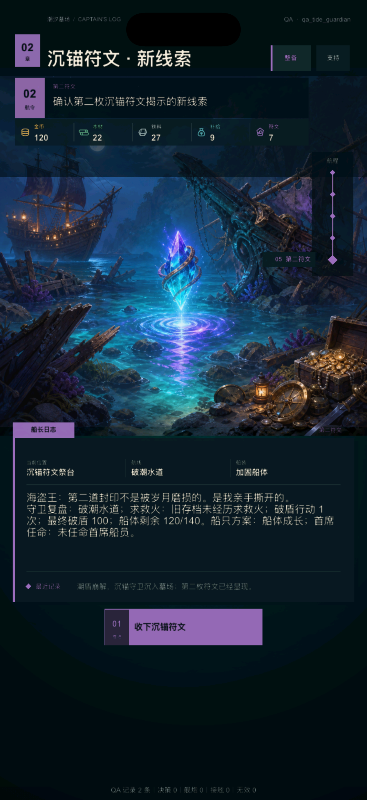

# V2 沉锚守卫视觉第 1 轮：专属战场与潮盾崩解

日期：2026-08-09

状态：`BASELINED`

产品开发：`ACTIVE`

真机与发行：`DEFERRED_UNTIL_FINAL`

## 1. 本轮目标

潮汐墓场已经形成“成长航线—角色取舍—沉锚守卫—第二符文”的可玩闭环，但守卫阶段仍复用首航追猎者的暖色舰炮背景。玩法、敌人名称和数值已经不同，视觉主体却仍像普通敌舰，最终一击又会直接刷新到符文页，玩家很难形成“击碎一个古老潮盾守卫”的记忆。

本轮不改战斗规则、数值、按钮和存档，只解决两个表现断点：为沉锚守卫提供与潮盾机制一致的专属战场；在最终一击与第二符文页之间增加一次短促、不可重复触发、不循环的潮盾崩解反馈。

## 2. Before / After / Why

| Before | After | Why |
| --- | --- | --- |
| 守卫复用橙色追猎者海战图 | `tide_guardian` 独占冷色墓场、锚链巨舰和青紫潮盾画面 | 让地点、敌人和核心机制在手机尺寸上一眼可辨 |
| 普通敌舰与沉锚守卫只有标题、仪表不同 | 我方船位于左侧，守卫与完整潮盾位于右侧，中央保留攻击通道 | 让按钮中的远距齐射、撞锚和场景目标建立空间对应 |
| 最终伤害后立即刷新到符文页 | 在旧战场上先显示守卫位置的崩解几何、`潮盾崩解` 和真实损失，再进入第二符文 | 补全“操作—结果—推进”的视觉因果 |
| 过场期间旧按钮仍可能被再次点击 | 反馈层吞掉触控，完成后才刷新新状态 | 防止不可逆动作重复派发，保持状态转换可预测 |
| 用长演出强调 Boss | 玩家默认总时长约 0.5 秒，其中基础动作轨约 0.4 秒；没有循环、弹跳和等待确认 | 提升命中感，但不打断当前快节奏文本冒险 |
| 短反馈难以留下截图证据 | `NEWPIRATE_V2_QA_FEEDBACK_HOLD` 只对 QA 档延长静态停留 | 开发验收与玩家实际时序分离 |

## 3. 专属视觉资产

运行资产：`bin/res/assets/Images/V2/ui2_tide_guardian.png`

- 规格：1024×1024、RGB PNG、无 Alpha；
- 构图：我方木船在左侧前景，沉锚守卫在右侧中景，守卫体量明显占优；
- 机制焦点：青紫色半透明潮盾与守卫船体分离，缩到手机画幅后仍能辨认；
- 色彩：冷调海蓝、青绿与克制紫光，仅在我方船灯保留少量暖色；
- 内容安全：无 UI、数字、文字、Logo、水印和骷髅旗；
- 接入范围：只替换 `presentation_tide_guardian`；首航舰炮和失败页继续使用原有 `ui2_combat.png`。

### 3.1 生成方式与保存位置

本资产使用 Codex 的**内置图像生成模式**生成。现有 `ui2_combat.png` 只作为完成度、光照密度和海战构图参考，没有被编辑或覆盖。

- 生成原图：`/Users/lizi/.codex/generated_images/019f571c-9ed2-7032-8315-a1ad693f3a4e/exec-adc48ed0-c20b-4482-9b6f-9cfa29849bee.png`
- 项目最终资产：`/Users/lizi/Desktop/NewPirate/bin/res/assets/Images/V2/ui2_tide_guardian.png`

最终提示词：

```text
Use case: stylized-concept
Asset type: square game combat hero background for a portrait mobile pirate game
Input images: Image 1 is a style, finish, lighting-density, and naval-composition reference only; create a new scene, do not edit or reproduce it.
Primary request: create a dedicated battle scene for the “Tide Anchor Warden”, an ancient supernatural guardian in a drowned ship graveyard.
Scene/backdrop: a deep ocean graveyard at blue hour, broken masts and half-submerged wrecks fading into cold teal fog, heavy storm clouds, rough dark water.
Subject: on the left foreground, the player’s sturdy wooden pirate ship approaches at a diagonal; on the right middle distance, a gigantic guardian formed from a ruined warship hull, interlocked black iron anchors, barnacle-covered chains, and a dim rune core rises from the water. A clearly readable translucent circular tide shield of cyan-violet water and runic currents surrounds the guardian, visibly separate from the hull.
Style/medium: polished cinematic painterly game concept art, grounded materials, dramatic but readable silhouette, same production quality and semi-realistic brushwork as the reference.
Composition/framing: 1:1 square, wide naval encounter, player ship left and smaller, guardian right and dominant, horizon in upper third, main silhouettes kept inside the central 80% so the image can be center-cropped in a portrait mobile hero panel. Preserve open water between ships for projectile and shield feedback. No close-up faces.
Lighting/mood: ominous cold moonlit teal and navy, violet rune glow, restrained warm lantern accents on the player ship; mysterious and threatening rather than horror-gore.
Materials/textures: wet aged timber, corroded iron anchors, heavy chains, sea spray, barnacles, translucent water energy.
Constraints: entirely new composition; no text, no numbers, no UI, no logos, no flags with symbols, no watermark. The guardian and tide shield must remain legible at mobile size.
Avoid: sunset-orange palette, ordinary pirate ship as the enemy, human monster, skull-and-crossbones emblems, clutter covering the shield, photorealism, cartoon proportions.
```

## 4. 潮盾崩解反馈

`V2UITheme.tideShieldBreakFeedback(before, after)` 是无引擎依赖的语义入口，只有同时满足以下条件才返回反馈：

- 旧阶段是 `tide_guardian`；
- 新阶段是 `tide_rune_clue`；
- 旧潮盾大于 0，新潮盾为 0。

因此普通破盾攻击仍沿用场景伤害标签，失败、重试和其他阶段转换不会误播 Boss 终结反馈。反馈数值取自前后状态差，不读取按钮文案，也不把 120 或 125 的方案火力冒充实际潮盾损失。

运行顺序为：

1. 战斗状态先完成真实结算并保存；
2. 旧守卫画面上增加轻量暗层并吞掉触控；
3. 在右侧守卫潮盾中心展开青紫几何碎裂，显示 `潮盾崩解` 与真实损失；
4. 玩家默认约 0.5 秒后移除反馈层；
5. 页面刷新到 `tide_rune_clue`，继续显示标准动作回执。

几何由现有 `LayerColor`、短线和缩放/透明度动作组成，不新增粒子运行库，不做循环呼吸、镜头抖动、弹跳或强制确认。QA 可把中间停留延长到最多 10 秒，仅用于模拟器截图。

## 5. iPhone 运行结果

### 5.1 守卫常态


守卫、潮盾和我方船在第一眼形成左右对抗；目标、资源、纵向航程、船长日志、双仪表和两项战术仍维持 UI 3.3 的稳定结构。新图没有把重要主体放到标题、日志或按钮背后。

### 5.2 最终破盾瞬间


截图来自真实执行 `tide_ram` 后的延长 QA 停留。碎裂中心落在守卫潮盾上，反馈明确显示 `守卫潮盾 -100`；旧战场仍在下方，因此玩家能把最终命中与目标建立直接对应。

### 5.3 第二符文结果



反馈结束后稳定进入第二符文页，奖励、战报、航程轨和下一步按钮都来自已经提交的新状态。三张图共同证明它不是孤立特效，而是一次真实状态转换。

三张图均来自 iPhone 17 模拟器，尺寸为 1206×2622 px。未执行真机、签名、TestFlight、商店截图或 App Store 工作。

## 6. 自动验收

- `tools/v2/test_v2_ui_theme.lua` 检查终结转换返回标题与真实损失，普通未破盾攻击不得触发；
- `tools/v2/validate_tide_guardian_visual.py` 检查 1024×1024 RGB 资产、唯一演出映射、运行语义、触控锁、三张 iPhone 证据、文档与回归链；
- `tools/v2/export_runtime.py --check` 保证 `presentation.csv` 与运行 Lua 一致；
- `tools/v2/validate_phase4.sh` 完整回归通过；
- `./xcode.sh ios-sim` 的 Debug 构建通过，产物内包含新资产。

## 7. 设计原则如何影响实现

- Apple Design 的反馈与空间一致性：结果发生在被攻击的右侧守卫，而不是跳到屏幕中央的通用提示；状态页只在反馈完成后推进。
- Apple Design 的克制：这次转换不可撤销且不足半秒，不引入可拖拽手势或复杂弹簧；触控锁只覆盖最短必要窗口。
- Emil Design Engineering 的单一焦点：破盾瞬间只强调“潮盾崩解”和真实损失，不同时弹出奖励、战报和多个数字。
- 渐进披露：守卫页负责攻击决策，崩解层负责确认结果，符文页负责解释奖励，三层信息不互相抢占。

## 8. 当前边界与下一步

本轮完成一名差异敌人的视觉模板，不代表全部敌人、完整 Boss 演出或第三海域已经制作：

- 不增加 Boss 多阶段形态、血条阶段、镜头震动和全屏粒子；
- 不更改沉锚守卫的 100 点潮盾、两种攻击和成长加成；
- 不把 QA 延长停留带入玩家档；
- 不提前执行真机或发行工作。

下一轮转入**内容扩展管线第 1 轮**：明确新事件、敌人、船员、奖励、演出和 QA 证据如何从唯一数据源进入运行时及回归链，并用一个小型第三航程设计草案验证扩展成本；草案不会在核心循环与稳定性达标前冒充可玩内容。随后进行长流程存档迁移、资源预算和连续远航稳定化。真机测试、签名、TestFlight 和 App Store 仍统一留到最终阶段。
