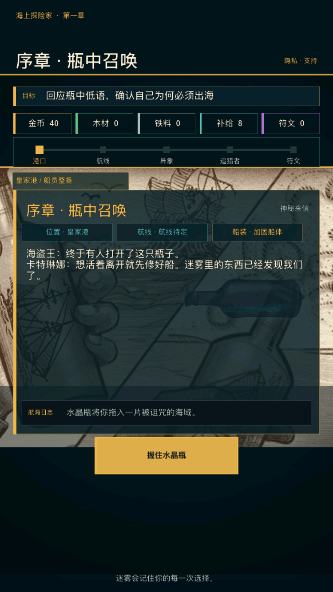
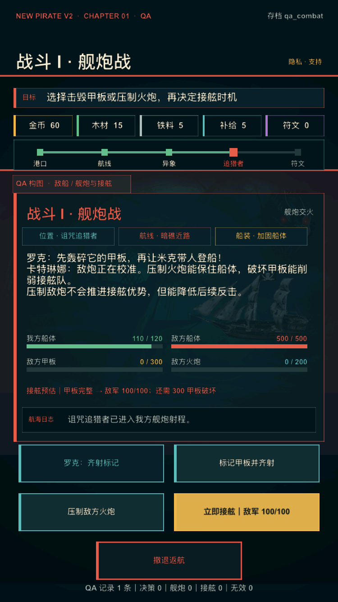
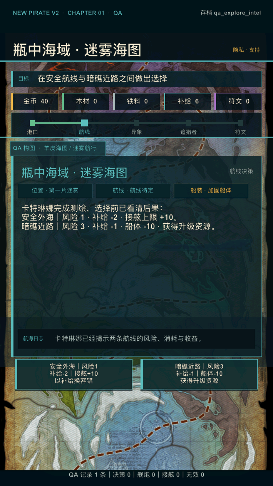
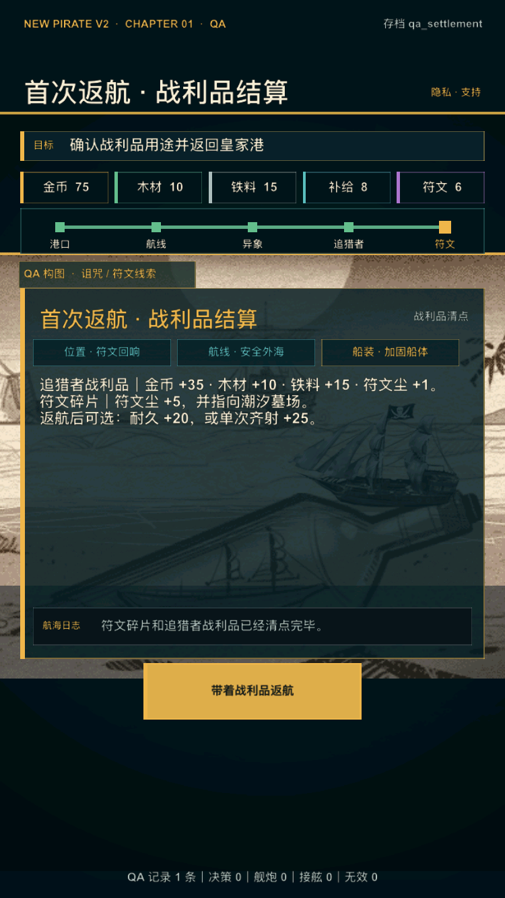
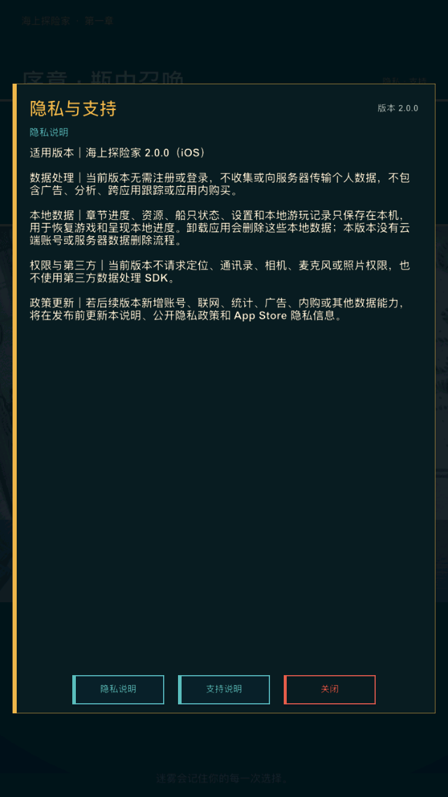
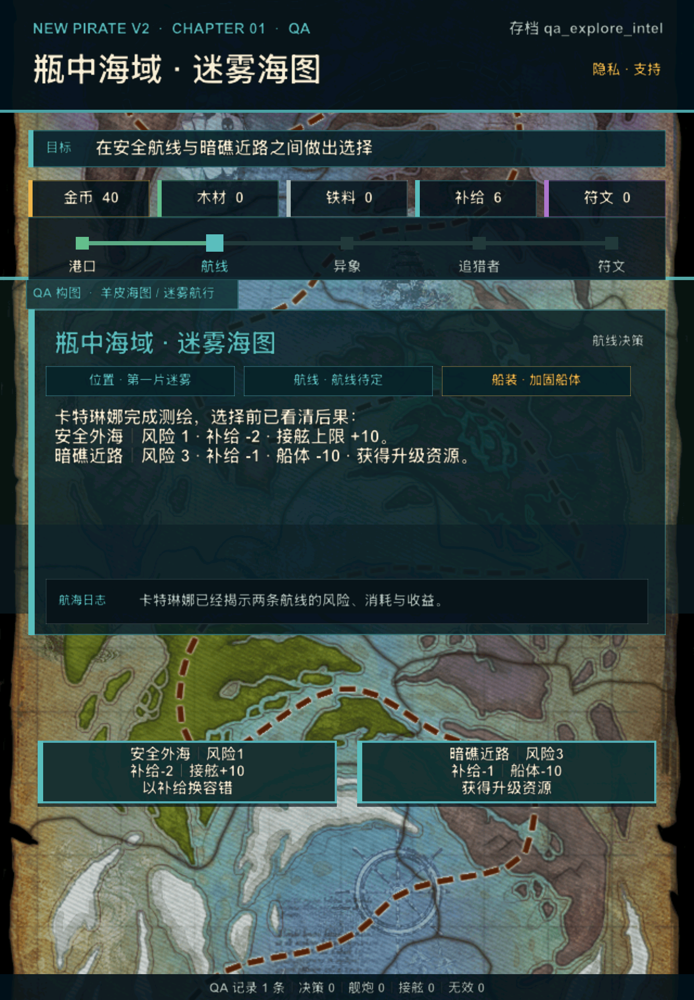
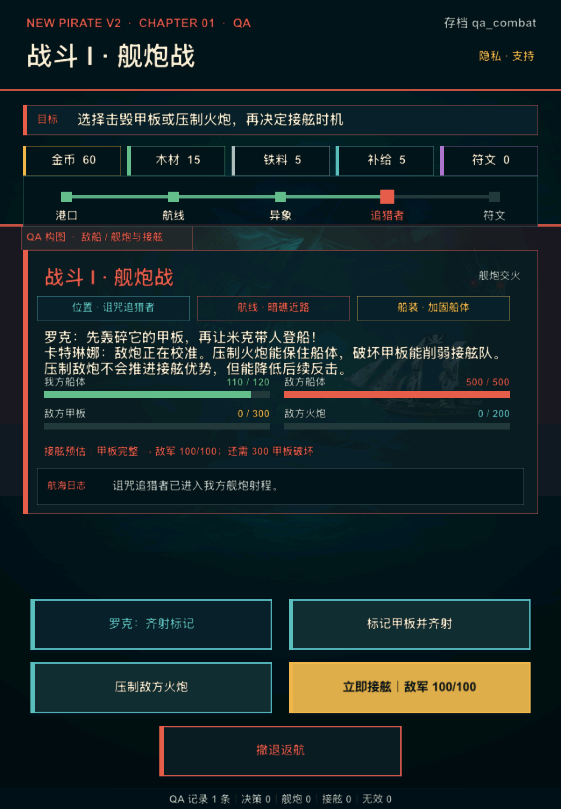

# V2 UI 2.0 第 1 轮：共享视觉骨架升级

日期：2026-08-05

## 1. 迭代结论

第一章现有玩法纵切保留不动，V2 表现层完成第一轮全局 UI 升级。新的界面不再用同一块深色大面板承载全部信息，而是形成“场景原画 + 航海仪表层 + 阶段内容卡 + 语义操作”的统一结构，并已覆盖开场、港口、航线、事件、诅咒、舰炮、接舷、符文、结算、升级、完成和失败状态。

本轮将旧的 `FROZEN` 内部样片保留为功能与体验对照基线，只重新打开 UI 表现层。阶段 4 的产品结论继续为 **HOLD**；本轮不授权第二海域、不替代真机或目标用户测试，也不改变外部发行门槛。

## 2. 不变边界

本轮没有修改：

- `V2ChapterState` 状态机与行动结果；
- 路线、战斗、奖励、升级和恢复数值；
- `V2ChapterController` 的调度与持久化；
- 存档 schema、QA 档种子与遥测口径；
- 第一章事件数量和第二海域范围。

UI 只读取既有状态、资源、战斗和演出数据。按钮位置与视觉角色可以变化，但点击后仍派发原来的 action id。

## 3. 视觉系统

### 3.1 设计语言

目标风格继续遵循“精致卡通 2.5D 海盗冒险 + 轻暗黑海怪”，本轮先建立能被现有引擎稳定实现的航海仪表层：

- 深海蓝作为结构底色，避免整屏纯黑；
- 海蓝用于探索与信息，金色用于推进和奖励；
- 红色只表示战斗、风险和撤退，紫色只表示诅咒与符文；
- 场景原画提高可见度，信息卡降低不透明度；
- 面板采用细描边、侧边强调条和大间距，移除旧式厚重发光边框；
- 正文保持暖白，次要信息降低对比度，避免所有文本争夺注意力。

颜色、阶段名称、航程位置、资源项和操作语义统一定义在 `V2UITheme.lua`，呈现层不再散落判断。

### 3.2 信息架构

所有阶段共用以下从上到下的结构：

1. 章节与阶段标题；
2. 单行当前目标；
3. 五个紧凑资源卡；
4. 港口、航线、异象、追猎者、符文五段航程；
5. 场景原画与半透明阶段内容卡；
6. 当前阶段操作区；
7. 航海日志与 QA/玩家页脚。

原来 7～9 个细节点在手机上难以快速识别，本轮只在 HUD 中显示五段旅程里程碑；实际地图节点、路线分支与状态机没有删减，当前位置仍通过内容卡中的“位置 / 航线 / 船装”显示。

### 3.3 交互层级

操作按钮改为 276 point 宽的自绘组件，最矮 58 point，超过 44 point 的触控下限，并提供按下态。语义分为：

- 金色主操作：出航、接舷、领取、返航等流程推进；
- 海蓝辅助操作：测绘、标记、防守、治疗等信息或战术辅助；
- 等权选择：路线、模块、升级等真实取舍；
- 红色风险操作：撤退和高风险行动；
- 金色描边已选择态：当前装配模块。

三操作页面按“两个等权选择 + 一个居中推进”或“居中测绘 + 两个路线选择”排列；五操作页面的最后一个撤退操作居中，避免落单误读。

### 3.4 战斗表达

舰炮与接舷不再只显示多行状态文本：

- 舰炮页同时显示我方船体、敌方船体、敌方甲板和敌方火炮四条进度；
- 接舷页显示我方接舷队与敌方甲板部队；
- 甲板击毁、火炮压制和接舷传递说明继续读取原有因果模型；
- 关键操作仍保留原有伤害、消耗和接舷后果预览。

### 3.5 动效约束

旧表现层中的无限漂浮、无限呼吸与奖励图标循环旋转已移除。当前只保留界面刷新时 0.28～0.32 秒的一次性淡入和轻位移，用于说明层级变化，不制造持续干扰。

## 4. 多尺寸运行证据

### 4.1 iPhone SE 3：默认玩家首屏

默认玩家档不显示 QA 档名、QA 构图或诊断记录；开场目标、阶段信息和金色主操作保持完整。

### 4.2 iPhone SE 3：舰炮

四条战斗进度、因果预估、航海日志和五个操作完整显示；最后一个撤退操作居中，底部 QA 记录可见。

### 4.3 iPhone SE 3：探索

海图仍是主视觉，已揭示的两条路线以等权按钮展示风险、消耗与收益。

### 4.4 iPhone SE 3：结算

奖励阶段使用金色强调，战利品说明、航海日志和单一返航主操作完整可见。

### 4.5 iPhone SE 3：隐私与支持

辅助弹层沿用同一深海面板、金色标题、海蓝辅助操作和红色关闭操作，按钮触控区不再只等于文字范围。

### 4.6 iPad A16：探索与舰炮

紧凑布局下资源卡、五段航程、内容卡、战斗进度和多行按钮均未越界；iPad 继续使用同一 640-point 设计宽度，不新增独立玩法布局。

## 5. 自动与构建验收

- `lua tools/v2/test_v2_ui_theme.lua`：阶段强调色、五段进度、资源模型与操作层级通过；
- `lua tools/v2/test_v2_chapter_layout.lua`：iPhone / iPad 间距、触控尺寸、航程与资源分区通过；
- `python3 tools/v2/validate_ui2_iteration_1.py`：UI 2.0 组件、动效和 7 张截图契约通过；
- `tools/v2/validate_phase4.sh`：阶段 0～4 完整内部回归通过；
- `./xcode.sh ios-sim`：arm64 Debug 模拟器构建通过；
- iPhone SE 3 / iOS 17.2 与 iPad A16 / iOS 26.2 均完成实际启动和截图复核。

## 6. 后续 UI 迭代方向

共享骨架已建立，后续应继续在不改玩法的前提下补强阶段差异：

1. 为港口、探索、战斗、符文/奖励四组场景补一套统一质量的新原画与前景层，优先替换复用度过高的旧素材；
2. 为金币、木材、铁料、补给、符文和战斗部位补同风格小图标，进一步减少文字；
3. 把结算与升级页拆成更具获得感的奖励卡和升级对比卡，而不是只依赖叙事段落；
4. 为路线选择补轻量地图标记与选中反馈，为舰炮命中补一次性冲击反馈；
5. 在真机补测安全区、触控手感、降低动态效果与降低透明度，再进入外部目标用户验证。

本轮已经完成全局样式换代，但不是最终美术冻结。后续新增位图应先做风格板和小范围 A/B，再替换生产资产，避免把促销概念图直接当作游戏界面。
