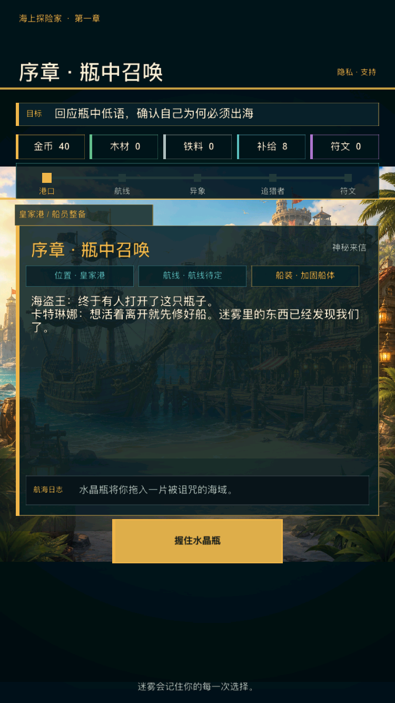
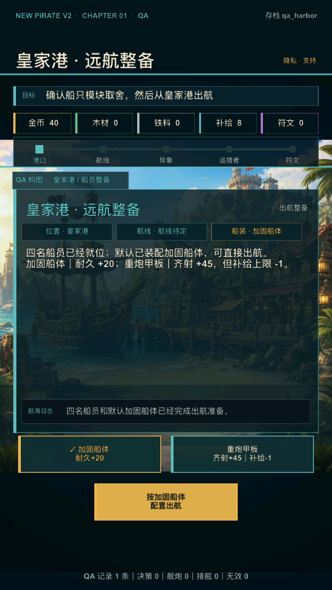
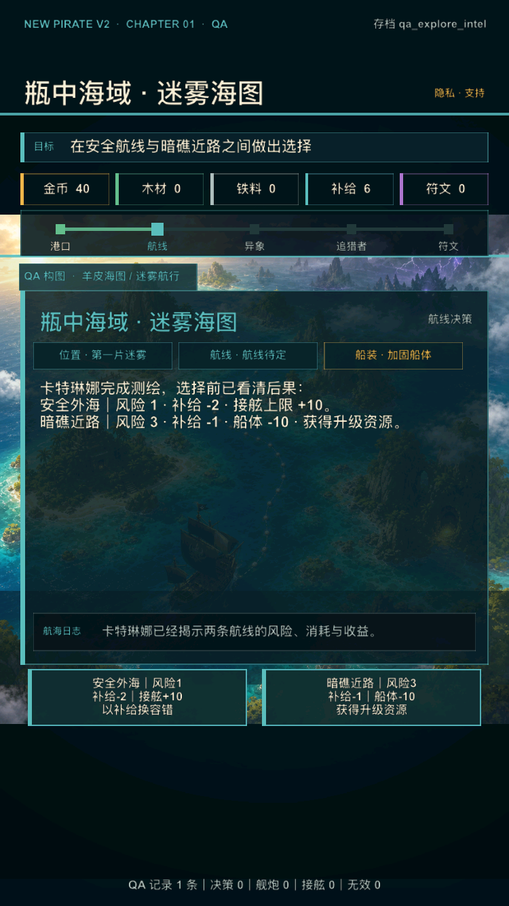
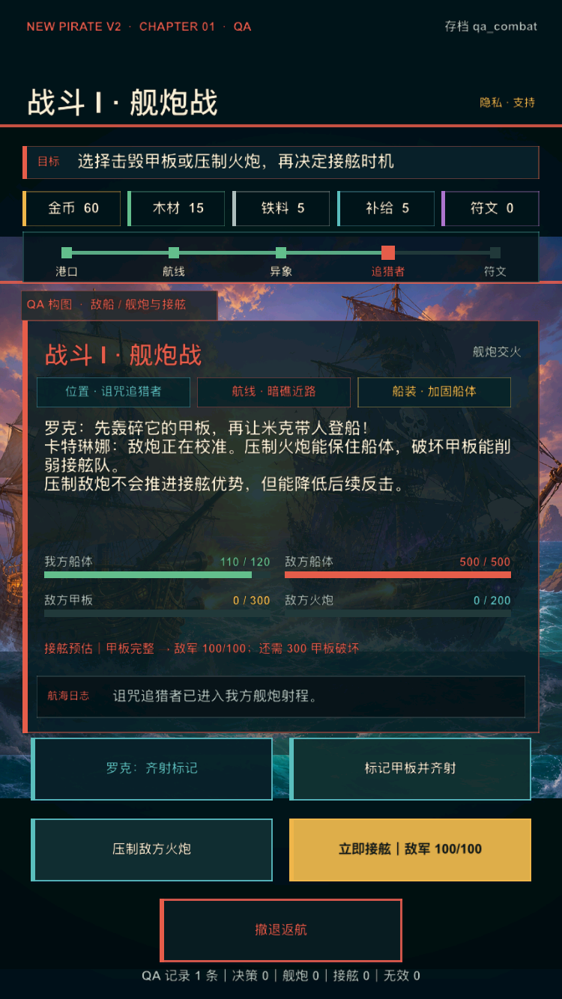
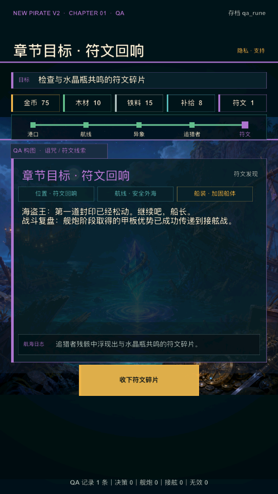
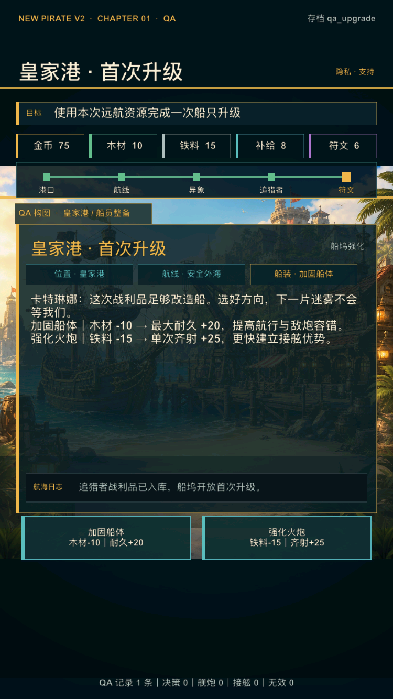
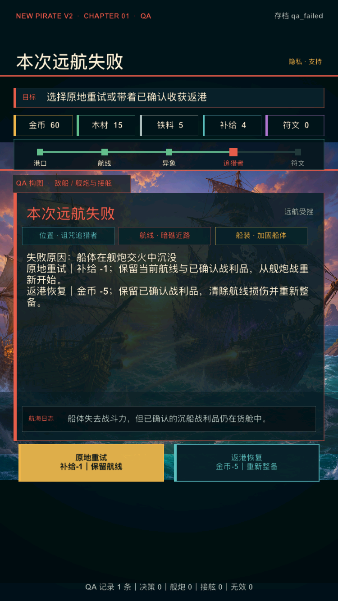
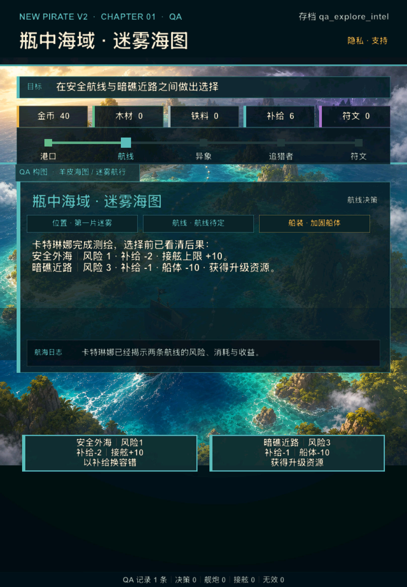
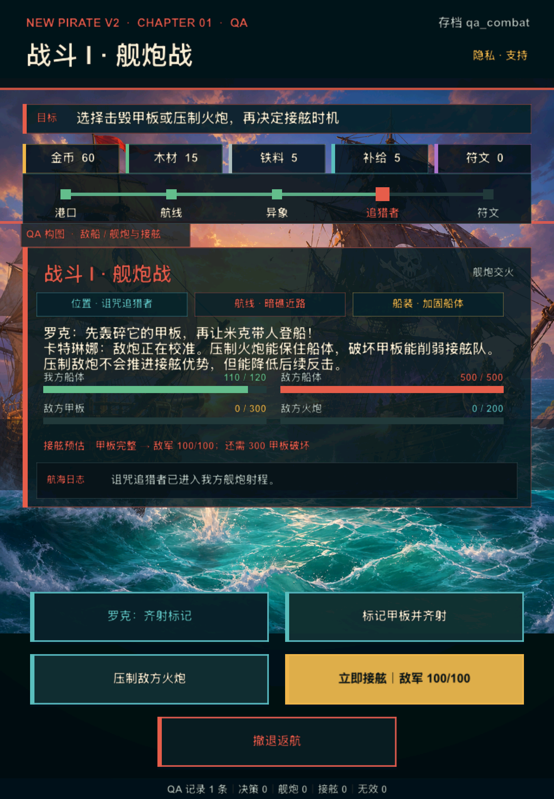

# V2 UI 2.0 第 2 轮：四组阶段美术升级

日期：2026-08-05

## 1. 迭代结论

在第 1 轮共享 UI 骨架稳定后，本轮把第一章 14 个演出状态归并到港口、探索、舰炮、符文四组新背景，移除与新背景质感不一致的旧前景和敌人头像叠层。开场、整备、选择、战斗、奖励、升级和失败仍使用原来的状态机、数据、按钮和结果，只替换表现资源。

四组素材均已接入真实 Debug 模拟器包，并在 iPhone SE 3 与 iPad A16 上完成运行裁切。当前结论为：**第 2 轮内部 UI / 美术验收通过**。产品与发行门槛仍为 **HOLD**，不因内部视觉升级跳过真机和两轮目标用户测试。

## 2. 资源方向

### 港口

- 明亮皇家港、生活化码头、船坞吊机和可识别的主船；
- 用于 opening、harbor、upgrade、complete；
- 宽裁切中仍保留船、城堡和码头，适合出航准备与成长阶段。

### 探索

- 高斜视角的蓝绿色群岛、航迹、主船、晴区与远方诅咒风暴；
- 用于 route_choice、route_event、black_tide；
- 明亮海域是第一印象，危险区只占远景，不把产品变成纯暗黑游戏。

### 舰炮

- 左右双船近距离齐射、炮烟、水柱和紫色诅咒细节；
- 用于 naval、boarding、failed；
- 两条船在 2:1 宽裁切中都保留，战斗背景与四条状态进度互相支持。

### 符文

- 月夜海湾、沉船、英雄船灯火和居中的蓝紫色符文晶体；
- 用于 whisper、curse_choice、rune_clue、settlement；
- 中心发光物为奖励焦点，气氛神秘但不血腥或恐怖。

## 3. 资源生产与治理

四张图由图像生成工具根据项目已有概念图制作生产候选，参考图只用于海盗世界、配色、材质和构图方向。提示明确禁止文字、UI、图标、边框、水印和 Logo；生成结果经过人工构图检查后复制到项目并统一压缩为 1024×1024 RGB PNG。

项目不依赖工具的临时输出目录，只收录以下最终副本：

| 文件 | 字节 | SHA-256 |
| --- | ---: | --- |
| `ui2_harbor.png` | 1,900,416 | `d05496b739a5ab572f74fe919a6f5591353bf227e29e93e593ba68cd5e32962c` |
| `ui2_exploration.png` | 2,016,280 | `d1cb54ae073154b8d42637b422ef792a690e8ca61d3bfe68a0d1029e44f728b6` |
| `ui2_combat.png` | 1,969,072 | `800de7d4630093c38c4a29c6317a541fd81a20ed45e65c852714d618f79dac27` |
| `ui2_rune.png` | 1,724,118 | `49f73240fcd4399b69c24909823afb1ff06d69b327cf31bad38aeb1e0055ba46` |

四张资源都没有 alpha；单张解码上限为 4 MiB，同屏只创建当前阶段背景。后续性能门槛仍以真实设备为准，本轮模拟器截图不替代内存和帧率真机结论。

## 4. 演出映射

| 阶段组 | 状态 | 背景 |
| --- | --- | --- |
| 港口 | `opening`, `harbor`, `upgrade`, `complete` | `Images/V2/ui2_harbor.png` |
| 探索 | `route_choice`, `route_event`, `black_tide` | `Images/V2/ui2_exploration.png` |
| 舰炮 | `naval`, `boarding`, `failed` | `Images/V2/ui2_combat.png` |
| 符文 | `whisper`, `curse_choice`, `rune_clue`, `settlement` | `Images/V2/ui2_rune.png` |

`presentation.csv` 仍保留 14 个演出记录、四种 hero group、原 accent、animation 和 audio cue。运行数据由 `tools/v2/export_runtime.py` 重新生成，不手写第二套映射。

## 5. 小屏运行证据

### 默认玩家首屏

无 QA 标签，主船与港口在卡片后可读，开场仍只有“握住水晶瓶”一个推进操作。

### 皇家港整备

模块等权选择和居中出航操作保持原结果；码头、主船和港口建筑建立了“活着的港口”感。

### 海域探索

安全航线与暗礁近路仍显示相同风险、消耗与收益，群岛、主船、航迹和风暴方向在半透明卡片后可辨。

### 舰炮交火

双船交火成为战斗主视觉；我方船体、敌方船体、甲板、火炮和接舷预估保持完整。

### 符文发现

符文晶体与领取主操作使用紫色/金色分层，奖励焦点清晰。

### 升级与失败

升级页仍明确显示成本和下一航程收益；失败页仍明确显示原地重试与返港恢复的成本、保留项和去向。

## 6. iPad 运行证据

iPad 紧凑布局中，新图没有因 2:1 中心裁切丢失主船、航迹或敌船；所有操作与页脚继续位于屏内。

## 7. 验收

- 四张生产副本均为 1024×1024 RGB PNG，文件大小和哈希已锁定；
- `presentation.csv` 14 个阶段映射完整，旧前景/头像叠层已清空；
- `python3 tools/v2/export_runtime.py --check` 通过；
- `python3 tools/v2/validate_ui2_iteration_2.py` 通过资源、映射、文档与 9 张截图契约；
- `tools/v2/validate_phase4.sh` 通过阶段 0～4 完整内部回归；
- `tools/release/validate_ios_release.sh` 通过发行级静态回归；
- `./xcode.sh ios-sim` 构建通过，新资源存在于最终模拟器 App 包。

## 8. 后续方向

全局 UI 与四组主场景已经完成换代。下一步优先级从“大面积换风格”转为小组件精修：

1. 制作金币、木材、铁料、补给、符文和战斗部位小图标，减少资源区文字；
2. 为奖励与升级增加一次性数值跳变和领取反馈，不加入循环装饰动效；
3. 对按钮按下态、触控声音、降低动态效果和降低透明度做真机检查；
4. 用无 QA 玩家档重拍正式产品截图候选，再交给外部目标用户验证理解率与继续航行意愿。

在真机和外测证据补齐前，不继续扩建第二海域。
