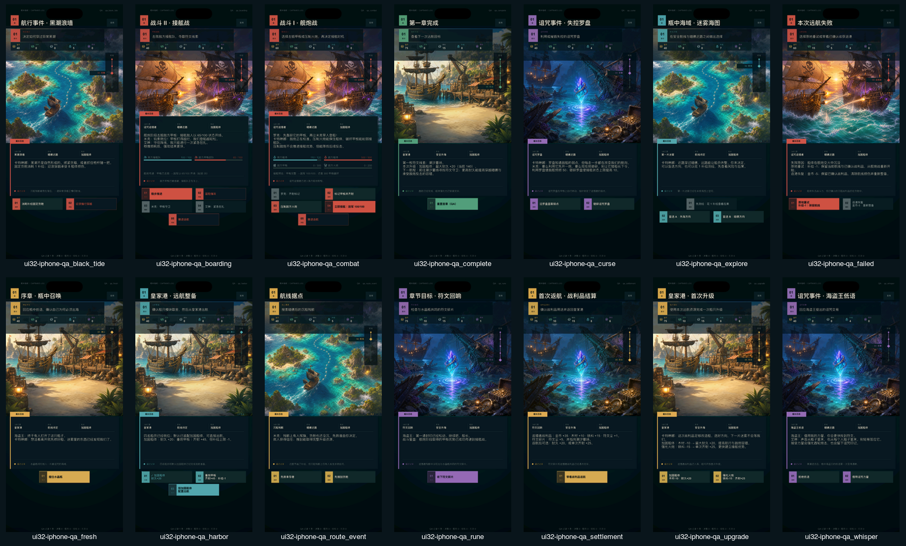
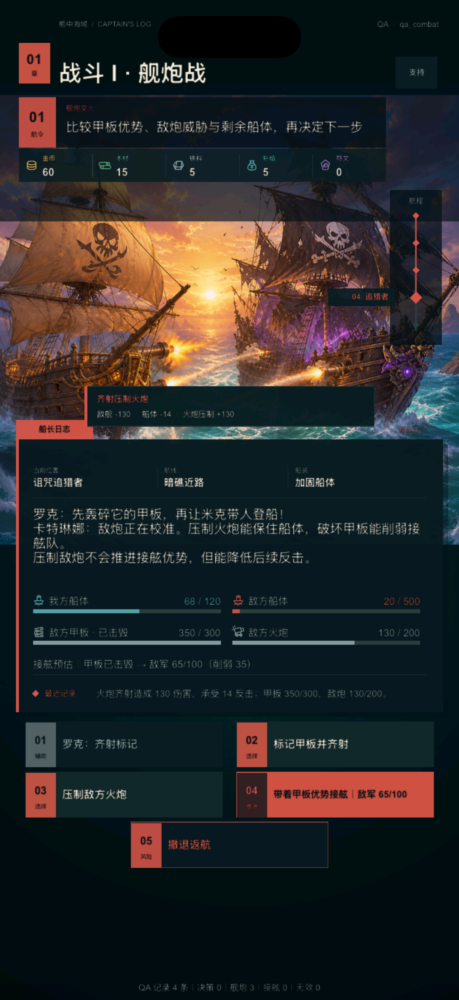
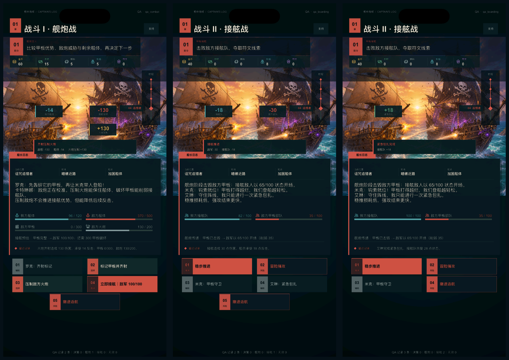
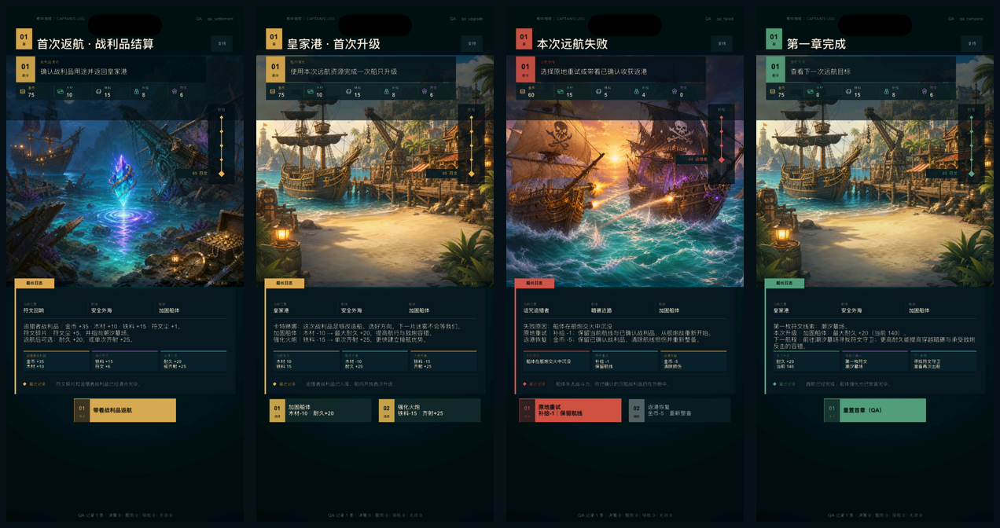
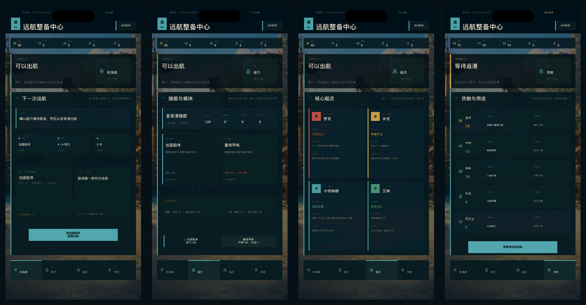
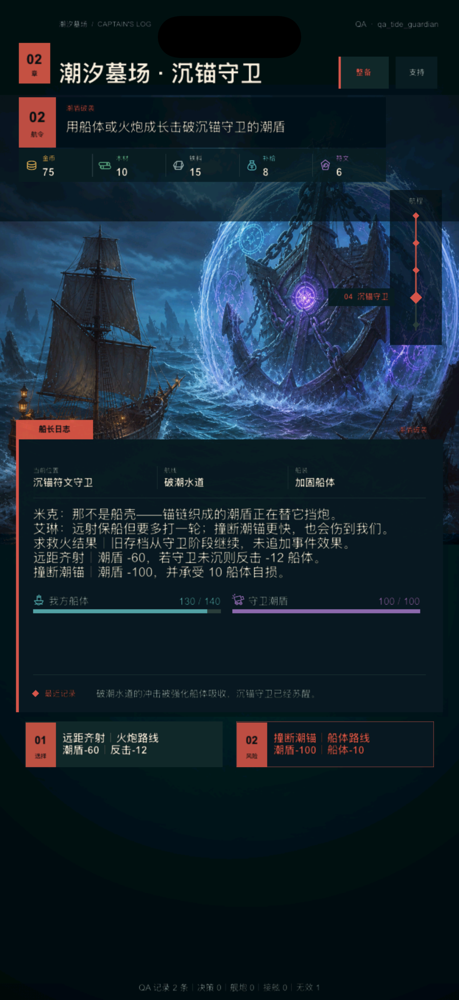
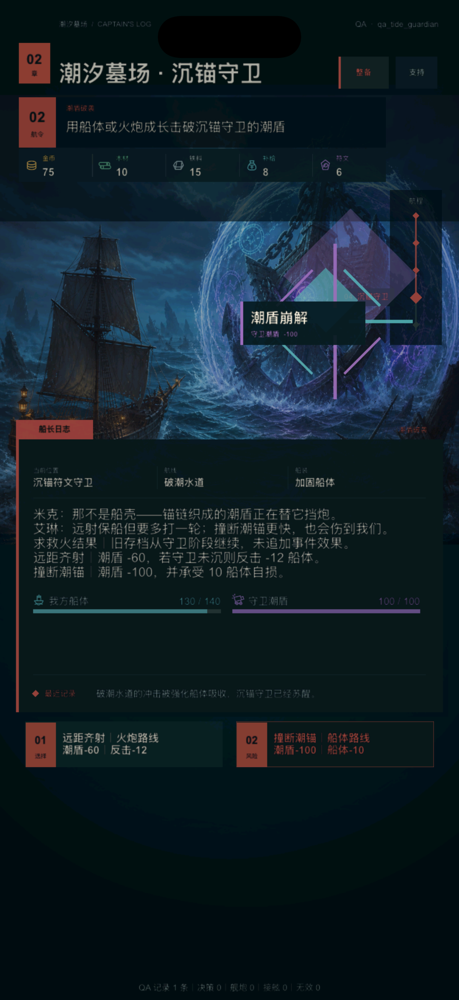

# V2 UI 3.5：整体风格与产品界面语言

日期：2026-08-09

## 1. 风格结论

第一章 UI 的统一方向确定为 **“克制的航海日志”**：场景美术负责海盗冒险的情绪和世界感，界面负责目标、状态与选择，不再用大量边框、彩色卡片和重复标题制造“游戏感”。

UI 3.0 首次运行复核虽然降低了噪音，但顶部栏、横向进度、文字资源行、大矩形叙事框和普通矩形按钮仍延续旧版骨架，第一眼容易被理解为“只换了背景”。UI 3.1 因此完整替换布局与组件语法；UI 3.2 补上资源/战斗语义图标、操作结果回执和 14 状态运行覆盖；UI 3.3 再把伤害、治疗和部位进度放回场景中的敌我位置，并将结算、升级、失败和完成页拆成结果组；UI 3.4 将同一语言扩展到独立的皇家港整备中心；UI 3.5 为差异敌人建立专属战场与终结反馈模板。新风格由此同时覆盖骨架、信息、操作、结果、产品导航和关键遭遇，不再停留在背景替换或单页美化。

本轮以主流 iPhone 竖屏作为唯一视觉判断基准。验收构建使用 1206×2622 px 模拟器画面；小屏与 iPad 只保留基础不越界回归，不再围绕不同机型分别定义风格。

玩法状态机、数值和存档不变。第一章 14 个状态、四组场景图、原操作 ID、战斗结算、QA 档和隐私/支持入口全部保留。

## 2. 现状审计与改版结果

| Before | After | Why |
| --- | --- | --- |
| 阶段标题在顶部、图片标签和内容卡中重复出现 | 阶段标题只在顶部出现一次 | 单一标题建立明确视线起点 |
| 顶部栏只有圆点、章节文字和大标题 | 左侧建立章节号铭牌，标题与英文日志索引形成固定船长 HUD | 不依赖背景也能识别产品界面 |
| 目标、五个资源与航程仍是横向文字排布 | 目标改为带编号的航令板，资源改为五格船载仪表，航程改为右侧纵向节点 | 三类信息获得不同形态与稳定位置 |
| 金、绿、青、紫、红同时竞争注意力 | 每个页面只使用单阶段强调色；危险操作保留红色语义 | 单阶段强调色让主操作和进度拥有稳定焦点 |
| 普通选择、工具操作和主推进都使用高对比描边 | 普通选择使用安静深色面，主推进使用实色，危险操作使用克制描边 | 操作优先级在扫视时即可识别 |
| 标题、正文、资源、日志与按钮全部粗体 | 标题粗体、正文常规字重，按钮仅在需要承诺操作时加粗 | 通过字重而非更多颜色建立阅读层级 |
| 非战斗与战斗共用同一张无识别度矩形卡 | 底部改为带突出页签、左侧书脊和三列上下文的船长日志；战斗按需扩展状态板 | 日志板成为跨场景的产品级视觉锚点 |
| 普通矩形按钮主要靠填充色区分 | 每个操作具有两位指令编号、推进/选择/辅助/风险角色和独立左侧控制块 | 不看背景也能辨认操作层级 |
| 资源仪表仍用“金/木/铁/补/符”单字占位 | 使用 5 枚同描边、可按语义着色的航海仪表图标，并保留完整资源名和数值 | 图形负责扫视，文字负责学习，不依赖猜缩写 |
| 舰炮与接舷状态只靠文字区分 | 船体、甲板、火炮、船员使用同一套单色战斗图标 | 战斗信息在高压场景下更快建立映射 |
| 指令执行后立即整屏刷新，结果埋在日志或数值中 | 成功操作显示 1.59 秒的一次性回执，最多列出 3 个真实数值变化 | 把“我的操作造成了什么”放回操作发生处 |
| 舰炮和接舷的结果只在中部回执与下方仪表变化 | 敌舰、我方船体、敌军、接舷队和治疗量分别锚定到场景内敌我两侧 | 玩家先在动作发生处感知结果，再用日志板复核完整因果 |
| 结算、升级和失败恢复依赖三行叙事解释 | 叙事下方增加三块“获得/库存/消耗/保留/下一步”结果组 | 高频决策信息可扫视，长文本继续承担世界与原因说明 |
| 只有 10 个状态具备隔离直达档 | 新增航线事件、黑潮、低语、诅咒罗盘 4 个直达档 | 14 个状态都能稳定复现并进行视觉回归 |
| QA 页脚与玩家装饰文案始终占据底部 | 玩家页移除无功能页脚，QA 档才显示遥测摘要 | 玩家界面不暴露测试噪音 |
| V2 只有一张章节页承载全部信息 | 新增航海桌、船只、船员、货舱四区皇家港整备中心 | 建立航程与整备分工，开始形成完整产品信息架构 |
| 旧船坞、招募、制造和仓库可直接恢复 | 港口只读取 V2 的四船员、两模块、五资源与真实动作 | 不让旧经济大厅重新主导当前产品 |
| 船员主动效果以内部动作 ID 存在 | 船员卡展示本地化技能效果与远航特性 | 玩家看到能力意义，不接触实现细节 |
| 差异守卫复用首航通用舰炮背景 | 沉锚守卫独占冷色墓场、锚链巨舰与完整潮盾战场 | 让地点、敌人和机制在手机尺寸上同时可辨 |
| Boss 最终一击直接跳到结果页 | 旧战场先显示目标位置的潮盾崩解与真实损失，再进入第二符文 | 补全操作、结果和推进的视觉因果 |

## 3. 视觉系统

### 3.1 色彩

- 基础层使用深海蓝黑，不使用纯黑；内容板与按钮只做小幅明度差；
- 主要文字使用暖象牙色，次要文字使用低饱和灰青；
- 港口/开场使用旧金，探索使用海青，战斗使用珊瑚红，符文使用雾紫；
- 同一画面只让当前阶段色进入阶段点、航程、短强调线、日志标签和主操作；
- 战斗例外保留我方海青与敌方红两种明确阵营语义，次级部位统一降为灰色。

### 3.2 排版

- 顶部仅保留“章节信息 + 当前阶段标题”；
- 标题使用粗体，正文、资源、元信息和结果使用常规字重；
- 正文保持自然行距，不用彩色文本拆分叙事；
- 目标、资源、航程按“航令板 → 船载仪表 → 右侧纵向航程”固定排列；
- QA 档名位于右上角低权重区域，不和阶段标题竞争。

### 3.3 表面与边框

- 页面只允许一张主要日志板；
- 资源区使用一体式五格仪表，各格使用统一线性图标、完整资源名与数值，不做五张独立卡；
- 普通卡片不使用四边描边，分组依赖间距和细分隔线；
- 主内容板只保留一段短阶段色顶线，作为航海日志的视觉书签；
- 隐私与支持使用同一套深色表面和 44 point 触控目标。

### 3.4 操作

- `primary`：当前阶段色实底，只给章节推进或明确承诺操作；
- `choice`：中性深色面，等权选择不抢主操作；
- `selected`：中性面 + 3 point 阶段色标记，表示已经装备或选中；
- `utility`：更低对比深色面，用于情报、标记、治疗等辅助行为；
- `danger`：透明深色面 + 细红线，用于撤退等破坏当前进程的行为；
- 所有章节指令左侧显示两位编号与角色，正文左对齐；同一套结构覆盖单按钮、三选项和五按钮战斗；
- 按下态通过轻微内缩与明度变化立即反馈，不加入弹跳和循环装饰动效。

## 4. 主流 iPhone 运行结果

矩阵基于同一台 iPhone 17 模拟器、同一套 1206×2622 px 画布，覆盖：

1. 开场召唤；
2. 皇家港整备；
3. 航线选择；
4. 航线事件；
5. 黑潮；
6. 瓶中低语；
7. 诅咒罗盘；
8. 舰炮战；
9. 接舷战；
10. 失败恢复；
11. 符文线索；
12. 战利品结算；
13. 首次升级；
14. 首航完成。

四组背景继续承担港口、探索、战斗与符文情绪；章节铭牌、航令、资源仪表、纵向航程、日志书脊和编号指令保持同一产品语言。UI 3.2 的变化主要出现在资源与战斗的图形映射，以及操作后短时出现的因果回执，不再依赖文字占位。

### 操作因果回执

截图由 `qa_combat + fire_at_guns` 自动执行真实状态机获得，不是静态样稿。单次齐射后，回执同步展示“敌舰 -130、船体 -14、火炮压制 +130”，下方仪表与最近记录使用同一组结果。回执位于场景与日志板之间，短时出现后自行移除，不阻挡后续指令。

### UI 3.3 场景内动作反馈

从左到右分别为：首轮压制火炮、稳步接舷推进、受损后的紧急包扎。舰炮显示敌舰 `-130`、我方船体 `-14` 和火炮压制 `+130`；接舷显示敌军 `-30` 与接舷队 `-18`；治疗显示接舷队实际恢复 `+18`。所有数字都来自操作前后的真实状态差值，敌方反馈锚定右侧目标，我方损伤和治疗锚定左侧船只，不占用操作按钮。

### UI 3.3 结果组

从左到右覆盖战利品结算、首次升级、失败恢复和首航完成。三块结果组不取代叙事，而是从同一数据源提取最需要比较的字段：结算显示收获与可转化方向，升级显示库存和两种成本收益，失败显示原因、重试保留项和返港清除项，完成显示已获得升级、线索和下一航程。

### UI 3.4 皇家港整备中心

从左到右为航海桌、船只、船员和货舱。界面使用与章节页一致的深海表面、象牙文字、海青焦点、五资源仪表和编号导航，但不复制章节日志布局。所有信息读取当前章节存档和生成数据表，出航、模块、升级和返港动作继续由原状态机执行；船员培养和制造等没有规则支持的能力保持只读或不出现。

详细架构、动作边界、QA 入口和后续顺序见 [`ui-3.4-royal-port.md`](ui-3.4-royal-port.md)。

### UI 3.5 差异敌人与终结反馈

沉锚守卫以锚链巨舰和青紫潮盾替换普通追猎者敌舰，同时保留稳定的章节铭牌、航令、资源仪表、纵向航程、日志板与编号指令。背景构图主动预留左右船位和中央攻击通道，场景内反馈由此可以锚定真实目标。

终结转换只显示一个结果：`潮盾崩解` 与真实潮盾损失。反馈在旧战场上完成，短暂吞掉触控，随后才刷新第二符文页；普通伤害继续沿用 UI 3.3 的轻量标签。详细资产、提示词、时序和验收见 [`tide-guardian-visual-iteration-1.md`](tide-guardian-visual-iteration-1.md)。

## 5. 交互与动效边界

- 高频章节切换不增加转场动画；
- 背景只做一次性短淡入，不允许 `RepeatForever` 装饰循环；
- 按钮按下立即反馈，成功后显示一次性结果回执，再按现有状态机刷新；
- 回执使用 140 ms 淡入/位移、1250 ms 停留、200 ms 淡出，无弹跳、无循环；
- 战斗场景数字使用 90 ms 淡入、520 ms 停留、180 ms 淡出；受击线、治疗十字和目标标记在约 320 ms 内完成；
- 差异敌人的不可逆终结转换可使用一次约 0.5 秒的目标锚定反馈；只在最短窗口吞掉触控，不允许循环或重复派发；
- 回执最多展示 3 个实际变化，额外变化折叠为“另 N 项”，不复制整段日志；
- 不在本轮引入拖拽、弹性面板、粒子庆祝或数值滚动；
- 奖励、升级与战斗回执必须来自真实状态差值，不允许播放与结算脱节的装饰动画。

## 6. 验收与范围

- 纯 Lua 主题与布局测试通过；
- iOS Simulator Debug 构建通过；
- 14 个状态均在 iPhone 17 模拟器完成 1206×2622 px 运行复核；
- 9 枚运行 PNG 均保留对应 SVG 源文件，统一使用 64×64 透明画布与单色描边；
- 舰炮操作的自动化主题测试同时验证“敌舰 -175、船体 -14、甲板破坏 +175”三项因果变化；
- `NEWPIRATE_V2_QA_ACTION` 只在 `qa_*` 档生效；`NEWPIRATE_V2_QA_FEEDBACK_HOLD` 只为模拟器证据延长停留，玩家默认时序不变；
- iPhone 17 运行态完成舰炮 `fire_at_guns`、接舷 `boarding_attack` 和治疗 `medic_heal` 三类真实操作复核；
- 战利品结算、首次升级、失败恢复和首航完成四页的结果组均完成 1206×2622 px 运行检查；
- 皇家港航海桌、船只、船员、货舱、升级态与章节入口均完成 iPhone 17 / 1206×2622 px 运行检查；
- 港口展示模型只过滤 `V2ChapterState.getActions`，没有复制玩法规则、恢复旧经济大厅或修改存档 schema；
- 沉锚守卫使用独立 1024×1024 RGB 战场，终结反馈只响应真实潮盾归零并进入第二符文的状态转换；
- 守卫常态、潮盾崩解与第二符文均完成 iPhone 17 / 1206×2622 px 连续运行检查；
- 新增的 4 个 QA 直达档只用于复现原有状态，没有增加玩法、数值、操作 ID 或存档 schema；
- 第一章纵切基线状态为 `BASELINED`，整体产品开发状态为 `ACTIVE`；
- 真机、签名、外部发行与 App Store 工作统一标记为 `DEFERRED_UNTIL_FINAL`，不进入当前迭代排序。

## 7. 后续 UI 迭代顺序

UI 3.5 已让章节、港口、第二次远航和关键遭遇共享同一套产品语言。接下来不扩建空壳菜单，也不继续孤立微调单页，而是先建立稳定的内容扩展方式：

1. 固化事件、敌人、船员、奖励、演出和 QA 证据的唯一数据源与自动验收模板；
2. 用第三航程最小设计草案验证主题、核心抉择、成长兑现和资产预算；
3. 草案通过后才实现新内容，不复用第二航程改名，也不提前堆大量节点；
4. 完成连续远航、存档迁移、资源预算和 P0/P1 稳定化；
5. 真机、签名、商店截图和 App Store 只在游戏内容与体验收敛后统一处理。
