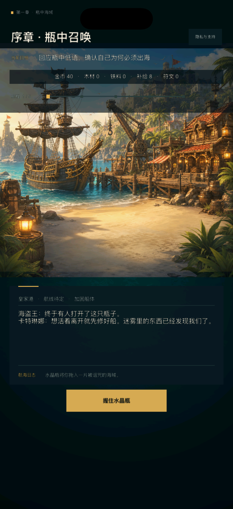
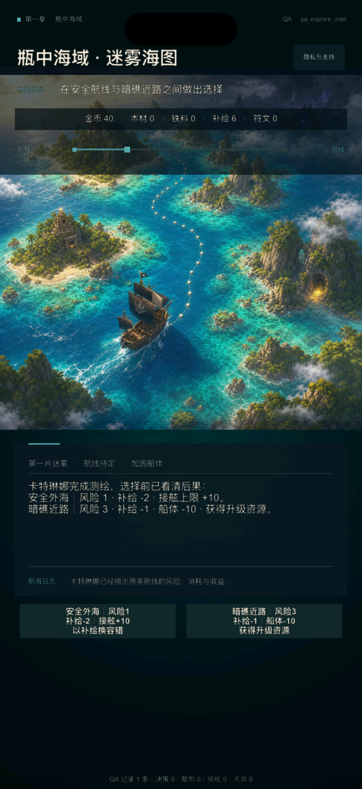
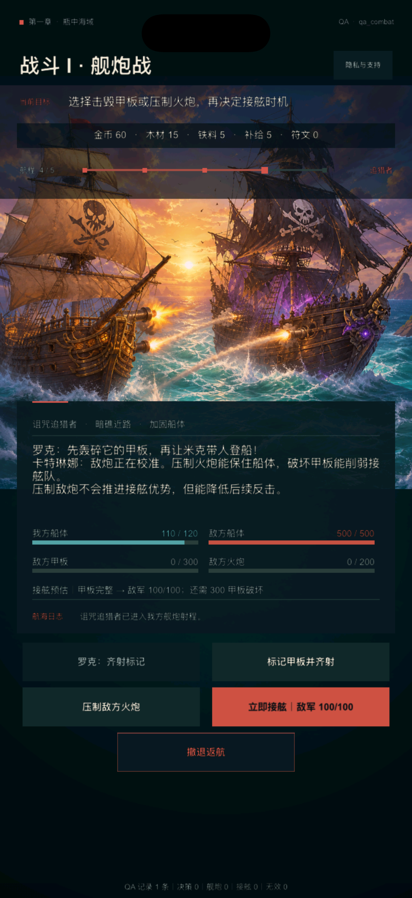
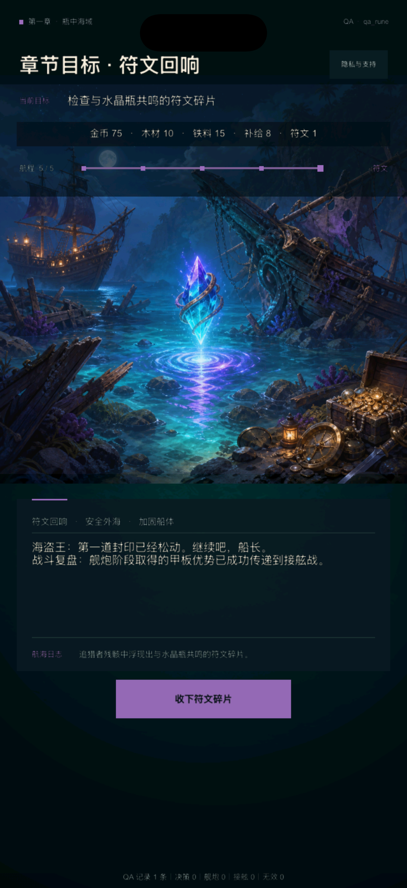

# V2 UI 3.0：整体风格与界面语言

日期：2026-08-06

## 1. 风格结论

第一章 UI 的统一方向确定为 **“克制的航海日志”**：场景美术负责海盗冒险的情绪和世界感，界面负责目标、状态与选择，不再用大量边框、彩色卡片和重复标题制造“游戏感”。

本轮以主流 iPhone 竖屏作为唯一视觉判断基准。验收构建使用 1206×2622 px 模拟器画面；小屏与 iPad 只保留基础不越界回归，不再围绕不同机型分别定义风格。

玩法状态机、数值和存档不变。第一章 14 个状态、四组场景图、原操作 ID、战斗结算、QA 档和隐私/支持入口全部保留。

## 2. 现状审计与改版结果

| Before | After | Why |
| --- | --- | --- |
| 阶段标题在顶部、图片标签和内容卡中重复出现 | 阶段标题只在顶部出现一次 | 单一标题建立明确视线起点 |
| 目标、五个资源、航程、三项元信息和日志各有独立边框 | 目标直接落在场景上，资源合并为一条状态行，元信息与日志改为文字和细分隔线 | 减少“每条信息都像按钮”的误读 |
| 金、绿、青、紫、红同时竞争注意力 | 每个页面只使用单阶段强调色；危险操作保留红色语义 | 单阶段强调色让主操作和进度拥有稳定焦点 |
| 普通选择、工具操作和主推进都使用高对比描边 | 普通选择使用安静深色面，主推进使用实色，危险操作使用克制描边 | 操作优先级在扫视时即可识别 |
| 标题、正文、资源、日志与按钮全部粗体 | 标题粗体、正文常规字重，按钮仅在需要承诺操作时加粗 | 通过字重而非更多颜色建立阅读层级 |
| 非战斗与战斗共用同一张高内容卡 | 非战斗使用短日志板，战斗按需要扩展为完整状态板 | 让港口和探索保留更多场景，战斗仍能完整容纳数值 |
| QA 页脚与玩家装饰文案始终占据底部 | 玩家页移除无功能页脚，QA 档才显示遥测摘要 | 玩家界面不暴露测试噪音 |

## 3. 视觉系统

### 3.1 色彩

- 基础层使用深海蓝黑，不使用纯黑；内容板与按钮只做小幅明度差；
- 主要文字使用暖象牙色，次要文字使用低饱和灰青；
- 港口/开场使用旧金，探索使用海青，战斗使用珊瑚红，符文使用雾紫；
- 同一画面只让当前阶段色进入阶段点、航程、短强调线、日志标签和主操作；
- 战斗例外保留我方海青与敌方红两种明确阵营语义，次级部位统一降为灰色。

### 3.2 排版

- 顶部仅保留“章节信息 + 当前阶段标题”；
- 标题使用粗体，正文、资源、元信息和结果使用常规字重；
- 正文保持自然行距，不用彩色文本拆分叙事；
- 目标、资源、航程按“任务 → 库存 → 位置”顺序固定排列；
- QA 档名位于右上角低权重区域，不和阶段标题竞争。

### 3.3 表面与边框

- 页面只允许一张主要内容板；
- 资源区允许一条整体状态底，不允许恢复五个资源框；
- 普通卡片不使用四边描边，分组依赖间距和细分隔线；
- 主内容板只保留一段短阶段色顶线，作为航海日志的视觉书签；
- 隐私与支持使用同一套深色表面和 44 point 触控目标。

### 3.4 操作

- `primary`：当前阶段色实底，只给章节推进或明确承诺操作；
- `choice`：中性深色面，等权选择不抢主操作；
- `selected`：中性面 + 3 point 阶段色标记，表示已经装备或选中；
- `utility`：更低对比深色面，用于情报、标记、治疗等辅助行为；
- `danger`：透明深色面 + 细红线，用于撤退等破坏当前进程的行为；
- 按下态通过轻微内缩与明度变化立即反馈，不加入弹跳和循环装饰动效。

## 4. 主流 iPhone 运行结果

### 玩家首屏

标题、目标、资源、航程、场景、叙事和唯一 CTA 形成从上到下的单一路径；玩家档不显示 QA 标签或无功能页脚。

### 海域探索

海图承担主要视觉，风险与消耗集中在日志板和两个等权选择中；资源不再使用五种颜色。

### 舰炮战

战斗页沿用同一骨架，只增加必要的四条状态；辅助操作、主接舷和撤退具备明确层级。

### 符文回响

雾紫只用于阶段定位与领取操作，符文场景仍是画面焦点，没有额外奖励弹框或装饰边框。

## 5. 交互与动效边界

- 高频章节切换不增加转场动画；
- 背景只做一次性短淡入，不允许 `RepeatForever` 装饰循环；
- 按钮按下立即反馈，触发结果后按现有状态机刷新；
- 不在本轮引入拖拽、弹性面板、粒子庆祝或数值滚动；
- 后续若增加奖励反馈，只允许一次性、可跳过、低动态版本。

## 6. 验收与范围

- 纯 Lua 主题与布局测试通过；
- iOS Simulator Debug 构建通过；
- 玩家首屏、探索、舰炮、符文四张主流 iPhone 运行截图完成视觉复核；
- 新风格没有修改 `V2ChapterState`、章节数据、操作 ID、数值或存档 schema；
- 阶段 0～4 和发行级回归继续作为合入门槛；
- 外部真机、目标用户测试、签名与 App Store 条件仍未补齐，总体保持 **HOLD**。

## 7. 后续 UI 迭代顺序

风格确定后只做同一语言内的精修，不再进行第三次大面积换皮：

1. 统一主流 iPhone 上所有 14 个状态的文案长度与按钮换行；
2. 为资源和战斗部位补一套低细节单色图标，但不恢复彩色资源卡；
3. 增加一次性领取/装备反馈，并提供低动态等价表现；
4. 使用无 QA 玩家档制作正式商店截图候选；
5. 交由目标用户验证“目标理解、风险理解、主操作识别”三项，而不是只询问是否好看。
