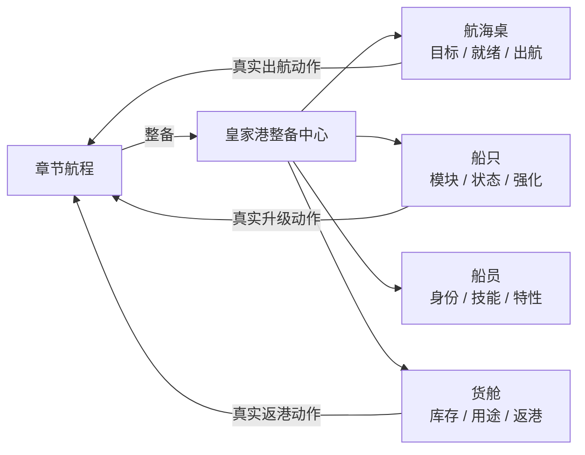

# V2 UI 3.4：皇家港整备中心

日期：2026-08-09

状态：`BASELINED`（第一版完整产品界面切片）

产品开发：`ACTIVE`

真机与发行：`DEFERRED_UNTIL_FINAL`

## 1. 本轮目标

UI 3.0～3.3 已经把第一章航行页从旧版界面整理为“克制的航海日志”，但产品仍只有一张承担全部状态的章节页。UI 3.4 的目标不是继续给这张页面换背景，而是建立第一张可导航、可读取真实成长状态、可执行真实动作的产品级功能界面。

本轮选择“皇家港整备中心”作为扩展起点，统一承载：

1. 航海桌：当前目标、出航准备和下一目标；
2. 船只：旗舰状态、模块取舍和真实升级动作；
3. 船员：四名核心船员的身份、主动技能、战斗效果和远航特性；
4. 货舱：五种资源的数量、主要用途、次要用途和结算返港动作。

主流 iPhone 竖屏仍是唯一风格判断基准。小屏与 iPad 暂只保留基础布局兼容，不为不同机型分别设计产品风格。

## 2. 现状审计与设计决策

仓库中仍保留旧版 `Repository`、`Expedition`、`TrainMode`、`MakeMode` 等大厅和系统代码，但它们围绕旧经济循环组织，并不等于当前 V2 的产品结构。直接恢复会重新形成多个等权入口、冗余资源链和菜单驱动体验。

| Before | After | Why |
| --- | --- | --- |
| V2 只有章节页，船只、船员和资源信息散落在阶段叙事中 | 新增独立皇家港整备中心，并从章节顶部“整备”进入 | 让章节负责航行，让港口负责准备与成长 |
| 恢复旧版船坞、招募、制造、仓库入口 | 收敛为航海桌、船只、船员、货舱四区 | 保留玩家心智模型，不恢复旧经济大厅 |
| 为了填满界面虚构升级、招募或制造按钮 | 只显示当前状态机允许的真实动作 | 避免“看起来能点，实际上没有玩法规则” |
| 船员只在战斗按钮中出现名字 | 四张身份卡同时展示主动技能、玩家可读的战斗效果和远航特性 | 让船员成为可理解的角色能力，而非动作 ID |
| 五种资源只有 HUD 数字 | 货舱说明每种资源的主要与次要用途 | 资源数量与策略用途在同一视线内建立映射 |
| 所有阶段都只能返回章节页找操作 | 港口根据当前阶段显示整备状态；结算可从货舱直接返港 | 港口成为真实流程节点，同时保持单一规则权威 |

## 3. 信息架构



港口不维护第二套玩法状态。`V2PortModel` 只把 `V2ChapterState.getActions` 返回的动作按分区过滤，动作执行仍统一交给 `V2ChapterController:dispatch`。

| 分区 | 数据来源 | 可执行动作 | 当前边界 |
| --- | --- | --- | --- |
| 航海桌 | 目标、船只、船员、补给、下一航程目标 | `start_voyage`、`return_to_port` | 不复制路线与战斗选择 |
| 船只 | 船体/火炮等级、航行损伤、模块表、升级成本 | 两种模块选择、两种首次升级 | 不虚构维修、改名或新槽位 |
| 船员 | 当前编队与 `crew` 数据表 | 无 | 尚无长期培养规则，因此保持只读 |
| 货舱 | 当前资源与 `resource` 数据表 | 结算阶段 `return_to_port` | 不恢复旧版制造与多层生产链 |

## 4. 视觉与交互规则

- 延续深海蓝黑表面、暖象牙正文、海青主操作和状态语义色；
- 港口顶部使用“港 / 整备”铭牌，与章节页“01 / 章”铭牌形成同一空间语法；
- 五资源继续使用 UI 3.2 单色线性图标，不重新引入旧版混合图标；
- 四区底部导航固定位置，当前区只用 3 point 顶线、海青图标和轻微明度差表示；
- 内容按可用高度分配，避免上半区堆叠、下半区大片无意义空白；
- 所有按钮拥有独立按下态并立即响应，不加入循环呼吸、弹跳或装饰性转场；
- 船员暂用编号、角色色和姓名首字建立身份，不以风格不一致的临时头像冒充正式角色美术。

Apple Design 的影响主要体现在稳定空间关系、即时按下反馈和克制动效；Emil Design Engineering 的影响主要体现在单一视觉焦点、可扫视信息层级、避免装饰性组件和让每个动作清楚表达后果。

## 5. 主流 iPhone 运行结果


从左到右为航海桌、船只、船员和货舱，全部来自同一台 iPhone 17 模拟器的 1206×2622 px 运行画面，不是静态设计稿。

补充运行证据：

- [`ui3-4-chapter-entry.png`](ui3-4-chapter-entry.png)：章节顶部“整备”入口；
- [`ui3-4-port-upgrade.png`](ui3-4-port-upgrade.png)：真实升级阶段的两种成本与操作；
- [`ui3-4-port-cargo.png`](ui3-4-port-cargo.png)：战利品结算后的五资源用途与返港动作。

## 6. 运行与回归入口

开发期可以用隔离 QA 档直接打开任一港口分区：

```text
NEWPIRATE_V2_PROFILE=qa_harbor
NEWPIRATE_V2_START_SURFACE=port
NEWPIRATE_V2_PORT_SECTION=chart|ship|crew|cargo
```

`NEWPIRATE_V2_START_SURFACE` 与 `NEWPIRATE_V2_PORT_SECTION` 只在 `qa_*` 存档中生效，不改变玩家默认入口和存档 schema。

自动验收覆盖：

- 四个分区及顺序；
- 当前模块、计算后船体耐久、升级成本与收益；
- 四名船员、职业、本地化技能效果；
- 五种资源、当前数值与用途；
- 出航、模块、升级和返港动作仍来自真实章节状态机；
- 六张 iPhone 运行图和四区矩阵的尺寸；
- V2 路由没有重新接入旧版经济大厅。

## 7. 本轮不做

- 不做真机、签名、TestFlight、商店截图或 App Store；
- 不新增船员升级、招募、制造、维修或装备槽规则；
- 不恢复旧版七按钮大厅和多资源生产树；
- 不扩建第二海域；
- 不把 QA 直达入口暴露为玩家功能。

## 8. 后续开发顺序

UI 3.4 建立了产品信息架构的第一块基线；后续重复远航第 1 轮已完成成长留存。当前按以下顺序推进：

1. **第二次远航灰盒**：以潮汐墓场为目标，复用现有路线—事件—舰炮—接舷骨架，新增一个差异敌人和一个符文目标；
2. **成长结果进入下一次策略**：船体/火炮已改变下一战数值，继续让两类成长分别改变一次潮汐墓场路线或事件选择；
3. **港口恢复规则**：补充重复远航后透明、最小的补给恢复，不恢复旧生产链；
4. **船员成长最小闭环**：先定义一条可验证的船员成长选择，再开放船员页操作，避免先做空壳培养菜单；
5. **正式角色与船只美术**：在结构稳定后补船员头像、旗舰识别形象和港口局部动态；
6. **最终发行阶段**：内容和体验收敛后再统一处理真机、签名、TestFlight 与 App Store。

成长留存实现与证据见 [`repeat-voyage-iteration-1.md`](repeat-voyage-iteration-1.md)。
